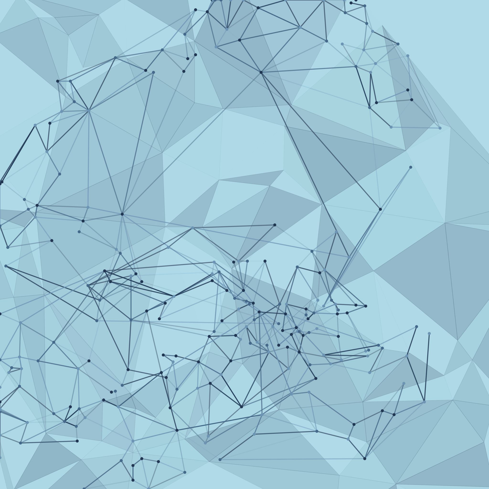
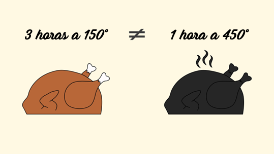

##  {background-color="#ffffff"}

::::: columns
::: {.column width="40%"}
  

{width="300" style="border-radius: 50%; display: block; margin: 0 auto;"}
:::

::: {.column width="60%"}
   

### Psicología de la Motivación y la Emoción

 · Bienvenida  · Modalidad: Asincrónica

Dr. Fernando Tonini
:::
:::::

## Cómo vamos a trabajar

::::: columns
::: {.column width="50%"}
**Cada semana**

📖 Se abre un módulo nuevo. Cada módulo una temática.

🏫 En las reuniones trabajamos sobre los módulos vistos.

💬 Dudas, debates, preguntas
:::

::: {.column width="50%"}
**Sus tareas**

Lectura activa y realización de las actividades.

Se traen las dudas a las reuniones sincrónicas.
:::
:::::

:::: {.callout-important appearance="simple"}

Las reunions son optativas. También pueden preguntar por blackboard.

::::

::: notes
Explicitar el contrato: leer antes es parte del trabajo. Las reuniones se aprovechan distinto si llegan con el material leído.
:::

## Cómo nos comunicamos

   

| Necesitás... | Usá... |
|------------------------------------|------------------------------------|
| Saber qué hay que leer o hacer | **Módulos** en Blackboard |
| Consultar una duda de contenido | **Mensaje** por Blackboard |
| Resolver un problema técnico | **Helpdesk** (*Antes de comenzar → Herramientas útiles*) |

::: fragment
**Todo pasa por Blackboard.**
:::

## Lo que sabemos sobre estudiar bien

Un hallazgo que les va a servir durante el resto de su formación.

::::::: columns
::::: {.column width="55%"}
::: fragment
> A mayor cantidad de texto resaltado, **peor rendimiento** en el examen (Dunlosky et al., 2013).
:::

::: fragment
Pero... Por qué? Resaltar casi todo promueve la **ilusión de aprendizaje**. "Sentimos" que aprendimos, pero solo marcamos.
:::
:::::

::: {.column width="45%"}
{fig-align="center" width="90%"}
:::
:::::::

::: notes
Este es un momento clave. Conecta con el contenido de la materia: la diferencia entre sentir que sabemos y saber de verdad es un tema motivacional y emocional.
:::

## Entonces... ¿Qué sí funciona?

::: incremental
-   **Distribuir** el estudio: un poco cada día \> todo la noche anterior

-   **Explicar** con tus palabras lo que leíste (a un compañero, al espejo, al gato)

-   **Hacerte preguntas** sobre el texto en vez de solo releerlo

-   No te preocupes si no entendés todo la primera vez. **Volvé a leer**

    :::: {.callout-note appearance="simple"}
    

    Estas estrategias tienen evidencia fuerte. Veremos algunas en la materia.

    

    ::::
:::

::: notes
Acá se puede mencionar que la materia misma les va a dar herramientas para entender por qué estas estrategias funcionan (autorregulación, metacognición, motivación intrínseca).
:::

## El cronograma y los módulos son tus mejores aliados

:::::: columns
:::: {.column width="55%"}

-   Lo van a tener en Blackboard
-   Tiene **qué leer** y **para cuándo**
-   Úsenlo para armar su propia agenda
-   Descargar el material y organizarlo por semana

::::

::: {.column width="45%"}
{fig-align="center" width="75%"}
:::
::::::

::: {.callout-important appearance="simple"}
Usen las *autoevaluaciones*, que son opcionales, pero muy útiles para chequear su progreso.
:::

## Evaluación

|                    |                                |
|--------------------|--------------------------------|
| **Parciales**      | 2 (cada uno con recuperatorio) |
| **Formato**        | 2 preguntas de desarrollo      |
| **Duración**       | 50 minutos                     |
| **Para aprobar**   | Mínimo 4 (escala 1–10)         |
| **Día de parcial** | 22h para poder rendir          |

:::: {.callout-important appearance="simple"}

No hay sorpresas. El parcial evalúa lo que trabaja en los módulos.

::::

## Resumen

   
[Módulos al día · Pregunten (Reuniones o Blackboard) · Usen el cronograma]{style="color: #000000;"}

:::: {.callout-important appearance="simple"}

[*Buen inicio del cuatrimestre* 🚀]{style="color: black; font-size: 1.2em;"}

::::

