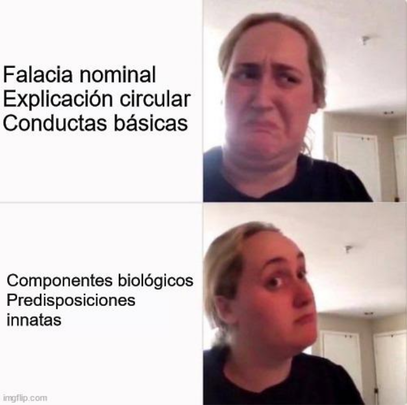
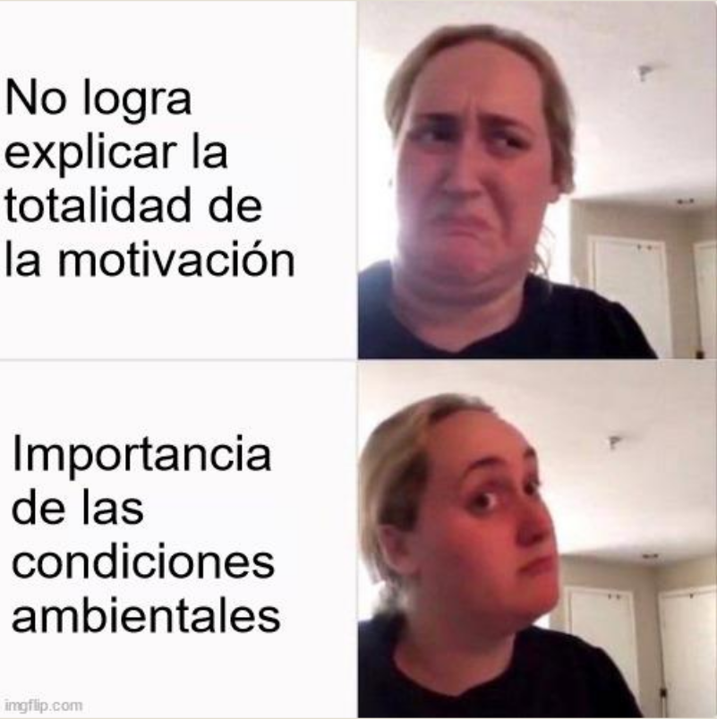
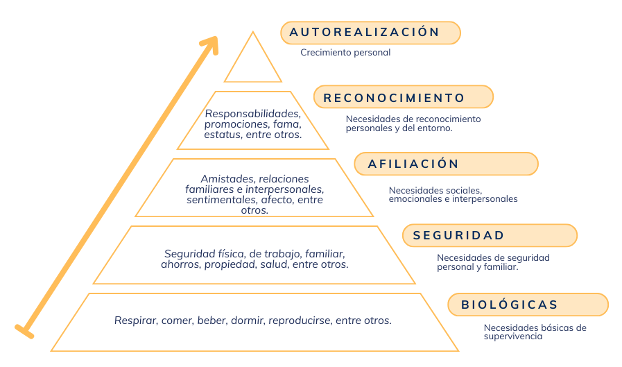
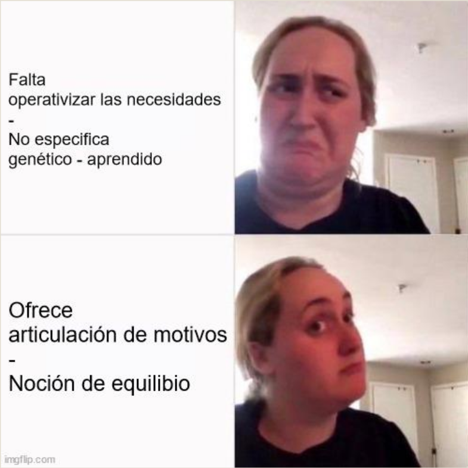
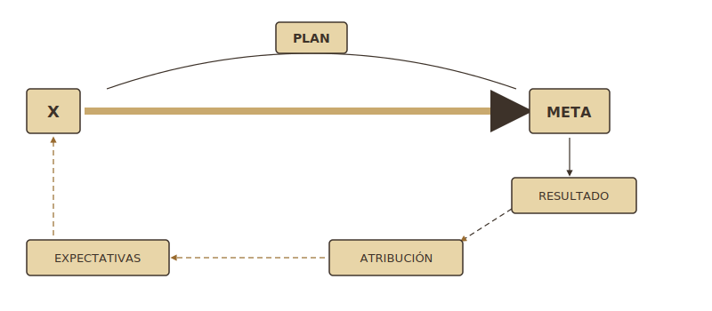

##  {data-background-color="#ffffff"}


<div style="position: absolute; top: 0; right: 0; width: 0; height: 0; border-top: 550px solid #3d3229; border-left: 500px solid transparent; z-index: 0;"></div>


<div style="position: relative; z-index: 1; display: flex; flex-direction: column; justify-content: center; height: 75vh; padding-left: 1em;">

[Historia]{style="color: #c9a96e; font-size: 0.55em; font-weight: 300; letter-spacing: 0.2em; text-transform: uppercase;"}

[Pequeñas y]{style="color: #3d3229; font-size: 1.4em; font-weight: 700; font-family: 'Libre Baskerville', serif; line-height: 1.2; display: block;"}
[Grandes teorías]{style="color: #3d3229; font-size: 1.4em; font-weight: 700; font-family: 'Libre Baskerville', serif; line-height: 1.2; display: block;"}

<br>

[Clase 2 · ]{style="color: #a09585; font-size: 0.5em;"}
[Dr. Fernando Tonini]{style="color: #a09585; font-size: 0.5em;"}

</div>

## Tres perspectivas

| Perspectiva | Foco | Ejemplos |
|------------------------|------------------------|------------------------|
| **Biológica** | Bases biológicas de la conducta motivada | Teoría del instinto |
| **Conductual** | Relación entre motivación y aprendizaje | Impulso, incentivo, refuerzo |
| **Cognitiva** | Actuar propositivamente para conseguir metas anticipadas | Procesamiento de la información |

## Grandes teorías vs. miniteorías

::::: columns
::: {.column width="50%"}
[**Grandes teorías**]{.accent}

Intentan explicar **toda** la motivación a partir de un concepto causal único.

-   Voluntad
-   Instinto
-   Impulso
:::

::: {.column width="50%"}
[**Miniteorías**]{.accent}

Explican **algunos** comportamientos motivados, no toda la conducta motivada.

-   Logro
-   Atribución
-   Disonancia cognitiva
-   Expectativa × Valor
-   Indefensión aprendida
:::
:::::

<!-- ═══════════════════════════════════════ -->

<!-- GRANDES TEORÍAS                        -->

<!-- ═══════════════════════════════════════ -->

##  {data-background-color="#ffffff"}

:::::: {style="display: flex; align-items: center; height: 70vh; padding-left: 0.5em;"}
<div>

::: {style="color: #c9a96e; font-size: 0.45em; letter-spacing: 0.2em; font-weight: 300; text-transform: uppercase; margin-bottom: 0.5em;"}
Grandes teorías
:::

::: {style="color: #3d3229; font-size: 1.4em; font-family: 'Libre Baskerville', serif; font-weight: 700; line-height: 1.3; border-left: 4px solid #c9a96e; padding-left: 0.5em;"}
La voluntad, el instinto<br>y el impulso
:::

</div>
::::::

## Primera gran teoría: la voluntad {.smaller}

**Descartes (Siglo XVII)**: la motivación reside en la voluntad que controla las pasiones.

-   La voluntad iniciaba y dirigía la acción; elegía si actuaba y qué hacer en el momento del acto.
-   Las necesidades corporales, las pasiones, los placeres y los dolores creaban impulsos a la acción, pero estos solo excitaban a la voluntad.
-   La voluntad era una facultad (poder) de la mente que controlaba los apetitos y pasiones corporales en beneficio de la virtud.

::: fragment
**Problemas**: dificultad para explicar qué es la voluntad y, por tanto, qué es la motivación.
:::

## Segunda gran teoría: el instinto

**Darwin (Siglo XIX)**: la motivación reside en el instinto.

::: fragment
Instintos genéticamente heredados llevan a actuar de modos específicos y le dan la **fuerza** a la motivación.
:::

::: fragment
[**Instintos**]{.accent}: conjunto de respuestas genéticamente programadas para que ocurran cuando las circunstancias son apropiadas, sin requerir aprendizaje previo.
:::

## Teorías del instinto

::::: columns
::: {.column width="50%"}
**James (1890)**

-   20 instintos físicos (succión, locomoción)
-   17 instintos mentales (imitación, sociabilidad)
-   El instinto se activa ante el estímulo pertinente
-   Siempre genera una acción específica
:::

::: {.column width="50%"}
**McDougall (1908)**

-   Toda conducta es básicamente instintiva (motores primarios)
-   Instinto como tendencia general
-   Combinación de instintos (ej. patriotismo)
:::
:::::

## Críticas y aportes del instinto

{fig-align="center" width="45%"}

## Tercera gran teoría: pulsión / impulso

Función del comportamiento: **satisfacer necesidades corporales**.

-   Freud (1915)
-   Hull (1943)

```{mermaid}
%%{init: {'theme':'base', 'themeVariables': {'primaryColor': '#e8d5a8', 'primaryBorderColor': '#3d3229', 'primaryTextColor': '#3d3229', 'lineColor': '#3d3229', 'fontSize': '20px'}}}%%
flowchart LR
  A[Necesidad] --> B[Energía] --> C[Impulso] --> D[Conducta] --> E[Reducción del impulso]
```

::: fragment
[**Impulso**]{.accent}: fuerza que actúa en el organismo para originar una conducta.
:::

## Hull (1943; 1952) {.smaller}

-   **Impulso**: fuente de energía compuesta por todas las perturbaciones corporales actuales (base puramente fisiológica).
-   La motivación podía predecirse a partir de condiciones ambientales antecedentes.
-   Impulso como función monótona creciente de la necesidad corporal total.

::: fragment
Impulsos básicos: hambre, sexo, sed, regulación de temperatura, descanso, cuidado de hijos, evitación del dolor.

-   **Impulso** → energía de la conducta
-   **Hábito** → dirección de la conducta (surge del aprendizaje por reforzamiento)
:::

## Hull: dos modelos

::::: columns
::: {.column width="50%"}
[**Modelo 1**]{.accent}

**E = H × D**

-   **E**: fuerza de la conducta
-   **H**: fuerza del hábito (*habit*)
-   **D**: impulso (*drive*)
:::

::: {.column width="50%"}
[**Modelo 2**]{.accent}

**E = H × D × K**

-   **E**: fuerza de la conducta
-   **H**: fuerza del hábito (*habit*)
-   **D**: impulso (*drive*)
-   **K**: incentivo
:::
:::::

## Críticas y aportes del impulso

{fig-align="center" width="45%"}

<!-- ═══════════════════════════════════════ -->

<!-- MODELO HUMANISTA                       -->

<!-- ═══════════════════════════════════════ -->

##  {data-background-color="#ffffff"}

:::::: {style="display: flex; align-items: center; height: 70vh; padding-left: 0.5em;"}
<div>

::: {style="color: #c9a96e; font-size: 0.45em; letter-spacing: 0.2em; font-weight: 300; text-transform: uppercase; margin-bottom: 0.5em;"}
Modelo humanista
:::

::: {style="color: #3d3229; font-size: 1.4em; font-family: 'Libre Baskerville', serif; font-weight: 700; line-height: 1.3; border-left: 4px solid #c9a96e; padding-left: 0.5em;"}
Necesidades y<br>autorrealización
:::

</div>
::::::

## Modelo humanista

Concepción positiva: **Motivos = Necesidades** (desarrollo del yo).

Criterio de referencia: necesidad como estado deseado.

::: fragment
-   **Rogers (1951)**: necesidades fundamentales de aceptación de los demás y de uno mismo.
-   **Maslow (1955, 1971)**: jerarquía de necesidades.
:::

## Maslow: jerarquía de necesidades

<br> <br>

```{mermaid}
%%{init: {'theme':'base', 'themeVariables': {'primaryColor': '#e8d5a8', 'primaryBorderColor': '#3d3229', 'primaryTextColor': '#3d3229', 'lineColor': '#3d3229', 'fontSize': '20px'}}}%%
flowchart LR
  A[Necesidad] --> B[Tensión] --> C[Conducta]
  C --> D[Éxito] --> E[Alivio Tensión]
  C --> F[Fracaso] --> G[Persiste Tensión]
  G -.-> C
```

## Maslow: jerarquía de necesidades

{fig-align="center"}

## Supuestos básicos de Maslow {.smaller}

::: incremental
-   A. Necesidades organizadas **jerárquicamente**
-   B. Necesidades de **déficit** y necesidades de **crecimiento**
-   C. Necesidad satisfecha **no motiva**
-   D. Varias motivaciones **simultáneas**
-   E. [**Hipótesis progresiva de la satisfacción**]{.accent}
-   F. Necesidades superiores se satisfacen de modo más diverso que las inferiores
:::

## Críticas y aportes de Maslow

{fig-align="center" width="45%"}

<!-- ═══════════════════════════════════════ -->

<!-- MINITEORÍAS                            -->

<!-- ═══════════════════════════════════════ -->

##  {data-background-color="#ffffff"}

:::::: {style="display: flex; align-items: center; height: 70vh; padding-left: 0.5em;"}
<div>

::: {style="color: #c9a96e; font-size: 0.45em; letter-spacing: 0.2em; font-weight: 300; text-transform: uppercase; margin-bottom: 0.5em;"}
Miniteorías
:::

::: {style="color: #3d3229; font-size: 1.4em; font-family: 'Libre Baskerville', serif; font-weight: 700; line-height: 1.3; border-left: 4px solid #c9a96e; padding-left: 0.5em;"}
De la motivación
:::

</div>
::::::

## Miniteorías de la motivación {.smaller}

{fig-align="center"}

## Miniteorías de la motivación {.smaller}

Explican algunos comportamientos motivados, no toda la conducta motivada en general.

-   Teoría de la motivación de **logro** (Atkinson, 1964)
-   Teoría de la **atribución** (Weiner, 1972)
-   Teoría de la **disonancia cognitiva** (Festinger, 1957)
-   Teoría **expectativa × valor** (Vroom, 1964)
-   Teoría de la **indefensión aprendida** (Seligman, 1975)

::: fragment
Surgen de: la naturaleza activa de la persona, la revolución cognitiva y la aplicación social.
:::

## Disonancia cognitiva (Festinger) {.smaller}

La conducta se orienta a **minimizar la inconsistencia** interna entre relaciones interpersonales, cogniciones, creencias, sentimientos y acciones.


```{mermaid}
%%{init: {'theme':'base', 'themeVariables': {'primaryColor': '#e8d5a8', 'primaryBorderColor': '#3d3229', 'primaryTextColor': '#3d3229', 'lineColor': '#3d3229', 'fontSize': '20px'}}}%%
flowchart LR
  A[Creencias contradictorias] --> B[Tensión psicológica] --> C[Motivación] --> D[Conducta] --> E[Reducción de tensión]
```


::: fragment
Soluciones posibles:

-   Añadir nuevas cogniciones o cambiar las existentes
-   Buscar información consistente con cogniciones existentes
-   Evitar información inconsistente con cogniciones existentes
:::

## Teoría de la atribución {.smaller}

Los juicios y cogniciones al comprender y explicar acciones ejercen **poderosa influencia** sobre las acciones (funciones motivacionales).

-   El sujeto asigna causas a su conducta y a la de los demás
-   La asignación de causas sigue reglas (no es aleatoria)
-   Las causas atribuidas pueden desencadenar otras conductas
-   Función: necesidad de **controlar el ambiente**


## Atribución: modelo de Weiner {.smaller}

<br> <br>

<table style="font-size:0.7em; border-collapse:collapse; width:100%;">
  <tr>
    <td colspan="2" rowspan="2" style="border:none;"></td>
    <td colspan="4" style="text-align:center; font-weight:bold; border:1px solid #3d3229; padding:10px;">Controlabilidad</td>
  </tr>
  <tr>
    <td colspan="2" style="text-align:center; border:1px solid #3d3229; padding:8px;">Controlable</td>
    <td colspan="2" style="text-align:center; border:1px solid #3d3229; padding:8px;">Incontrolable</td>
  </tr>
  <tr>
    <td colspan="2" style="font-weight:bold; border:1px solid #3d3229; padding:8px;">Estabilidad</td>
    <td style="text-align:center; font-style:italic; border:1px solid #3d3229; padding:8px;">Estable</td>
    <td style="text-align:center; font-style:italic; border:1px solid #3d3229; padding:8px;">Inestable</td>
    <td style="text-align:center; font-style:italic; border:1px solid #3d3229; padding:8px;">Estable</td>
    <td style="text-align:center; font-style:italic; border:1px solid #3d3229; padding:8px;">Inestable</td>
  </tr>
  <tr>
    <td rowspan="2" style="font-weight:bold; border:1px solid #3d3229; padding:8px;">Locus de<br>control</td>
    <td style="font-style:italic; border:1px solid #3d3229; padding:8px;">Interno</td>
    <td style="border:1px solid #3d3229; padding:8px;">Esfuerzo habitual del sujeto</td>
    <td style="border:1px solid #3d3229; padding:8px;">Esfuerzo extra del sujeto</td>
    <td style="border:1px solid #3d3229; padding:8px;">Habilidad del sujeto</td>
    <td style="border:1px solid #3d3229; padding:8px;">Fatiga, suerte del sujeto</td>
  </tr>
  <tr>
    <td style="font-style:italic; border:1px solid #3d3229; padding:8px;">Externo</td>
    <td style="border:1px solid #3d3229; padding:8px;">Esfuerzo habitual de otros</td>
    <td style="border:1px solid #3d3229; padding:8px;">Esfuerzo extra de otros</td>
    <td style="border:1px solid #3d3229; padding:8px;">Habilidad habitual de otros</td>
    <td style="border:1px solid #3d3229; padding:8px;">Fatiga, suerte de los otros</td>
  </tr>
</table>

<br> <br>

::: fragment
El tipo de atribución será el factor principal que explique la dedicación y el rendimiento posterior en tareas similares.
:::

<!-- ═══════════════════════════════════════ -->

<!-- MODELO COGNITIVO                       -->

<!-- ═══════════════════════════════════════ -->

##  {data-background-color="#ffffff"}

:::::: {style="display: flex; align-items: center; height: 70vh; padding-left: 0.5em;"}
<div>

::: {style="color: #c9a96e; font-size: 0.45em; letter-spacing: 0.2em; font-weight: 300; text-transform: uppercase; margin-bottom: 0.5em;"}
Perspectiva actual
:::

::: {style="color: #3d3229; font-size: 1.4em; font-family: 'Libre Baskerville', serif; font-weight: 700; line-height: 1.3; border-left: 4px solid #c9a96e; padding-left: 0.5em;"}
Modelo cognitivo
:::

</div>
::::::

## Modelo cognitivo {.smaller}

[**Motivación**]{.accent}: conjunto de pautas para la acción, emocionalmente cargadas, que anticipan la consecución de un objetivo o meta.

::: fragment
El proceso motivacional incluye todos los factores **cognitivos y afectivos** que influyen en la elección, iniciación, dirección, magnitud y calidad de una acción que persigue un fin.
:::

::: fragment
Componentes del proceso:

**X** (sujeto) → con un **PLAN** → hacia una **META** → produce un **RESULTADO** → genera una **ATRIBUCIÓN** → modifica las **EXPECTATIVAS** → nuevo ciclo
:::

## Esquema Modelo cognitivo {.smaller}


{fig-align="center"}

## Meta {.smaller}

Desencadenante de la conducta motivada, núcleo imprescindible. Representación del sujeto sobre lo que le gustaría que sucediera (o no).

Influye en la conducta a partir de 4 mecanismos:

::: incremental
1.  **Dirigir** la atención
2.  **Movilizar** esfuerzo para la tarea
3.  **Persistir** en la tarea
4.  **Facilitar** estrategias a desarrollar
:::

::: fragment
Las metas varían en: contenido (globales/específicas), nivel de conciencia (implícitas/explícitas) y grado de dificultad.
:::

## Plan

[**Conocimiento declarativo**]{.accent}: descripción de procedimiento para alcanzar la meta.

Representación sobre las acciones que permiten reducir la distancia entre **estado actual** y **estado ideal** (meta).

::: fragment
**Estado inicial** ══════▶ **PLAN** ══════▶ **Estado final**

Es fundamental tener una descripción adecuada del plan. El desconocimiento y la representación inadecuada influyen negativamente en el proceso motivacional.
:::

## Expectativas {.smaller}

Percepción subjetiva (creencia) relacionada con la consecución de la meta.

Probabilidad de éxito depende de: dificultad de la meta, plan de acción, autoconfianza y autoeficacia.

::: fragment
**Bandura (1977)**:

-   [**Expectativas de eficacia**]{.accent}: creencia de reunir condiciones para alcanzar la meta.
-   [**Expectativas de resultado**]{.accent}: creencia de que una conducta conducirá a consecuencias determinadas.
:::

## Atribución (en el modelo cognitivo)

Una vez terminada la acción, se buscan explicaciones sobre las causas de los resultados: [**atribución causal**]{.accent}.

::: fragment
**Weiner (1972)**: controlable/incontrolable · interno/externo · estable/inestable.

El tipo de atribución va a ser el factor principal de explicación de la dedicación y rendimiento posterior en tareas similares.
:::

## Dinamismo motivacional {.smaller}

Tres ejes del dinamismo motivacional:

::: incremental
1.  **Aproximación – evitación**
2.  **Intrínseca – extrínseca**
3.  **Profunda (implícita) – superficial (autoatribuida)**:
    -   *Esquemas profundos*: internalizados, metas genéricas, actividades básicas, poco conscientes. Ej. motivo de logro.
    -   *Esquemas superficiales*: planeamiento consciente de intereses concretos, determinados por la situación. Ej. estudiar para un examen particular.
:::

<!-- ═══════════════════════════════════════ -->

<!-- MOTIVACIÓN INTRÍNSECA / EXTRÍNSECA     -->

<!-- ═══════════════════════════════════════ -->

##  {data-background-color="#ffffff"}

:::::: {style="display: flex; align-items: center; height: 70vh; padding-left: 0.5em;"}
<div>

::: {style="color: #c9a96e; font-size: 0.45em; letter-spacing: 0.2em; font-weight: 300; text-transform: uppercase; margin-bottom: 0.5em;"}
Tipos de motivación
:::

::: {style="color: #3d3229; font-size: 1.4em; font-family: 'Libre Baskerville', serif; font-weight: 700; line-height: 1.3; border-left: 4px solid #c9a96e; padding-left: 0.5em;"}
Motivación intrínseca<br>y extrínseca
:::

</div>
::::::

## Intrínseca vs. extrínseca

::::: columns
::: {.column width="50%"}
[**Motivación intrínseca**]{.accent}

Lo que interesa es la **propia actividad**, que es un fin en sí misma y no un medio para otras metas.
:::

::: {.column width="50%"}
[**Motivación extrínseca**]{.accent}

Se realiza una actividad que está **regulada por aspectos externos** a la actividad misma (ej. beneficio tangible).
:::
:::::

## Componentes de la motivación intrínseca {.smaller}

::: incremental
-   [**Autodeterminación**]{.accent}: sensación de que uno es responsable de sus acciones. Control sobre la acción + autonomía para elegir.
-   [**Sentimiento de competencia (autoeficacia)**]{.accent}: percepción de competencia (más que competencia en sí). Depende de resultados pasados y de la valoración de los demás.
-   [**Reto óptimo**]{.accent}: equilibrio entre habilidades y nivel de dificultad de la tarea. Modelo de flujo (Csikszentmihalyi, 1975, 1990).
-   [**Curiosidad**]{.accent}: incertidumbre e incongruencia moderadas generan curiosidad. Excesiva novedad genera miedo y ansiedad.
:::

## Componentes de la motivación extrínseca {.smaller}

[**Recompensa**]{.accent}: tangible o simbólica.

::: fragment
**Recompensa útil**: cuando el interés intrínseco inicial es bajo, la recompensa sirve de camino para que el sujeto se vaya formando intereses.
:::

::: fragment
[**Efecto socavador de la recompensa**]{.accent}:

-   Recompensa predecible genera expectativa → más concentración en anticipar el refuerzo que en la actividad misma.
-   La recompensa denota regulación externa. Si cambia el locus de causalidad, se modifica el sentimiento de competencia y la autodeterminación.
:::

::: fragment
La recompensa **informativa** y la recompensa **simbólica** (elogio) no generan este efecto.
:::

##  {data-background-color="#ffffff"}

<div style="display: flex; align-items: center; height: 70vh; padding-left: 0.5em;">
<div>
<div style="color: #c9a96e; font-size: 0.45em; letter-spacing: 0.2em; font-weight: 300; text-transform: uppercase; margin-bottom: 0.5em;">Muchas gracias!!</div>
<div style="color: #3d3229; font-size: 1.4em; font-family: 'Libre Baskerville', serif; font-weight: 700; line-height: 1.3; border-left: 4px solid #c9a96e; padding-left: 0.5em;">Clase siguiente: Más teorías del a motivación ¿Aproximación o evitación?</div>
</div>
</div>
