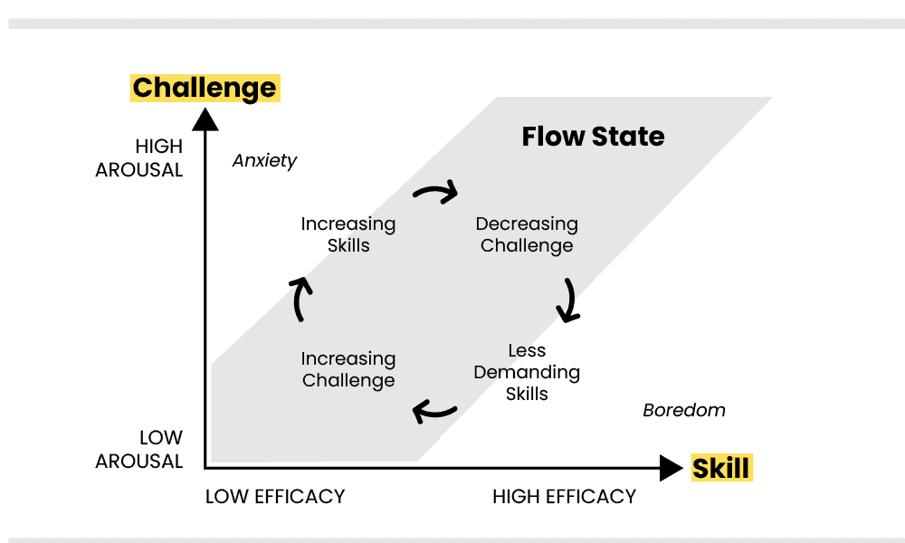

##  {data-background-color="#ffffff"}


<div style="position: absolute; top: 0; right: 0; width: 0; height: 0; border-top: 550px solid #3d3229; border-left: 500px solid transparent; z-index: 0;"></div>


<div style="position: relative; z-index: 1; display: flex; flex-direction: column; justify-content: center; height: 75vh; padding-left: 1em;">

[Procesos básicos]{style="color: #c9a96e; font-size: 0.55em; font-weight: 300; letter-spacing: 0.2em; text-transform: uppercase;"}

[Proceso Motivacional -]{style="color: #3d3229; font-size: 1.4em; font-weight: 700; font-family: 'Libre Baskerville', serif; line-height: 1.2; display: block;"}
[Motivación Intrínseca y]{style="color: #3d3229; font-size: 1.4em; font-weight: 700; font-family: 'Libre Baskerville', serif; line-height: 1.2; display: block;"}
[Extrínseca]{style="color: #3d3229; font-size: 1.4em; font-weight: 700; font-family: 'Libre Baskerville', serif; line-height: 1.2; display: block;"}


<br>

[Clase 3 · ]{style="color: #a09585; font-size: 0.5em;"}
[Dr. Fernando Tonini]{style="color: #a09585; font-size: 0.5em;"}

</div>

<!-- ═══════════════════════════════════════ -->
<!-- ÍNDICE                                 -->
<!-- ═══════════════════════════════════════ -->

## Índice

<div class="cols-2" style="margin-top: 0.8em;">

<div>

<div class="tarjeta">
<h4>Atribución, Disonancia e Impulso</h4>
Weiner · Festinger · Hull
</div>

<div class="tarjeta" style="margin-top: 0.6em;">
<h4>Asunción de riesgos</h4>
Atkinson
</div>

</div>

<div>

<div class="tarjeta">
<h4>Valencia y Expectativas</h4>
Dweck
</div>

<div class="tarjeta" style="margin-top: 0.6em;">
<h4>Intrínseco vs. Extrínseco</h4>
Deci y Ryan
</div>

</div>

</div>

<!-- ═══════════════════════════════════════ -->
<!-- TRANSICIÓN: WEINER & FESTINGER         -->
<!-- ═══════════════════════════════════════ -->


##  {data-background-color="#ffffff"}

:::::: {style="display: flex; align-items: center; height: 70vh; padding-left: 0.5em;"}
<div>

::: {style="color: #c9a96e; font-size: 0.45em; letter-spacing: 0.2em; font-weight: 300; text-transform: uppercase; margin-bottom: 0.5em;"}
PARTE I
:::

::: {style="color: #3d3229; font-size: 1.4em; font-family: 'Libre Baskerville', serif; font-weight: 700; line-height: 1.3; border-left: 4px solid #c9a96e; padding-left: 0.5em;"}
Weiner · Festinger · Hull
:::

</div>
::::::

<!-- ═══════════════════════════════════════ -->
<!-- WEINER - NOTA GENERAL                  -->
<!-- ═══════════════════════════════════════ -->

## Weiner — Aclaración inicial


El objetivo de la **atribución** es explicar aquello que hice / hicieron los demás. No explica el posible estado afectivo que surge a la par de la atribución.


<br>

::: {.fragment}
> La atribución es un proceso cognitivo de búsqueda de causas, **no** una teoría de las emociones.
:::

<!-- ═══════════════════════════════════════ -->
<!-- WEINER - BÚSQUEDA DE CAUSACIÓN         -->
<!-- ═══════════════════════════════════════ -->

## Weiner — Búsqueda de causación

Las personas tienden a buscar causas para entender por qué ocurren los eventos, especialmente si los resultados son **negativos o inesperados**.

::: {.incremental}
- Este fenómeno se observa de manera repetida y consistente
- Se considera una **respuesta natural y espontánea** del proceso cognitivo
- No requiere instrucción — ocurre automáticamente
:::

<!-- ═══════════════════════════════════════ -->
<!-- WEINER - DIMENSIONES CAUSALES          -->
<!-- ═══════════════════════════════════════ -->

## Weiner — Dimensiones causales

Las causas identificadas se clasifican en tres dimensiones:

<div class="cols-3" style="margin-top: 0.7em;">

<div class="tarjeta">
<h4>Locus</h4>
Interno o externo al sujeto
</div>

<div class="tarjeta">
<h4>Estabilidad</h4>
Duradera o temporal
</div>

<div class="tarjeta">
<h4>Controlabilidad</h4>
Controlable o no por el sujeto
</div>

</div>

::: {.fragment}
<div class="caja-dorada" style="margin-top: 0.7em;">
Estas dimensiones permiten **comparar causas** y predecir cómo las personas se sentirán y actuarán en función de sus percepciones.
</div>
:::

<!-- ═══════════════════════════════════════ -->
<!-- WEINER - EMOCIONES                     -->
<!-- ═══════════════════════════════════════ -->

## Weiner — Dimensiones causales y emociones

::: {.incremental}
- **Orgullo** → atribución interna del éxito (locus interno)
- **Desesperanza** → fracaso atribuido a causa estable e incontrolable
- **Vergüenza** → fracaso con locus interno y controlable
- **Ira** → fracaso atribuido a causa externa controlable por otro
:::

::: {.fragment}
<div class="caja-dorada">
Weiner considera estos hallazgos **"altamente replicables"** en nuestra disciplina. Se pudo observar estos mecanismo en múltiples estudios, con consistencia independiente del contexto o la población.
</div>
:::

## Cómo se estudia? Ej. Stupnisky et al. (2018) 

<div class="caja-dorada">
Pregunta central: cuando los estudiantes universitarios tienen problemas tecnológicos en contextos académicos... ¿Cómo las atribuciones que hacen sobre esos problemas afectan sus emociones?
</div>

::: {.incremental}
- Marco teórico: Teoría de la atribución de Weiner (2010)
- Dos estudios con estudiantes universitarios 
- N total = 559 (universidades tradicionales y en línea)
- Emociones medidas: esperanza, culpa, desesperanza, orgullo, vergüenza, ansiedad, aburrimiento
:::

## Stupnisky et al. (2018) — Diseño

<div class="cols-2">

<div class="tarjeta">
<h4>Estudio 1</h4>
Escenarios hipotéticos de problemas tecnológicos. Se manipuló si el problema era **esperado o inesperado** y si era de **alta o baja importancia**. Muestra: estudiantes de universidad tradicional.
</div>

<div class="tarjeta">
<h4>Estudio 2</h4>
Manipulación experimental directa. Comparó estudiantes de universidad **tradicional vs. en línea**. Problemas menores vs. mayores con distinto grado de controlabilidad percibida.
</div>

</div>


## Stupnisky et al. (2018) — Resultados principales

| Atribución | Emoción resultante | Adaptativa |
|---|---|---|
| Estable + externa | Desesperanza, aburrimiento, culpa | ✗ |
| Estable (problema inesperado) | Ansiedad (estudiantes tradicionales) | ✗ |
| Externa + controlable (problema menor) | Esperanza, menos ansiedad | ✓ |
| Inestable | Mayor expectativa de éxito futuro | ✓ |

::: {.fragment}
<div class="caja-dorada">
El efecto negativo de las atribuciones **estables** se replicó en ambos estudios. Los efectos de la controlabilidad fueron más mixtos.
</div>
:::

## Emociones ante problemas tecnológicos académicos

```{r}
library(haven)
library(dplyr)
library(tidyr)
library(ggplot2)

# Leer y estandarizar nombres
s1_trad   <- read_sav("datos/Study_1_Traditional_Students.sav") |> rename_with(tolower)
s1_online <- read_sav("datos/Study_1_Online_Students.sav")      |> rename_with(tolower)
s2_trad   <- read_sav("datos/Study_2_Traditional_Students.sav") |> rename_with(tolower)
s2_online <- read_sav("datos/Study_2_Online_Students.sav")      |> rename_with(tolower)

emo_vars <- c("emo_1","emo_2","emo_3","emo_4","emo_7","emo_10","emo_11","emo_13")
emo_labels <- c("Esperanza","Culpa","Desesperanza","Orgullo",
                "Vergüenza","Aburrimiento","Ansiedad","Disfrute")

# Combinar
df <- bind_rows(
  s1_trad   |> mutate(grupo = "S1 Tradicional"),
  s1_online |> mutate(grupo = "S1 Online"),
  s2_trad   |> mutate(grupo = "S2 Tradicional"),
  s2_online |> mutate(grupo = "S2 Online")
) |> select(grupo, all_of(emo_vars))

# Calcular medias por grupo
medias <- df |>
  group_by(grupo) |>
  summarise(across(all_of(emo_vars), \(x) mean(as.numeric(x), na.rm = TRUE))) |>
  pivot_longer(-grupo, names_to = "var", values_to = "media") |>
  mutate(emocion = emo_labels[match(var, emo_vars)])

# Gráfico
ggplot(medias, aes(x = emocion, y = media, fill = grupo)) +
  geom_col(position = "dodge", width = 0.7) +
  scale_fill_manual(values = c(
    "S1 Tradicional" = "#3d3229",
    "S1 Online"      = "#c9a96e",
    "S2 Tradicional" = "#6b7c45",
    "S2 Online"      = "#a09585"
  )) +
  labs(
    x        = NULL,
    y        = "Media (1–10)",
    fill     = "Grupo"
  ) +
  theme_minimal(base_size = 13) +
  theme(
    axis.text.x      = element_text(angle = 30, hjust = 1),
    plot.title       = element_text(face = "bold"),
    legend.position  = "bottom"
  )
```


## Stupnisky et al. (2018) — ¿Qué confirma de Weiner?

::: {.incremental}
- Las atribuciones **estables** predicen emociones negativas (desesperanza, ansiedad) → replicación directa
- Los problemas **inesperados** generan mayor búsqueda causal → consistente con la teoría
- Las atribuciones **internas y controlables** se asocian a emociones activadoras (culpa → esperanza) → tal como predice Weiner
:::

::: {.fragment}
<div class="caja-dorada">
Lo novedoso: este mecanismo funciona incluso en un dominio que Weiner no estudió (las dificultades tecnológicas académicas). La estructura atribución → emoción se generaliza.
</div>
:::

## Stupnisky et al. (2018) — El hallazgo inesperado

Para estudiantes **en línea**, las atribuciones **externas** ante problemas menores fueron emocionalmente *beneficiosas* (más esperanza, menos ansiedad).

<br>


¿Por qué? En entornos virtuales, los problemas tecnológicos son percibidos como algo del sistema, no del estudiante. Atribuirlos afuera **protege la autoestima** ante la desesperanza, porque el problema se ve como algo que se puede resolver.


::: {.fragment}
> Esto matiza la teoría de Weiner: no siempre las atribuciones externas son maladaptativas.
:::

## Stupnisky et al. (2018) — Para pensar

<div class="cols-2">

<div class="tarjeta">
<h4>Implicancia práctica</h4>
Si un estudiante cree que sus problemas tecnológicos se deben a su falta de habilidad (interno, estable, incontrolable) → desesperanza. La intervención no es "aprendé a usar la tecnología" sino **trabajar la atribución**.
</div>

<div class="tarjeta">
<h4>Límite del estudio</h4>
Muestra norteamericana, mayormente escenarios hipotéticos. ¿Se replica en contextos latinoamericanos donde la brecha digital y la relación con la tecnología son distintas?
</div>

</div>

::: {.fragment}
<div class="caja-dorada" style="margin-top: 0.6em;">
**Referencia:** Maymon, R., Hall, N. C., Goetz, T., Chiarella, A., & Rahimi, S. (2018). Technology, attributions, and emotions in post-secondary education. *PLOS ONE, 13*(3), e0193443.
</div>
:::


<!-- ═══════════════════════════════════════ -->
<!-- FESTINGER                              -->
<!-- ═══════════════════════════════════════ -->

## Festinger — Disonancia cognitiva

La **magnitud de la disonancia** depende de las características de los elementos disonantes.

<div class="cols-2" style="margin-top: 0.7em;">

<div class="tarjeta">
<h4>Poca magnitud</h4>
Creer que la limpieza es necesaria, pero no levantar un papel de la calle y tirarlo a la basura.
</div>

<div class="tarjeta">
<h4>Gran magnitud</h4>
Ir con mala preparación a un examen importante para la carrera.
</div>

</div>

::: {.fragment}
> A mayor magnitud de disonancia, mayor motivación para reducirla.
:::

<!-- ═══════════════════════════════════════ -->
<!-- HULL                                   -->
<!-- ═══════════════════════════════════════ -->

## Hull — Teoría del impulso

El gran debate entre **Hull y Tolman** sobre qué impulsa la conducta.

::: {.incremental}
- Hull: la conducta es función del **impulso biológico** (drive) y los hábitos aprendidos
- Tolman: la conducta está guiada por **expectativas y mapas cognitivos**
- El debate da origen a una distinción central: motivación como energía vs. motivación como dirección
:::

::: {.fragment}
<div class="caja-dorada">
Ver recursos del debate Hull–Tolman para una discusión detallada del conductismo de la época.
</div>
:::

##  {data-background-color="#ffffff"}

:::::: {style="display: flex; align-items: center; height: 70vh; padding-left: 0.5em;"}
<div>

::: {style="color: #c9a96e; font-size: 0.45em; letter-spacing: 0.2em; font-weight: 300; text-transform: uppercase; margin-bottom: 0.5em;"}
PARTE II
:::

::: {style="color: #3d3229; font-size: 1.4em; font-family: 'Libre Baskerville', serif; font-weight: 700; line-height: 1.3; border-left: 4px solid #c9a96e; padding-left: 0.5em;"}
Atkinson - ¿Aproximación o Evitación?
:::

</div>
::::::

<!-- ═══════════════════════════════════════ -->
<!-- ATKINSON - MODELO GENERAL              -->
<!-- ═══════════════════════════════════════ -->

## Atkinson — Modelo de asunción de riesgo

<div style="display: flex; flex-direction: column; align-items: center; gap: 0.7em; margin-top: 0.5em;">

<div class="formula-box" style="width: 50%;">
$$\text{Conducta} = T_e - T_{ef}$$
</div>

<div style="display: flex; gap: 1.5em; width: 100%; justify-content: center;">
<div class="formula-box" style="flex: 1; max-width: 40%;">
$$T_e = M_e \times P_e \times I_e$$
</div>
<div class="formula-box" style="flex: 1; max-width: 40%;">
$$T_{ef} = M_{ef} \times P_{ef} \times I_{ef}$$
</div>
</div>

</div>

::: {.fragment}
La conducta resultante es la diferencia entre la **tendencia a buscar el éxito** y la **tendencia a evitar el fracaso**.
:::

<!-- ═══════════════════════════════════════ -->
<!-- ATKINSON - ESPERANZA DE ÉXITO          -->
<!-- ═══════════════════════════════════════ -->

## Atkinson — Esperanza de éxito ($T_e$)

<div class="formula-box">
$$T_e = M_e \times P_e \times I_e$$
</div>

<div class="cols-3" style="margin-top: 0.65em;">

<div class="tarjeta">
<h4>$M_e$ — Motivo de éxito</h4>
Disposición general de la personalidad. Se mide con el TAT.
</div>

<div class="tarjeta">
<h4>$P_e$ — Probabilidad subjetiva</h4>
Combinación de la dificultad de la tarea y las habilidades del sujeto.
</div>

<div class="tarjeta">
<h4>$I_e$ — Incentivo</h4>
Valencia de la meta: <br> $I_e = 1 - P_e$
</div>

</div>

<!-- ═══════════════════════════════════════ -->
<!-- ATKINSON - MIEDO AL FRACASO            -->
<!-- ═══════════════════════════════════════ -->

## Atkinson — Miedo al fracaso ($T_{ef}$)

<div class="formula-box">
$$T_{ef} = M_{ef} \times P_{ef} \times I_{ef}$$
</div>

<div class="cols-3" style="margin-top: 0.65em;">

<div class="tarjeta">
<h4>$M_{ef}$ — Motivo evitar fracaso</h4>
Disposición general de la personalidad. Se mide con el TAQ.
</div>

<div class="tarjeta">
<h4>$P_{ef}$ — Probabilidad subjetiva</h4>
$P_{ef} = 1 - P_e = I_e$
</div>

<div class="tarjeta">
<h4>$I_{ef}$ — Incentivo</h4>
Incentivo negativo (vergüenza).
</div>

</div>

<!-- ═══════════════════════════════════════ -->
<!-- ATKINSON - SIMPLIFICANDO               -->
<!-- ═══════════════════════════════════════ -->

## Atkinson — Simplificando

::: {.fragment}
**Punto de partida:** las probabilidades son complementarias

<div class="caja-dorada" style="font-size: 0.8em;">
Si $P_e = 0.7$ → probabilidad de fracasar es $0.3$ → pero $0.3 = I_e = 1 - P_e$  
Por lo tanto: $P_{ef} = I_e$ y $I_{ef} = P_e$
</div>
:::

::: {.fragment}
**Sustituimos** en $T_{ef}$:

$$T_{ef} = M_{ef} \times \color{#c9a96e}{I_e} \times \color{#c9a96e}{P_e}$$
:::

::: {.fragment}
**Ambos términos comparten el mismo factor:**

$$T_e - T_{ef} = (M_e \times \color{#c9a96e}{P_e \times I_e}) - (M_{ef} \times \color{#c9a96e}{P_e \times I_e})$$
:::

## Atkinson — Simplificando

::: {.fragment}
**Factor común afuera:**

<div class="formula-box">
$$Mot = (M_e - M_{ef}) \times (P_e \times I_e)$$
</div>
:::

- Primer término asoc. a características personales

- Segundo término asoc. a factores situacionales

## Atkinson — Calculadora

<iframe src="mot_Calculadora.html" width="100%" height="550px" style="border: none; border-radius: 8px;"></iframe>


<!-- ═══════════════════════════════════════ -->
<!-- ATKINSON - CONSECUENCIAS               -->
<!-- ═══════════════════════════════════════ -->

## Atkinson — Consecuencias

<div class="cols-2">

<div>
**Obtención del éxito**

::: {.incremental}
- *Inmediatas*: orgullo y satisfacción
- *Medio/largo plazo*: aprendizaje y fortalecimiento de estrategias apropiadas
:::
</div>

<div>
**Obtención del fracaso**

::: {.incremental}
- *Inmediatas*: vergüenza y pérdida de confianza
- *Medio/largo plazo*: modificación de estrategias y comportamientos no apropiados
:::
</div>

</div>

<!-- ═══════════════════════════════════════ -->
<!-- TRANSICIÓN: DWECK                      -->
<!-- ═══════════════════════════════════════ -->

##  {data-background-color="#ffffff"}

:::::: {style="display: flex; align-items: center; height: 70vh; padding-left: 0.5em;"}
<div>

::: {style="color: #c9a96e; font-size: 0.45em; letter-spacing: 0.2em; font-weight: 300; text-transform: uppercase; margin-bottom: 0.5em;"}
PARTE III
:::

::: {style="color: #3d3229; font-size: 1.4em; font-family: 'Libre Baskerville', serif; font-weight: 700; line-height: 1.3; border-left: 4px solid #c9a96e; padding-left: 0.5em;"}
Dwek - Metas y Teorías implícitas
:::

</div>
::::::

<!-- ═══════════════════════════════════════ -->
<!-- DWECK - TEORÍAS IMPLÍCITAS             -->
<!-- ═══════════════════════════════════════ -->

## Dweck — Teorías implícitas

La manera en que las personas piensan sobre sus cualidades personales (inteligencia, personalidad) puede caracterizarse en una de dos formas (Dweck, 1999, 2006):

<div class="cols-2" style="margin-top: 0.7em;">

<div class="tarjeta">
<h4>Teóricos de la entidad</h4>
Ven estas cualidades como **características fijas y duraderas**. No cambian con el esfuerzo.
</div>

<div class="tarjeta">
<h4>Teóricos incrementales</h4>
Ven las cualidades como **características maleables** que se pueden aumentar mediante el esfuerzo.
</div>

</div>

<!-- ═══════════════════════════════════════ -->
<!-- DWECK - PREDICCIÓN DE METAS            -->
<!-- ═══════════════════════════════════════ -->

## Dweck — Predicción de metas

Las teorías implícitas predicen el tipo de meta que las personas elegirán perseguir:

<div class="cols-2" style="margin-top: 0.7em;">

<div class="tarjeta">
<h4>Entidad → Metas de desempeño</h4>
Buscan demostrar que tienen la capacidad. Evitan situaciones donde puedan quedar mal.
</div>

<div class="tarjeta">
<h4>Incremental → Metas de dominio</h4>
Buscan aprender y mejorar. Ven los errores como parte del proceso.
</div>

</div>

<!-- ═══════════════════════════════════════ -->
<!-- DWECK - TABLA CLIMA                    -->
<!-- ═══════════════════════════════════════ -->

## Dweck — Clima de metas

| Dimensión del clima | Meta de dominio | Meta de desempeño |
|---|---|---|
| Éxito definido como | Mejoría, progreso | Calificaciones elevadas |
| Valor dado a | Esfuerzo, aprendizaje | Capacidad normativamente elevada |
| Razones de satisfacción | Trabajo arduo, desafío | Superar a los demás |
| Maestro orientado hacia | La manera en que aprenden | Cómo se desempeñan los alumnos |
| Errores son | Parte del aprendizaje | Provocadores de ansiedad |
| Criterios de evaluación | Progreso absoluto | Normativos |

<!-- ═══════════════════════════════════════ -->
<!-- TRANSICIÓN: DECI Y RYAN                -->
<!-- ═══════════════════════════════════════ -->

##  {data-background-color="#ffffff"}

:::::: {style="display: flex; align-items: center; height: 70vh; padding-left: 0.5em;"}
<div>

::: {style="color: #c9a96e; font-size: 0.45em; letter-spacing: 0.2em; font-weight: 300; text-transform: uppercase; margin-bottom: 0.5em;"}
PARTE IV
:::

::: {style="color: #3d3229; font-size: 1.4em; font-family: 'Libre Baskerville', serif; font-weight: 700; line-height: 1.3; border-left: 4px solid #c9a96e; padding-left: 0.5em;"}
Deci y Ryan - Autodeterminación de la conducta
:::

</div>
::::::

<!-- ═══════════════════════════════════════ -->
<!-- MOTIVACIÓN INTRÍNSECA VS EXTRÍNSECA    -->
<!-- ═══════════════════════════════════════ -->

## Dinamismo motivacional

<div class="cols-2" style="margin-top: 0.6em;">

<div class="caja-oscura">
**MOTIVACIÓN INTRÍNSECA**<br>
<span style="font-weight: 300; font-size: 0.9em;">Lo que interesa es la propia actividad, que es un fin en sí misma y no un medio para otras metas (ej. pasatiempo).</span>
</div>

<div class="caja-dorada">
**MOTIVACIÓN EXTRÍNSECA**<br>
<span style="font-size: 0.9em;">Todo comportamiento que esté regulado por aspectos externos a la actividad misma (ej. beneficio tangible).</span>
</div>

</div>

<!-- ═══════════════════════════════════════ -->
<!-- MOTIVACIÓN INTRÍNSECA - COMPONENTES    -->
<!-- ═══════════════════════════════════════ -->

## Motivación intrínseca — Componentes

<div class="cols-2">

<div>

**Autodeterminación**  
Sensación de ser responsable de las propias acciones. Control + autonomía para elegir circunstancias y contexto.

**Sentimiento de competencia**  
Percepción de competencia (más que competencia en sí). Depende de la interpretación de actos/resultados pasados y de la valoración de los demás.

</div>

<div>

**Reto óptimo**  
Equilibrio entre habilidades y nivel de dificultad de la tarea → *flow* (Csikszentmihalyi, 1975, 1990).

**Curiosidad**  
- Incertidumbre e incongruencia moderadas → curiosidad
- Excesiva novedad → miedo y ansiedad

</div>

</div>

<!-- ═══════════════════════════════════════ -->
<!-- FLOW                                   -->
<!-- ═══════════════════════════════════════ -->

## Motivación intrínseca — Estado de *flow*



::: {.fragment}
<div class="caja-dorada">
El estado de *flow* ocurre cuando la dificultad de la tarea y la habilidad del sujeto están alineadas y en un nivel suficientemente elevado.
</div>
:::

<!-- ═══════════════════════════════════════ -->
<!-- MOTIVACIÓN EXTRÍNSECA - COMPONENTES    -->
<!-- ═══════════════════════════════════════ -->

## Motivación extrínseca — Componentes

**Recompensa**: tangible o simbólica.

::: {.incremental}
- **Recompensa útil**: cuando el interés intrínseco inicial es bajo, la recompensa sirve de camino para que el sujeto se vaya formando intereses propios.
- **Efecto socavador**: la recompensa predecible genera expectativa y desplaza la atención hacia la recompensa en lugar de la actividad misma. Además, señala regulación externa y modifica el sentimiento de competencia y autodeterminación.
:::

::: {.fragment}
<div class="caja-dorada">
La recompensa **informativa** y la **simbólica** (elogio) **no** generan el efecto socavador.
</div>
:::

<!-- ═══════════════════════════════════════ -->
<!-- MOTIVACIÓN EXTRÍNSECA - INCENTIVOS     -->
<!-- ═══════════════════════════════════════ -->

## Motivación extrínseca — Incentivos y reforzadores

**Incentivo**: suceso ambiental que atrae o repele hacia un curso de acción. *Antecede* al comportamiento (S:R).

**Reforzador**: cualquier factor extrínseco que *aumenta* la conducta. Es posterior a ella (R→C).


<div class="formula-box">
$$S_{\text{señal}} : R_{\text{respuesta}} \rightarrow C_{\text{consecuencia}}$$
</div>


## Motivación extrínseca — Incentivos y reforzadores

<div class="cols-2" style="margin-top: 0.5em;">
<div class="tarjeta">
<h4>Consecuencias que aumentan P(conducta)</h4>
- Reforzamiento positivo
- Reforzamiento negativo
</div>

<div class="tarjeta">
<h4>Consecuencias que reducen P(conducta)</h4>
- Castigo
</div>

</div>

::: {.fragment}
> Todos los reforzadores positivos son recompensas, pero no todas las recompensas funcionan como reforzadores.
:::

<!-- ═══════════════════════════════════════ -->
<!-- DECI Y RYAN - TAD                      -->
<!-- ═══════════════════════════════════════ -->


## Deci y Ryan — Teoría de la autodeterminación

| Tipo | Descripción | Autodeterminación |
|---|---|---|
| Regulación externa | Controlada por recompensas y castigos externos | Muy baja |
| Regulación introyectada | Presión internalizada parcialmente (culpa, vergüenza) | Baja |
| Regulación identificada | La persona valora el comportamiento como propio | Media |
| Integración | La regulación se incorpora al self | Alta |


<!-- ═══════════════════════════════════════ -->
<!-- DECI Y RYAN - IMPORTANCIA              -->
<!-- ═══════════════════════════════════════ -->

## Deci y Ryan — Por qué importa

<div class="caja-dorada">
Mientras **más autodeterminada** sea la motivación extrínseca de la persona, mayor será su funcionamiento en términos de desempeño, desarrollo social y bienestar psicológico.
</div>

<br>

::: {.fragment}
El objetivo no es eliminar la motivación extrínseca sino **promover su internalización** hacia formas más autónomas.
:::

## Deci y Ryan — Necesidades psicológicas básicas

<div class="cols-3" style="margin-top: 0.7em;">

<div class="tarjeta">
<h4>Autonomía</h4>
Sentir que uno elige y es el origen de sus propios comportamientos.
</div>

<div class="tarjeta">
<h4>Competencia</h4>
Sentir que uno es capaz de lograr lo que se propone en su entorno.
</div>

<div class="tarjeta">
<h4>Vinculación</h4>
Sentir que pertenece y que es valorado por los demás.
</div>

</div>

::: {.fragment}
<div class="caja-dorada" style="margin-top: 0.7em;">
Si el contexto **frustra** alguna de estas necesidades, la motivación se deteriora independientemente de los reforzadores externos (Deci & Ryan, 2000; Ryan & Deci, 2017).
</div>
:::

## Deci y Ryan — Debate 

<div class="cols-2" style="margin-top: 0.6em;">
<div>

<div class="tarjeta" style="margin-top: 0.5em;">
<h4>Cameron & Pierce (1994)</h4>
Argumentan que el efecto socavador desaparece cuando se controla el tipo de recompensa y la complejidad de la tarea.
</div>

<div class="tarjeta">
<h4>Deci, Koestner & Ryan (1999)</h4>
Metaanálisis de 128 estudios. Las recompensas tangibles reducen consistentemente la motivación intrínseca, especialmente cuando son esperadas y no contingentes al desempeño.
</div>

</div>
<div>

::: {.fragment}
**Aplicación educativa**

<div class="caja-dorada" style="margin-top: 0.5em;">
Contextos que apoyan la autonomía (ej. dar opciones, explicar el *porqué* de las tareas, evitar el control excesivo). Esto predice mayor motivación intrínseca, mejor aprendizaje y menor abandono (Reeve, 2009; Ryan & Deci, 2020).
</div>
:::

</div>
</div>

##  {data-background-color="#ffffff"}

<div style="display: flex; align-items: center; height: 70vh; padding-left: 0.5em;">
<div>
<div style="color: #c9a96e; font-size: 0.45em; letter-spacing: 0.2em; font-weight: 300; text-transform: uppercase; margin-bottom: 0.5em;">Muchas gracias!!</div>
<div style="color: #3d3229; font-size: 1.4em; font-family: 'Libre Baskerville', serif; font-weight: 700; line-height: 1.3; border-left: 4px solid #c9a96e; padding-left: 0.5em;">Clase siguiente: Motivos biológicos y sociales</div>
</div>
</div>
