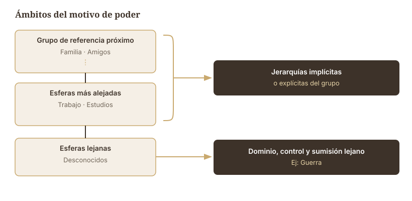

##  {data-background-color="#ffffff"}


<div style="position: absolute; top: 0; right: 0; width: 0; height: 0; border-top: 550px solid #3d3229; border-left: 500px solid transparent; z-index: 0;"></div>


<div style="position: relative; z-index: 1; display: flex; flex-direction: column; justify-content: center; height: 75vh; padding-left: 1em;">

[MOTIVOS]{style="color: #c9a96e; font-size: 0.55em; font-weight: 300; letter-spacing: 0.2em; text-transform: uppercase;"}

[Motivos Biológicos y]{style="color: #3d3229; font-size: 1.4em; font-weight: 700; font-family: 'Libre Baskerville', serif; line-height: 1.2; display: block;"}
[Sociales]{style="color: #3d3229; font-size: 1.4em; font-weight: 700; font-family: 'Libre Baskerville', serif; line-height: 1.2; display: block;"}


<br>

[Clase 4 · ]{style="color: #a09585; font-size: 0.5em;"}
[Dr. Fernando Tonini]{style="color: #a09585; font-size: 0.5em;"}

</div>


## Necesidades y motivos

Cualquier **condición inherente al organismo** que es esencial y necesaria para la vida, el desarrollo y bienestar del organismo.

<br> <br>

```{mermaid}
%%{init: {'theme': 'base', 'themeVariables': {'primaryColor': '#f5efe6', 'primaryTextColor': '#3d3229', 'primaryBorderColor': '#c9a96e', 'lineColor': '#3d3229', 'edgeLabelBackground': '#ffffff', 'fontSize': '18px'}}}%%
flowchart LR
    A[Necesidad] --> B[Estado<br>motivacional]
    B --> C["− Daño<br>+ Bienestar"]
```


## Tipos de necesidades

```{mermaid}
%%{init: {'theme': 'base', 'themeVariables': {'primaryColor': '#f5efe6', 'primaryTextColor': '#3d3229', 'primaryBorderColor': '#c9a96e', 'lineColor': '#3d3229', 'fontSize': '16px'}}}%%
flowchart TD
    A[Necesidades] --> B["<b>Fisiológicas</b><br><i>Cap. 4</i><br>Sed · Hambre · Sueño"]
    A --> C["<b>Psicológicas</b><br><i>Cap. 6</i><br>Autonomía · Competencia · Afinidad"]
    A --> D["<b>Sociales</b><br><i>Cap. 7</i><br>Logro · Afiliación · Poder"]
```


##  {data-background-color="#ffffff"}

:::::: {style="display: flex; align-items: center; height: 70vh; padding-left: 0.5em;"}
<div>

::: {style="color: #c9a96e; font-size: 0.45em; letter-spacing: 0.2em; font-weight: 300; text-transform: uppercase; margin-bottom: 0.5em;"}
Motivos
:::

::: {style="color: #3d3229; font-size: 1.4em; font-family: 'Libre Baskerville', serif; font-weight: 700; line-height: 1.3; border-left: 4px solid #c9a96e; padding-left: 0.5em;"}
Motivos primarios (biológicos)
:::

</div>
::::::


## Motivos primarios (biológicos)

:::: {.columns}
::: {.column width="50%"}
- Innatos
- Base biológica
- Centrales para la [integridad del organismo]{.accent}
- Presentes en todas las especies
:::
::: {.column width="50%"}

**Ejemplos**

- Sed
- Hambre
- Sueño

:::
::::


## Motivos primarios: ciclo homeostático

:::: {.columns}
::: {.column width="40%"}
::: {style="transform: scale(1); transform-origin: top left;"}
```{mermaid}
%%{init: {'theme': 'base', 'themeVariables': {'primaryColor': '#f5efe6', 'primaryTextColor': '#3d3229', 'primaryBorderColor': '#c9a96e', 'lineColor': '#3d3229', 'fontSize': '16px'}}}%%
flowchart TD
    A["SACIEDAD"] --> B["Privación gradual"]
    B --> C["Privación general –Proceso físico"]
    C --> D["Pulsión (CC nec.)"]
    D --> E["Motivación"]
    E --> F["Conducta"]
    F --> G["Reducción pulsión"]
    G --> A
    style A fill:#3d3229,color:#ffffff,stroke:#3d3229
```
:::
:::
::: {.column width="60%"}

- Mecanismo de [adaptación]{.accent} para garantizar la vida del organismo
- **Homeostasis:** autorregulación hacia el punto óptimo
- El entorno no permite estabilidad permanente

**Autorregulación:** mecanismos físicos automáticos y comportamentales

↓

**Retroacción negativa:** concluye el restablecimiento del equilibrio

:::
::::


##  {data-background-color="#ffffff"}

:::::: {style="display: flex; align-items: center; height: 70vh; padding-left: 0.5em;"}
<div>

::: {style="color: #c9a96e; font-size: 0.45em; letter-spacing: 0.2em; font-weight: 300; text-transform: uppercase; margin-bottom: 0.5em;"}
Motivos
:::

::: {style="color: #3d3229; font-size: 1.4em; font-family: 'Libre Baskerville', serif; font-weight: 700; line-height: 1.3; border-left: 4px solid #c9a96e; padding-left: 0.5em;"}
Motivos secundarios (sociales)
:::

</div>
::::::


## Motivos secundarios (sociales)

- [Aprendidos]{.accent}
- Dimensión social y cultural
- Centrales para el **bienestar psíquico** e **integración social**
- Patrimonio de la especie humana

::: {.callout-cita}
**Madsen:** motivos adquiridos y psicogénicos, centrales, que después de un proceso de aprendizaje están relacionados con el crecimiento general del sujeto.
:::


## Motivos sociales: surgen en interacción

Esquemas motivacionales profundos que hacen referencia a un modo de comportarse y que se activan en [contextos sociales determinados]{.accent}.

```{mermaid}
%%{init: {'theme': 'base', 'themeVariables': {'primaryColor': '#3d3229', 'primaryTextColor': '#ffffff', 'primaryBorderColor': '#c9a96e', 'lineColor': '#c9a96e', 'fontSize': '18px'}}}%%
flowchart LR
    A["Motivo de<br><b>Logro</b>"]
    B["Motivo de<br><b>Poder</b>"]
    C["Motivo de<br><b>Afiliación</b>"]
```


##  {data-background-color="#ffffff"}

:::::: {style="display: flex; align-items: center; height: 70vh; padding-left: 0.5em;"}
<div>

::: {style="color: #c9a96e; font-size: 0.45em; letter-spacing: 0.2em; font-weight: 300; text-transform: uppercase; margin-bottom: 0.5em;"}
Motivos secundarios
:::

::: {style="color: #3d3229; font-size: 1.4em; font-family: 'Libre Baskerville', serif; font-weight: 700; line-height: 1.3; border-left: 4px solid #c9a96e; padding-left: 0.5em;"}
Motivo de Logro
:::

</div>
::::::

## Motivo de logro: definición

::: {.callout-cita}
Deseo o necesidad de realizar las cosas del mejor modo posible, no para conseguir la aprobación o recompensa de agentes externos, sino para obtener la [propia satisfacción]{.accent} (McClelland, 1985).
:::

**Funciones del motivo de logro:**

- Crecimiento
- Superación
- Obtención de reconocimiento (no tangible)


## Motivo de logro: fórmula de Atkinson

$$Mot = (M_e \times M_{ef})(P_e \times I_e)$$

- La motivación de logro es **mayor** cuando la dificultad de la tarea es [intermedia]{.accent}
- Si $P_e$ o $I_e$ toman valores absolutos (0 o 1), se reduce la motivación de logro
- Cuando se tiende a ser lo más eficaz posible, se prefieren tareas **moderadamente desafiantes**


## Motivo de logro: desarrollo

**Investigación longitudinal** (McClelland & Pilon, 1983):

- 1957 — Sears entrevista a madres de niños de 5 años
- 1983 — McClelland entrevista a los hijos (31 años)

**Resultados:**

Conducta parental más [definida, clara y congruente]{.accent}, que permite autonomía, se asoció a mayor motivación de logro en los hijos/as.


## Motivo de logro: estilos parentales

:::: {.columns}
::: {.column width="50%"}
**Alto motivo de logro**

Padres/madres con alto nivel de aspiración sobre las capacidades del hijo/a. Mayor [autonomía]{.accent} genera evaluación realista de los resultados del proceso motivacional.
:::
::: {.column width="50%"}
**Bajo motivo de logro**

Padres/madres con un estilo más **autoritario**, controlador y dominante sobre sus hijos/as.
:::
::::


## Características del alto motivo de logro

- Rendimiento mejor en dificultad [moderada]{.accent}
- Persistencia cuando se fracasa en tarea fácil, no en difícil
- Responsabilidad sobre desempeño y obtención de retroalimentación del trabajo hecho
- Búsqueda de **innovación** y evitación de rutina
- Asociación entre alta motivación de logro y alto rendimiento profesional


## Experimento: metas de logro

Objetivo: explicar cómo las metas de logro afectan motivación, ansiedad y desempeño.

```{mermaid}
%%{init: {'theme': 'base', 'themeVariables': {'primaryColor': '#f5efe6', 'primaryTextColor': '#3d3229', 'primaryBorderColor': '#c9a96e', 'lineColor': '#3d3229', 'fontSize': '15px'}}}%%
flowchart TD
    A[Participantes] --> B["<b>Metas desempeño evitación</b><br><i>'No tengan un peor desempeño<br>que el otro grupo'</i>"]
    A --> C["<b>Metas desempeño aproximación</b><br><i>'Demuestren que tienen<br>capacidades elevadas en esta tarea'</i>"]
    B --> D[Medir desempeño en la tarea]
    C --> D
```


##  {data-background-color="#ffffff"}

:::::: {style="display: flex; align-items: center; height: 70vh; padding-left: 0.5em;"}
<div>

::: {style="color: #c9a96e; font-size: 0.45em; letter-spacing: 0.2em; font-weight: 300; text-transform: uppercase; margin-bottom: 0.5em;"}
Motivos secundarios
:::

::: {style="color: #3d3229; font-size: 1.4em; font-family: 'Libre Baskerville', serif; font-weight: 700; line-height: 1.3; border-left: 4px solid #c9a96e; padding-left: 0.5em;"}
Motivo de Poder
:::

</div>
::::::


## Motivo de poder: definiciones

::: {.callout-cita}
Tendencia estable para influir, persuadir y controlar a otras personas con el objetivo de obtener reconocimiento y aclamación por sus conductas (Winter, 1973).
:::

::: {.callout-cita}
Deseo de controlar los medios para influenciar a otros, cambiar la manera de pensar, o dominar en alguna forma las acciones o pensamientos de los demás (Santamaría, 1987).
:::


## Dónde se motiva el ejercicio de poder?




## Motivo de poder: desarrollo

**Investigación longitudinal** (McClelland & Pilon, 1983):

- 1957 — Sears entrevista a madres de niños de 5 años
- 1983 — McClelland entrevista a los hijos (31 años)

**Resultados:**

Asociación entre pautas educativas [tolerantes con la agresión]{.accent} de niños y alto motivo de poder cuando son adultos.


## Características del alto motivo de poder

- Tendencia a mandar, dirigir, indicar
- Satisfacción con el uso de la autoridad
- Asumir autoridad y la palabra del grupo
- Interés marcado por desempeñar papeles y funciones que otorguen [mando sobre otros]{.accent}


## Motivo de poder: protagonismo en grupos

Sujeto con alto motivo de poder busca ser más **visible** dentro de los grupos y recibir reconocimiento.

:::: {.columns}
::: {.column width="50%"}
**Fodor et al. (1990)**

- G1: bajo motivo de poder
- G2: bajo y alto poder
- Resultado: Desempeño G2 < G1
- Líder impone idea sin considerar las del grupo
:::
::: {.column width="50%"}
**Winter (1973)**

- Alumnos universitarios y trayectoria profesional
- Alto motivo de poder asociado a: periodismo, sacerdocio, docencia, psicología, puestos ejecutivos
:::
::::


## Motivo de poder: funciones

Cuando se canaliza de un modo [socialmente aceptado]{.accent}, se consigue:

- **Cohesión** del grupo
- **Orientación firme** hacia metas beneficiosas para el grupo


## Experimento: poder y conducta prosocial

**Wang, Qu, Li & Fu (2022)**

<table class="tabla-estilo">
<thead>
<tr><th>Método</th><th>Descipción</th></tr>
</thead>
<tbody>
<tr><td><b>Muestra</b></td><td>140 personas adultas con alto motivo de poder</td></tr>
<tr><td><b>Diseño</b></td><td>2 × 2 entre grupos con asignación aleatoria</td></tr>
<tr><td><b>Manipulación</b></td><td>Video (temática de poder vs. neutral) × Presencia social (experimentador vs. no)</td></tr>
<tr><td><b>Control</b></td><td>Tiempo de exposición · Cantidad de dinero para donar</td></tr>
<tr><td><b>Medición</b></td><td>Conducta prosocial: cantidad de dinero donado en un juego</td></tr>
</tbody>
</table>


## Experimento: resultados (Wang et al., 2022)

- Motivo de poder **incrementa** conducta prosocial cuando la donación era pública (sujeto observado)
- Motivo de poder **sin efecto** si no hay observación

::: {.callout-cita}
Personas con alto motivo de poder aumentan su conducta prosocial cuando mejora su [reputación social]{.accent} (**altruismo competitivo**).
:::


## Estudio correlacional: poder y liderazgo

**Friederichs, Waldenmeier & Baumann (2023)**

<table class="tabla-estilo">
<thead>
<tr><th>Método</th><th>Descipción</th></tr>
</thead>
<tbody>
<tr><td><b>Muestra</b></td><td>383 personas adultas con puestos de liderazgo en organizaciones</td></tr>
<tr><td><b>Diseño</b></td><td>Correlacional transversal</td></tr>
<tr><td rowspan="4"><b>Instrumentos</b></td><td>Motivo de poder prosocial vs. dominante</td></tr>
<tr><td>Orientación a la acción (autorregulación)</td></tr>
<tr><td>Ansiedad relacionada al poder</td></tr>
<tr><td>Bienestar en líderes</td></tr>
</tbody>
</table>


## Resultados (Friederichs et al., 2023)

- Autorregulación predice motivo de poder orientado a lo [prosocial]{.accent}
- Motivo de poder prosocial se asocia a **menor ansiedad** relacionada con el ejercicio del poder y **mayor bienestar**

::: {.callout-cita}
Líderes con gran capacidad de autorregulación tienden a satisfacer su necesidad de poder de una manera **prosocial**, obteniendo mayor bienestar y menor ansiedad.
:::


##  {data-background-color="#ffffff"}

:::::: {style="display: flex; align-items: center; height: 70vh; padding-left: 0.5em;"}
<div>

::: {style="color: #c9a96e; font-size: 0.45em; letter-spacing: 0.2em; font-weight: 300; text-transform: uppercase; margin-bottom: 0.5em;"}
Motivos secundarios
:::

::: {style="color: #3d3229; font-size: 1.4em; font-family: 'Libre Baskerville', serif; font-weight: 700; line-height: 1.3; border-left: 4px solid #c9a96e; padding-left: 0.5em;"}
Motivo de Afiliación
:::

</div>
::::::


## Motivo de afiliación: definiciones

::: {.callout-cita}
Interés en establecer, mantener o restaurar una relación afectiva positiva con una o varias personas (Atkinson, Heyns & Veroff, 1954).
:::

::: {.callout-cita}
Necesidad de ser [socialmente aceptado]{.accent} y de construir relaciones interpersonales seguras (McAdams, 1980).
:::


## Características del alto motivo de afiliación

- Constante búsqueda de amistades
- Valoración positiva del trabajo grupal
- Establecimiento, mantenimiento y restauración de [vínculos]{.accent}
- Priorizar la satisfacción de metas del grupo antes que las propias
- Búsqueda de la **aprobación** de los demás
- Mayor ansiedad ante fracaso en sus vínculos
- En ámbito laboral: más **cooperación** que competencia


##  {data-background-color="#ffffff"}

<div style="display: flex; align-items: center; height: 70vh; padding-left: 0.5em;">
<div>
<div style="color: #c9a96e; font-size: 0.45em; letter-spacing: 0.2em; font-weight: 300; text-transform: uppercase; margin-bottom: 0.5em;">Muchas gracias!!</div>
<div style="color: #3d3229; font-size: 1.4em; font-family: 'Libre Baskerville', serif; font-weight: 700; line-height: 1.3; border-left: 4px solid #c9a96e; padding-left: 0.5em;">Clase siguiente: Motivación en entornos laborales</div>
</div>
</div>
