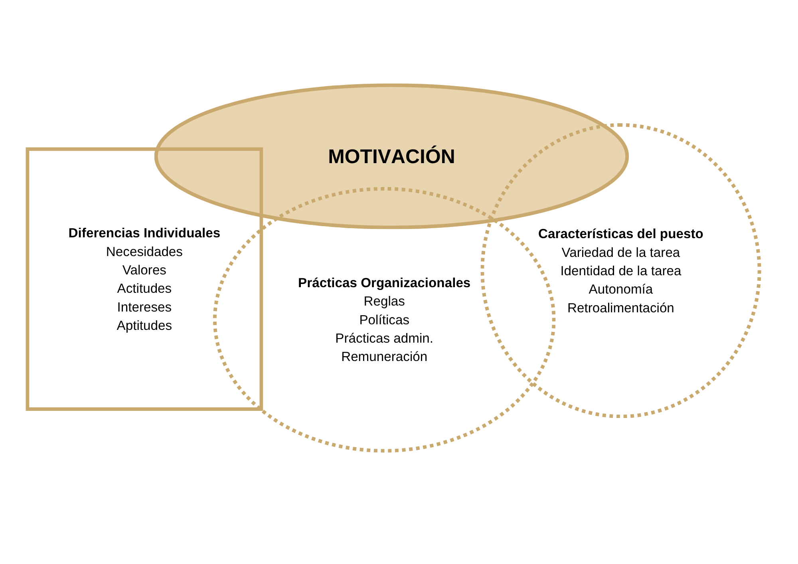
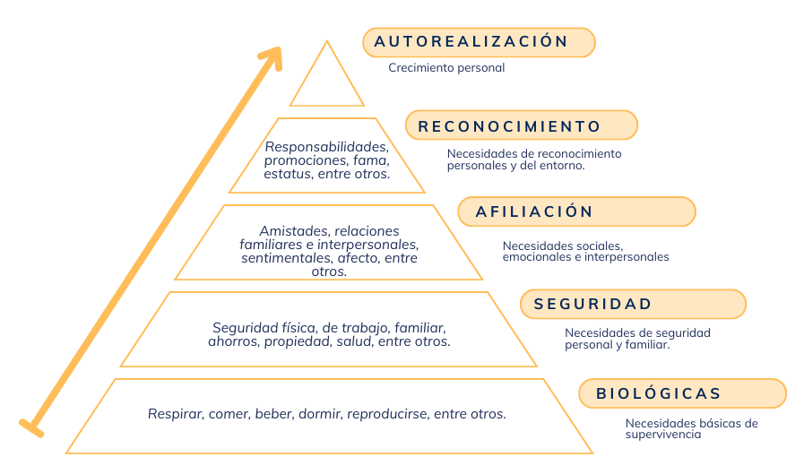
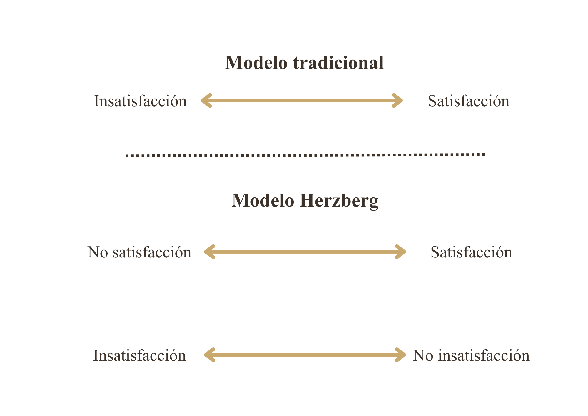
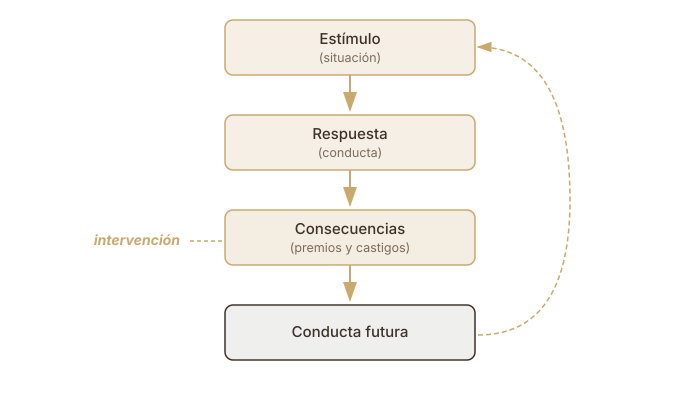

##  {data-background-color="#ffffff"}


<div style="position: absolute; top: 0; right: 0; width: 0; height: 0; border-top: 550px solid #3d3229; border-left: 500px solid transparent; z-index: 0;"></div>


<div style="position: relative; z-index: 1; display: flex; flex-direction: column; justify-content: center; height: 75vh; padding-left: 1em;">

[Teorías clásicas y contemporáneas]{style="color: #c9a96e; font-size: 0.55em; font-weight: 300; letter-spacing: 0.2em; text-transform: uppercase;"}

[Teorías de la Motivación]{style="color: #3d3229; font-size: 1.4em; font-weight: 700; font-family: 'Libre Baskerville', serif; line-height: 1.2; display: block;"}
[en organizaciones laborales]{style="color: #3d3229; font-size: 1.4em; font-weight: 700; font-family: 'Libre Baskerville', serif; line-height: 1.2; display: block;"}


<br>

[Clase 5 · ]{style="color: #a09585; font-size: 0.5em;"}
[Dr. Fernando Tonini]{style="color: #a09585; font-size: 0.5em;"}

</div>

---

## ¿Qué es la motivación?

- Es uno de los factores que interviene en el desempeño personal. La motivación junto con las habilidades y las aptitudes van a definir el rendimiento en la actividad laboral.

- Es un proceso dinámico (no un estado estable del sujeto). Por lo tanto, puede modificarse a través de intervenciones.

---

## ¿Qué es la motivación?

La motivación que la persona experimente en el trabajo va ser producto de la confluencia de tres factores:

- Las [necesidades individuales]{.dorado} que cada uno busca cubrir con el trabajo (qué valor le asignamos al trabajo, qué necesidad buscamos satisfacer en el trabajo).

- Las [características de la tarea]{.dorado} que debemos realizar a diario en nuestro trabajo (por lo cual algunas características nos van a resultar más motivantes, como por ejemplo tener una tarea variada o tener autonomía en la toma de decisiones).

- Las [prácticas organizacionales]{.dorado}, que son todas las características que definen la organización en la que trabajamos (política salarial, infraestructura, normas y reglamentos).

---

## ¿Qué es la motivación?

{fig-align="center"}


---

##  {data-background-color="#ffffff"}

:::::: {style="display: flex; align-items: center; height: 70vh; padding-left: 0.5em;"}
<div>

::: {style="color: #c9a96e; font-size: 0.45em; letter-spacing: 0.2em; font-weight: 300; text-transform: uppercase; margin-bottom: 0.5em;"}
MOTIVACIÓN LABORAL
:::

::: {style="color: #3d3229; font-size: 1.4em; font-family: 'Libre Baskerville', serif; font-weight: 700; line-height: 1.3; border-left: 4px solid #c9a96e; padding-left: 0.5em;"}
Teorías Clásicas
:::

</div>
::::::

---

## Modelo de la jerarquía de necesidades (Maslow, 1955, 1971)

Según Maslow, la conducta se rige por un principio de homeostasis, por lo cual el camino cada vez que surge una necesidad sería el siguiente:

```{mermaid}
%%{init: {'theme':'base', 'themeVariables': {'primaryColor': '#e8d5a8', 'primaryBorderColor': '#3d3229', 'primaryTextColor': '#3d3229', 'lineColor': '#3d3229', 'fontSize': '20px'}}}%%
flowchart LR
  A[Necesidad] --> B[Tensión] --> C[Conducta]
  C --> D[Éxito] --> E[Alivio Tensión]
  C --> F[Fracaso] --> G[Persiste Tensión]
  G -.-> C
```
---

## Modelo de la jerarquía de necesidades 

Según Maslow, las necesidades están organizadas jerárquicamente.

{fig-align="center" width="40%"}

---

## Modelo de la jerarquía de necesidades

- Las necesidades se organizan en [inferiores (déficit)]{.dorado} y [superiores (crecimiento)]{.dorado}

- Una necesidad satisfecha no motiva. [Hipótesis progresiva de satisfacción]{.dorado}.

- [Necesidades superiores]{.dorado} se satisfacen de modo más diverso que las inferiores. No todas las personas buscarán satisfacer las necesidades superiores en el ambiente laboral.

---

## Modelo de la jerarquía de necesidades

<table class="tabla-contenido">
  <tr>
    <th>NECESIDAD</th>
    <th>SATISFECHA</th>
    <th>INSATISFECHA</th>
  </tr>
  <tr>
    <td><strong>Fisiológicas</strong></td>
    <td>Deben estar satisfechas para que la persona pueda trabajar</td>
    <td>No pueden estar insatisfechas!</td>
  </tr>
  <tr>
    <td><strong>Seguridad</strong></td>
    <td>Trabajador/a percibe su trabajo como un lugar estable </td>
    <td>Suscita cautela por la inestabilidad percibida</td>
  </tr>
  <tr>
    <td><strong>Pertenencia</strong></td>
    <td>Promueve el trabajo grupal</td>
    <td>Tensión en el clima laboral = baja la productividad y ausentismo</td>
  </tr>
  <tr>
    <td><strong>Estima</strong></td>
    <td>Estimula la intensidad en el trabajo y promueve la búsqueda de logros y desafíos </td>
    <td>No siempre del interes del trabajador</td>
  </tr>
  <tr>
    <td><strong>Autorrealización</strong></td>
    <td>Promueve la iniciativa en la toma de decisiones y la resolución de problemas</td>
    <td>No siempre del interes del trabajador</td>
  </tr>
</table>

---

## Teoría X y teoría Y (McGregor, 1960)

Modo en que gerentes perciben a los empleados:

- [Teoría X]{.dorado}: "los trabajadores solo tienen un buen rendimiento bajo presión o amenazas".

- [Teoría Y]{.dorado}: "los trabajadores quieren y necesitan trabajar".

---

## Teoría X y teoría Y 

:::{.subtitulo-slide}
En la organización laboral
:::

- [Teoría X]{.dorado}: las personas necesitan ser obligadas, castigadas o amenazadas para cumplir con las metas establecidas. Por lo tanto, es necesaria la existencia de una figura a quien respetar, obedecer y temer, porque el empleado es incapaz de asumir responsabilidades y prefiere obedecer órdenes. Esta figura será la del [líder autoritario]{.dorado}.

- [Teoría Y]{.dorado}: para los empleados, el trabajo es algo motivador que forma parte de la vida cotidiana. El trabajo no es considerado un peso ni una obligación. Es el momento del día para producir. Por lo tanto, el empleado puede aportar ideas libremente, ya que administradores y trabajadores tienen metas organizacionales que se basan en el crecimiento y el rendimiento profesional. Esta figura será la del [líder participativo]{.dorado}.

---

## Teoría X y teoría Y

:::{.subtitulo-slide}
En la organización laboral
:::

Ambas posiciones son opuestas y excluyentes en la regulación del trabajo. Para la teoría X, el empleado será la parte menos importante de la organización y sus opiniones no suman al crecimiento organizacional. 

Por su parte, la teoría Y considera que el empleado trabaja en un ambiente de confianza y respeto mutuo. Las intervenciones motivacionales realizadas en el marco de cada teoría son completamente distintas.

---

## Modelo dos factores (Herzberg, 1959)

Así como las dos teorías anteriores consideraban centralmente las necesidades individuales, la teoría de Herzberg focaliza en las características del puesto y de las prácticas organizacionales.

---

## Modelo dos factores (Herzberg, 1959)

:::{.subtitulo-slide}
Concepciones de la satisfacción laboral
:::

Para Herzberg, no todas las características del trabajo se vinculan a la motivación. Algunas características aumentan la motivación y otras características son prerrequisitos para que la motivación pueda aumentar.

{fig-align="center" width="40%"}

---

## Modelo dos factores (Herzberg, 1959)

:::{.subtitulo-slide}
En la organización laboral
:::

<table class="tabla-contenido">
  <tr>
    <th>FACTORES DE HIGIENE</th>
    <th>FACTORES DE MOTIVACIÓN</th>
  </tr>
  <tr>
    <td>
      Se refieren a características del entorno laboral ajenas al puesto:<br>
      • Condiciones de trabajo<br>
      • Políticas de la compañía<br>
      • Grado de supervisión<br>
      • Salario y seguridad laboral<br><br>
      Si son positivos, mantienen un nivel razonable de motivación laboral pero no la incrementan
    </td>
    <td>
      Se refieren a las características del puesto:<br>
      • Grado de interés del trabajo<br>
      • Responsabilidad en la tarea<br>
      • Reconocimiento<br>
      • Avance y crecimiento<br><br>
      Dan por resultado un desempeño superior solo en ausencia de insatisfacción de los factores de higiene
    </td>
  </tr>
</table>

---

## Modelo dos factores (Herzberg, 1959)

:::{.subtitulo-slide}
En la organización laboral
:::

Con factores de higiene satisfechos se puede trabajar sobre factores de motivación:

- [Asignando tareas interesantes]{.dorado}

- [Atendiendo al trabajo en sí mismo]{.dorado}

- [Permitiendo sugerencias sobre cómo mejorar propio desempeño]{.dorado}

---

## Modelo de necesidades adquiridas (McClelland, 1961, 1975, 1986)

Los motivos se adquieren en interacción con el entorno, tanto para la vida en general como para el trabajo.

:::{.subtitulo-slide}
En la organización laboral
:::

<table class="tabla-contenido">
  <tr>
    <td><strong style="color: var(--dorado);">Motivo de logro</strong></td>
    <td>
      • Asumir responsabilidad sobre elección de metas<br>
      • Metas moderadamente difíciles<br>
      • Retroalimentación inmediata y concreta
    </td>
  </tr>
  <tr>
    <td><strong style="color: var(--dorado);">Motivo de afiliación</strong></td>
    <td>
      • Aprobación de los otros<br>
      • Adaptación a normas grupales
    </td>
  </tr>
  <tr>
    <td><strong style="color: var(--dorado);">Motivo de poder</strong></td>
    <td>
      • Poder personal (confirmar dominio sobre los demás)<br>
      • Poder socializado (resolver problemas organizacionales, contribuir metas de la organización)
    </td>
  </tr>
</table>

---

## Modelo de necesidades adquiridas (McClelland, 1961, 1975, 1986)

:::{.subtitulo-slide}
En la organización laboral
:::

- [Motivo de logro]{.dorado}: en un mundo competitivo, si las personas carecen de esta orientación se exponen a perder su trabajo (eliminación de puestos, sectores, gerencias).

- [Motivo de afiliación]{.dorado}: las personas a las que les desagrada trabajar con los demás no podrán adaptarse al trabajo en equipo.

- [Motivo de poder]{.dorado}: los equipos autodirigidos actúan sobre toda la gestión de un proceso (administrativa y técnica); para tener éxito en esta autogestión deben estar orientados hacia el poder socializado, no personal.

---

## Críticas a las teorías clásicas de la motivación laboral

- [Teoría de Maslow]{.dorado}: no cuenta con base empírica que sostenga la teoría.

- [Teoría de McGregor]{.dorado}: no cuenta con base empírica que sostenga la teoría.

- [Teoría de Herzberg]{.dorado}: si bien cuenta con base empírica, esta tiene fallas metodológicas.

- [Teoría de McClelland]{.dorado}: si bien cuenta con base empírica, el constructo de necesidad inconsciente es difícil de medir, lo cual resulta poco práctico en las organizaciones.


---

##  {data-background-color="#ffffff"}

:::::: {style="display: flex; align-items: center; height: 70vh; padding-left: 0.5em;"}
<div>

::: {style="color: #c9a96e; font-size: 0.45em; letter-spacing: 0.2em; font-weight: 300; text-transform: uppercase; margin-bottom: 0.5em;"}
MOTIVACIÓN LABORAL
:::

::: {style="color: #3d3229; font-size: 1.4em; font-family: 'Libre Baskerville', serif; font-weight: 700; line-height: 1.3; border-left: 4px solid #c9a96e; padding-left: 0.5em;"}
Teorías Contemporáneas
:::

</div>
::::::

---

## Teorías contemporáneas

- Son una serie de teorías, mayormente de base cognitiva (excepto la teoría del reforzamiento que tiene fundamentos conductistas), que cuentan con gran cantidad de investigaciones empíricas que las sostienen.

- Este conjunto de teorías cognitivas no son excluyentes entre sí, si no que, por el contrario, pueden combinarse para explicar la motivación en el trabajo.

---

## Teoría de la autodeterminación (Deci & Ryan, 2000, 2002)

[Autodeterminación]{.dorado}: los trabajadores prefieren sentir que tienen control sobre sus acciones, de manera que se debe tener cuidado porque cualquier situación que haga que una tarea se experimente como una obligación reducirá la motivación.

Es importante repasar en este punto el concepto de [costo oculto de la recompensa]{.dorado} aplicado al trabajo, ya que no siempre la inclusión de recompensas aumenta la motivación sino todo lo contrario (teoría de la evaluación cognitiva).

---

## Teoría de la autodeterminación (Deci & Ryan, 2000, 2002)

:::{.subtitulo-slide}
En la organización laboral
:::

- Lograr que el trabajo sea interesante, dar reconocimiento y fomentar el crecimiento y el desarrollo de los empleados.

- Ofrecer incentivos tanto intrínsecos como extrínsecos, siempre teniendo en cuenta la autodeterminación y autoconsistencia para no provocar el efecto socavador de la recompensa.

---

## Teoría del establecimiento de metas (Locke, 1968, 1997)

La especificidad, el desafío y la retroalimentación de las metas definen el desempeño.

:::{.subtitulo-slide}
En la organización laboral
:::

- Plantear metas específicas, que resulten desafiantes y sobre las que se obtenga *feedback*.

- Ofrecer metas que se perciban como autodeterminadas y posibles de ser alcanzadas, de modo que generen compromiso con lograrlas.

---

## Teoría de la autoeficacia (Bandura, 1997)

La autoeficacia (teoría cognitiva social o teoría del aprendizaje social) refiere a la creencia que tiene un individuo de que es capaz de realizar una tarea, esto es, creer que se tienen los recursos para alcanzar la meta. Por tanto, el nivel de autoeficacia será central en la persistencia al camino a la meta.

---

## Teoría de la autoeficacia (Bandura, 1997)

:::{.subtitulo-slide}
En la organización laboral
:::

Modos de aumentar la autoeficacia:

- [Dominio del acto]{.dorado}: obtener experiencia relevante en la tarea. Si en el pasado fui capaz de alcanzar una meta, en el futuro sucederá algo similar.

- [Modelamiento vicario]{.dorado}: si alguien similar a mí logra una meta, yo también voy a lograrla.

- [Persuasión verbal]{.dorado}: efecto motivacional de la palabra de otro sobre la percepción de mis recursos.

- [Activación]{.dorado}: siempre es necesario un nivel de activación moderado para realizar la conducta.

En la organización serán fundamentales las capacitaciones y la retroalimentación de los gerentes para aumentar la motivación.

---

## Teoría de la equidad y justicia organizacional (Adams, 1965)

Los individuos perciben lo que obtienen de sus puestos de trabajo (salario, aumentos y reconocimiento) en relación con lo que aportan (esfuerzo, experiencia, educación y competencia) y, luego, comparan su índice resultado-inversión con los de otras personas que los rodean.

Si perciben equidad, se sienten motivadas. Si perciben inequidad, sienten enojo (cuando perciben desventaja) o culpa (cuando perciben ventaja).

---

## Teoría de la equidad y justicia organizacional (Adams, 1965)

:::{.subtitulo-slide}
En la organización laboral
:::

- [Yo-dentro]{.dorado}. Las experiencias del empleado en un puesto diferente dentro de la organización donde trabaja actualmente.
- [Yo-fuera]{.dorado}. Las experiencias del individuo en una situación o puesto fuera de la organización donde trabaja actualmente.
- [Otro-dentro]{.dorado}. Otro individuo o grupo de individuos dentro de la organización donde trabaja el empleado.
- [Otro-fuera]{.dorado}. Otro individuo o grupo de individuos fuera de la organización donde trabaja el empleado.

Luego de hacer la evaluación y percibir un estado de inequidad, se tomará esa conclusión como motivador para llevar a cabo una conducta que suprima ese estado de disonancia.

---

## Teoría de la equidad y justicia organizacional (Adams, 1965)

:::{.subtitulo-slide}
Moderadores de las reacciones a la (in)justicia
:::


A estas comparaciones se le suman variables moderadoras como la antigüedad, la escolaridad, el género:


- [Ideología de intercambio]{.dorado} (*exchange ideology*): las personas que creen firmemente que el esfuerzo debe ser correspondido con recompensas reaccionan con mayor intensidad ante la injusticia (Scott & Colquitt, 2007).

- [Género]{.dorado}: se han reportado diferencias en la forma en que varones y mujeres ponderan la justicia distributiva versus la procedimental al evaluar la confianza en la organización (Lee & Farh, 1999).

- [Tipo de referente de comparación]{.dorado}: la antigüedad, el nivel jerárquico y la escolaridad influyen en si la persona se compara consigo misma en el pasado, con pares dentro de la organización o con referentes externos (Adams, 1965; Colquitt et al., 2001).

---

## Teoría de las expectativas (Vroom, 1964)

La motivación depende del grado de certeza de que un mayor esfuerzo dará los resultados deseados.

---

## Teoría de las expectativas (Vroom, 1964)

:::{.subtitulo-slide}
En la organización laboral
:::

Relaciones que definen las expectativas:

- [Relación esfuerzo-desempeño]{.dorado}. La probabilidad que percibe el individuo de que cierta cantidad de esfuerzo conducirá al desempeño (por ejemplo, buena evaluación de desempeño).

- [Relación desempeño-recompensa]{.dorado}. Grado en que el individuo cree que el desempeño a un nivel particular llevará a la obtención del resultado deseado (por ejemplo, bono o aumento de sueldo).

- [Relación recompensas-metas personales]{.dorado}. Grado en que las recompensas organizacionales satisfacen las metas o necesidades personales de un individuo y el atractivo que tienen dichas recompensas potenciales para él.

---

## Teoría del reforzamiento (Skinner, 1971)

A diferencia de las teorías contemporáneas anteriores, que se fundamentaban en conceptos cognitivos, esta teoría se inscribe en el análisis experimental del comportamiento.

Sostiene que la probabilidad de ocurrencia de una conducta es función de sus consecuencias:

- [Conducta seguida de un reforzador]{.dorado}: aumenta su probabilidad de ocurrencia futura.

- [Conducta seguida de un estímulo aversivo]{.dorado}: disminuye su probabilidad de ocurrencia futura.

---

## Teoría del reforzamiento (Skinner, 1971)

:::{.subtitulo-slide}
Esquema operante básico
:::

{fig-align="center"}

---

## Teoría del reforzamiento (Skinner, 1971)

:::{.subtitulo-slide}
1. Conducta operante mensurable
:::

Conducta que puede ser observada, registrada y cuantificada en términos de frecuencia, duración o intensidad.

<table class="tabla-contenido">
  <tr>
    <th style="color: var(--dorado);">Ventajas</th>
    <th>Desventajas</th>
  </tr>
  <tr>
    <td>
      ✓ Mejor coordinación y trabajo en equipo<br>
      ✓ Mayor orientación hacia las metas<br>
      ✓ Establecimiento de repertorios conductuales más eficientes
    </td>
    <td>
      ✗ Riesgo de restringir el análisis a conductas cuantificables, desatendiendo otras dimensiones del desempeño
    </td>
  </tr>
</table>

---

## Teoría del reforzamiento (Skinner, 1971)

:::{.subtitulo-slide}
1. Conducta operante mensurable - Ejemplo IA
:::



## Teoría del reforzamiento (Skinner, 1971)

:::{.subtitulo-slide}
2. Contingencias de reforzamiento
:::

<table class="tabla-contenido">
  <tr>
    <th></th>
    <th style="color: var(--dorado);">PRESENTACIÓN DEL ESTÍMULO</th>
    <th>RETIRO DEL ESTÍMULO</th>
  </tr>
  <tr>
    <td><strong>Estímulo apetitivo</strong></td>
    <td><strong>Reforzamiento positivo</strong><br>Aumenta la probabilidad de la conducta</td>
    <td><strong>Extinción</strong><br>Disminuye la probabilidad de la conducta</td>
  </tr>
  <tr>
    <td><strong>Estímulo aversivo</strong></td>
    <td><strong>Castigo positivo</strong><br>Disminuye la probabilidad de la conducta</td>
    <td><strong>Reforzamiento negativo</strong><br>Aumenta la probabilidad de la conducta</td>
  </tr>
</table>

---

## Teoría del reforzamiento (Skinner, 1971)

:::{.subtitulo-slide}
2. Contingencias de reforzamiento
:::

- [Reforzamiento positivo]{.dorado}: la presentación de un estímulo apetitivo (elogio, ascenso, incremento salarial) contingente a la conducta aumenta su tasa de emisión.

- [Reforzamiento negativo]{.dorado}: la remoción de un estímulo aversivo contingente a la conducta aumenta su tasa de emisión (la contingencia es operada por el propio sujeto).

- [Castigo positivo]{.dorado}: la presentación de un estímulo aversivo (amonestación, sanción económica, suspensión) contingente a la conducta disminuye su tasa de emisión.

- [Extinción]{.dorado}: la supresión del reforzador que mantenía la conducta produce una disminución progresiva de su frecuencia (en general, retiro del reforzamiento positivo).

---

## Teoría del reforzamiento (Skinner, 1971)

:::{.subtitulo-slide}
3. Programas de reforzamiento
:::

La eficacia de las contingencias para modificar la conducta depende de:

- [Tipo de contingencia]{.dorado}

- [Programa de administración del reforzador]{.dorado}

---

## Teoría del reforzamiento (Skinner, 1971)

<table class="tabla-contenido tabla-pequeña">
  <tr>
    <th>PROGRAMA</th>
    <th>DESCRIPCIÓN</th>
  </tr>
  <tr>
    <td><strong>Intervalo fijo</strong></td>
    <td>Reforzamiento tras un período temporal constante, independiente de la tasa de respuesta. Ej: pago quincenal. Genera tasas bajas de respuesta entre reforzadores.</td>
  </tr>
  <tr>
    <td><strong>Intervalo variable</strong></td>
    <td>Reforzamiento tras intervalos temporales variables. Ej: inspecciones aleatorias. Produce tasas de respuesta moderadas y estables.</td>
  </tr>
  <tr>
    <td><strong>Razón fija</strong></td>
    <td>Reforzamiento tras un número fijo de respuestas, independiente del tiempo. Ej: comisión por cantidad de ventas. Genera aceleración progresiva a medida que se aproxima el punto de reforzamiento.</td>
  </tr>
  <tr>
    <td><strong>Reforzamiento continuo</strong></td>
    <td>Reforzamiento tras cada emisión de la conducta (razón 1:1). Produce adquisición rápida, pero también saciación temprana.</td>
  </tr>
  <tr>
    <td><strong>Razón variable</strong></td>
    <td>Reforzamiento tras un número variable de respuestas. Programa más resistente a la extinción, pero de difícil implementación organizacional (excepto promociones).</td>
  </tr>
</table>

---

## Aplicación en la organización laboral

- Administrar reforzamiento y castigo de manera [contingente y proporcional]{.dorado} al desempeño (no reforzar conductas indiscriminadamente).
- Aplicar las consecuencias con [inmediatez temporal]{.dorado} respecto a la conducta.
- Calibrar la [magnitud del reforzador o del estímulo aversivo]{.dorado} para que sea perceptible por el sujeto.
- Controlar el [nivel de privación]{.dorado} del reforzador (limitar el acceso para mantener su valor funcional).
- Considerar que la [ausencia de consecuencias]{.dorado} también modifica la conducta (extinción por omisión).
- Especificar la [topografía de la conducta objetivo]{.dorado} requerida para acceder al reforzador.
- Señalar con precisión la [conducta inadecuada]{.dorado} y su consecuencia.
- Evitar la administración de estímulos aversivos en presencia de terceros (efecto de humillación pública).

---

## Teoría del reforzamiento (Skinner, 1971)

<table class="tabla-contenido">
  <tr>
    <th style="color: var(--dorado);">Ventajas</th>
    <th>Limitaciones</th>
  </tr>
  <tr>
    <td>
      ✓ Incremento de la eficiencia operativa<br>
      ✓ Reducción de costos<br>
      ✓ Disminución del ausentismo<br>
      ✓ Aumento de la productividad
    </td>
    <td>
      ✗ Riesgo de reduccionismo conductual (omitir diferencias individuales, valores y necesidades)<br>
      ✗ Desatención de la motivación intrínseca<br>
      ✗ Posibilidad de ejercer un control excesivo sobre el comportamiento de los empleados
    </td>
  </tr>
</table>
---

##  {data-background-color="#ffffff"}

<div style="display: flex; align-items: center; height: 70vh; padding-left: 0.5em;">
<div>
<div style="color: #c9a96e; font-size: 0.45em; letter-spacing: 0.2em; font-weight: 300; text-transform: uppercase; margin-bottom: 0.5em;">Muchas gracias!!</div>
<div style="color: #3d3229; font-size: 1.4em; font-family: 'Libre Baskerville', serif; font-weight: 700; line-height: 1.3; border-left: 4px solid #c9a96e; padding-left: 0.5em;">Clase siguiente: Reactancia, indefensión y adaptación</div>
</div>
</div>
