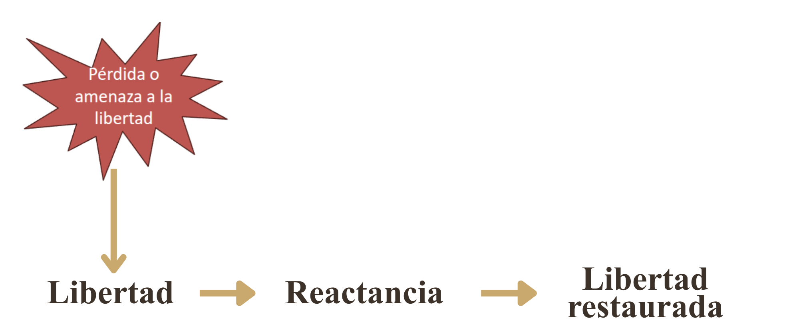
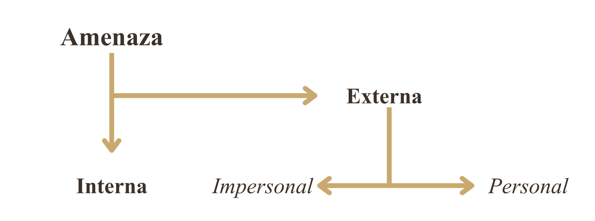
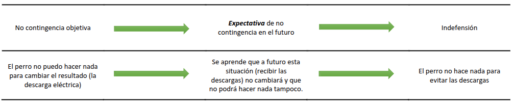
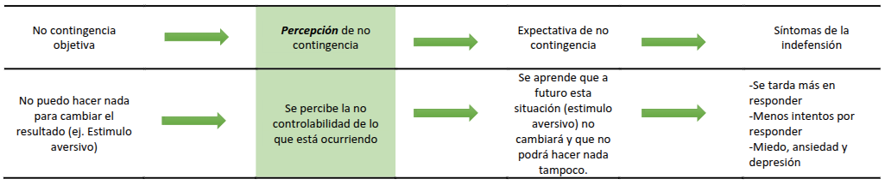
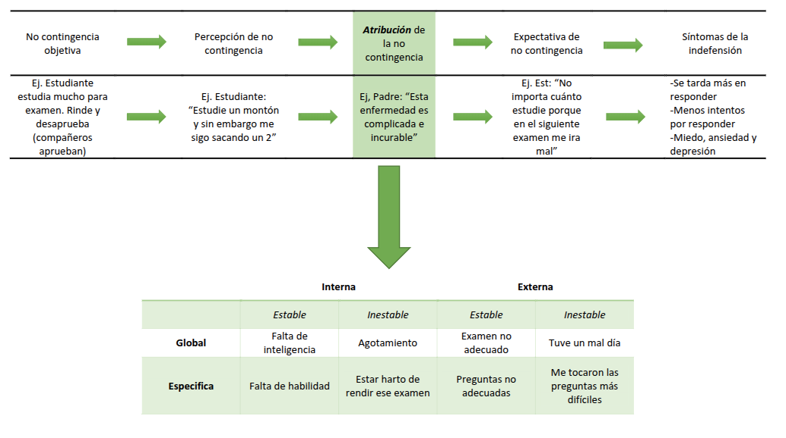

##  {data-background-color="#ffffff"}

[Motivación y atribuciones de control]{style="color: #c9a96e; font-size: 0.55em; font-weight: 300; letter-spacing: 0.2em; text-transform: uppercase;"}

[Reactancia, Indefensión y]{style="color: #3d3229; font-size: 1.4em; font-weight: 700; font-family: 'Libre Baskerville', serif; line-height: 1.2; display: block;"}
[Adaptación]{style="color: #3d3229; font-size: 1.4em; font-weight: 700; font-family: 'Libre Baskerville', serif; line-height: 1.2; display: block;"}

 

[Clase 6 · ]{style="color: #a09585; font-size: 0.5em;"}
[Dr. Fernando Tonini]{style="color: #a09585; font-size: 0.5em;"}

---

## {.slide-frase}

::: {.caja-frase}
Eventos objetivamente incontrolables
:::

---

##  {data-background-color="#ffffff"}

:::::: {style="display: flex; align-items: center; height: 70vh; padding-left: 0.5em;"}

::: {style="color: #c9a96e; font-size: 0.45em; letter-spacing: 0.2em; font-weight: 300; text-transform: uppercase; margin-bottom: 0.5em;"}
MOTIVACIÓN Y ATRIBUCIONES DE CONTROL
:::

::: {style="color: #3d3229; font-size: 1.4em; font-family: 'Libre Baskerville', serif; font-weight: 700; line-height: 1.3; border-left: 4px solid #c9a96e; padding-left: 0.5em;"}
Reactancia psicológica
:::

::::::

---

## Reactancia psicológica (Brehm, 1966)

:::{.subtitulo-slide}
Proceso
:::

{fig-align="center" width="70%"}

---

## Reactancia psicológica (Brehm, 1966)

[Reactancia]{.dorado} —> Estado motivacional que produce un evento que el individuo percibe como negativo, porque cree que amenaza o ya ha supuesto una pérdida de su libertad.

[Libertad]{.dorado} —> Creencia de que uno puede comprometerse con una conducta particular:

- Específica (qué, cómo, cuándo)
- Capacidad
- Absoluta o condicional

[Amenaza]{.dorado} —> Percepción de que algún evento ha incrementado la dificultad para ejercer la libertad en cuestión.

---

## Reactancia psicológica (Brehm, 1966)

:::{.subtitulo-slide}
Tipos de amenaza
:::

{fig-align="center" width="70%"}

---

## Reactancia psicológica (Brehm, 1966)

:::{.subtitulo-slide}
Condiciones y efectos
:::

La reactancia se activa solo cuando:

- La persona se cree [libre para elegir]{.dorado} y realizar la conducta y [capaz]{.dorado} para ejecutarla.
- Experimenta que un elemento está [amenazando o ha eliminado]{.dorado} esa libertad.

Función básica de la reactancia: impulsar a la persona a tratar de [restablecer la libertad]{.dorado}.

Efectos de la reactancia:

- [Conductuales]{.dorado}: restauración directa de la libertad (en caso de amenaza).
- [Subjetivos]{.dorado}: mayor atracción por el resultado amenazado y hostilidad hacia el agente de la amenaza.

---

##  {data-background-color="#ffffff"}

:::::: {style="display: flex; align-items: center; height: 70vh; padding-left: 0.5em;"}

::: {style="color: #c9a96e; font-size: 0.45em; letter-spacing: 0.2em; font-weight: 300; text-transform: uppercase; margin-bottom: 0.5em;"}
MOTIVACIÓN Y ATRIBUCIONES DE CONTROL
:::

::: {style="color: #3d3229; font-size: 1.4em; font-family: 'Libre Baskerville', serif; font-weight: 700; line-height: 1.3; border-left: 4px solid #c9a96e; padding-left: 0.5em;"}
Indefensión aprendida
:::

::::::

---

## Indefensión aprendida (Seligman, 1967, 1975)

:::{.subtitulo-slide}
Diseño experimental original
:::

Fase de entrenamiento:

- [G1]{.dorado}: grupo con posibilidad de escape.
- [G2]{.dorado}: grupo sin posibilidad de escape.

Fase de prueba:

- G2 no aprende a escapar ni lo intenta. Aprenden que el shock es incontrolable; son pasivos.

[Inmunización]{.dorado}: si en la fase de aprendizaje primero se aprende escape, o si se combinan shocks inescapables con escapables, los animales posteriormente aprenden a escapar.

{fig-align="center" width="25%"}

---

## {.slide-cita}

:::::: {.slide-cita}

::: {.caja-cita}
"Cuando un organismo es expuesto a una situación real de no contingencia, primero debe [percibir]{.clarito} la no contingencia para poder desarrollar la [expectativa]{.clarito} de no contingencia" (Seligman, 1975).
:::

:::::: 

{fig-align="center" width="25%"}

---

## Indefensión aprendida (Seligman, 1967, 1975)

:::{.subtitulo-slide}
Síntomas
:::

- [Motivacionales]{.dorado}: lentitud de inicio de respuestas voluntarias y reducción de la motivación para ejercer control.

- [Cognitivos]{.dorado}: aprendizaje de que la respuesta es no contingente con el resultado, lo cual interfiere proactivamente con el aprendizaje futuro.

- [Afectivos]{.dorado}: aprendizaje de incontrolabilidad produce un estado de alta emocionalidad que incluye miedo, ansiedad y depresión.

---

## Indefensión aprendida (Seligman, 1967, 1975)

:::{.subtitulo-slide}
Modelo de depresión
:::

Seligman (1975): [Indefensión aprendida ≅ depresión reactiva]{.dorado}

Ambas comparten: incontrolabilidad.

Tratamiento:

- Inmunización con experiencias tempranas de control.
- El paciente debe volver a creer que puede controlar eventos.

---

## Reformulación atribucional (Abramson et al., 1978)

[Indefensión aprendida]{.dorado} (Seligman) + [Teoría atribucional]{.dorado} (Weiner)

Según el tipo de atribución que hagamos, los déficits de la indefensión se generalizarán y persistirán en el tiempo.

{fig-align="center" width="45%"}

---

##  {data-background-color="#ffffff"}

:::::: {style="display: flex; align-items: center; height: 70vh; padding-left: 0.5em;"}

::: {style="color: #c9a96e; font-size: 0.45em; letter-spacing: 0.2em; font-weight: 300; text-transform: uppercase; margin-bottom: 0.5em;"}
MOTIVACIÓN Y ATRIBUCIONES DE CONTROL
:::

::: {style="color: #3d3229; font-size: 1.4em; font-family: 'Libre Baskerville', serif; font-weight: 700; line-height: 1.3; border-left: 4px solid #c9a96e; padding-left: 0.5em;"}
Adaptación cognitiva
:::

::::::

---

## Adaptación cognitiva (Taylor, 1983)

Resistencia a perder el control → sesga cognitivamente la información que le proporciona el evento y distorsiona la realidad en beneficio propio → salvaguardar la autoestima y encontrar significado al evento adverso.

Víctimas de experiencias negativas tienden a [autoculparse]{.dorado} para:

- Recuperar control sobre eventos futuros.
- Encontrar sentido al evento.

---

## Adaptación cognitiva (Taylor, 1983)

:::{.subtitulo-slide}
Sesgos adaptativos
:::

[Autoculpa]{.dorado}: mecanismo adaptativo → percepción de invulnerabilidad (eventos negativos).

[Ilusión positiva]{.dorado} → Visión positiva de:

- Uno mismo
- Grado de control personal
- Futuro

Incrementa la motivación y perseverancia en situaciones negativas: rasgo adaptativo y promoción de salud física y mental.

---

## Adaptación cognitiva (Taylor, 1983)

- Autoculpa e ilusión positiva contradicen la pasividad y el abandono propuestos por la indefensión aprendida.

- Se cae en pasividad cuando la persona se convence de que realmente no podrá controlar el resultado deseado o evitar el resultado aversivo.

- La aparición más o menos temprana de la desesperanza está en conjunto con las ilusiones positivas.
