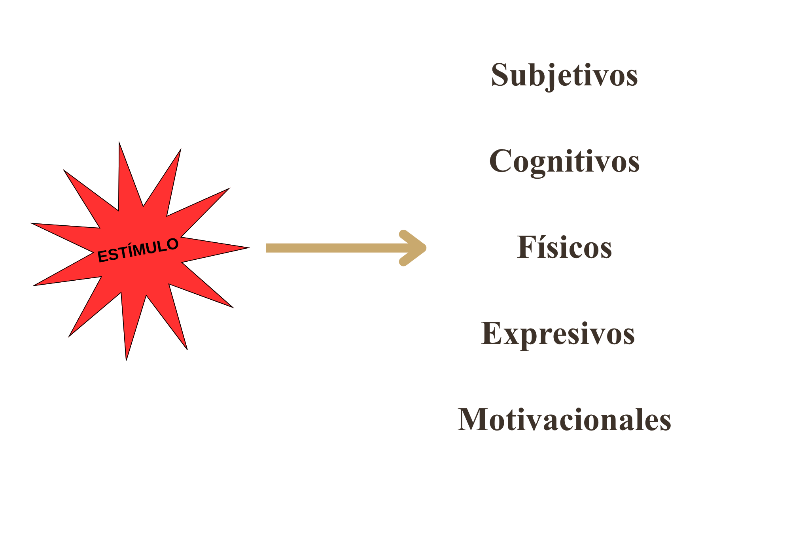
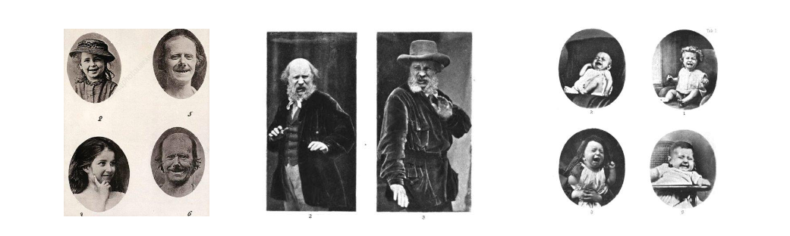
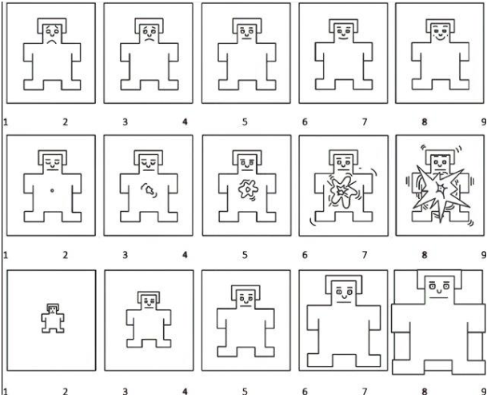
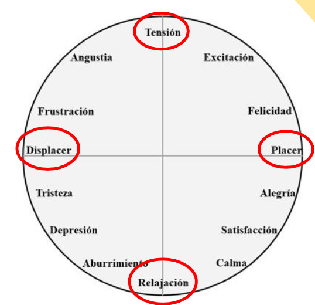
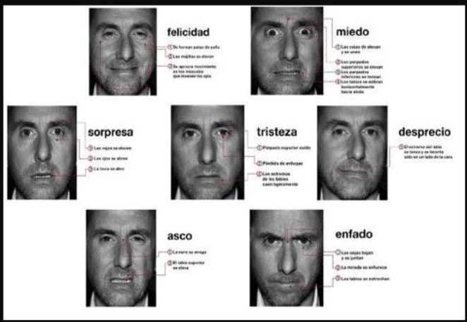
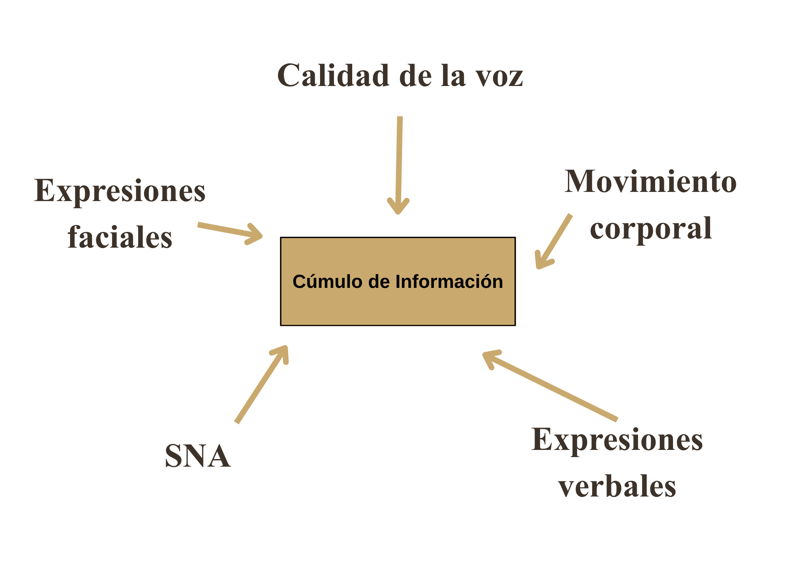
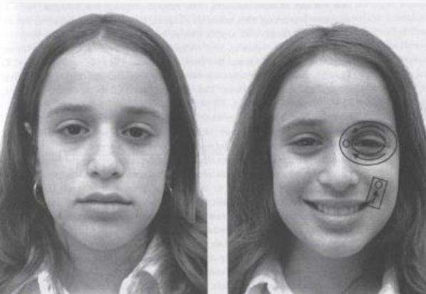

##  {data-background-color="#ffffff"}


<div style="position: absolute; top: 0; right: 0; width: 0; height: 0; border-top: 550px solid #3d3229; border-left: 500px solid transparent; z-index: 0;"></div>


<div style="position: relative; z-index: 1; display: flex; flex-direction: column; justify-content: center; height: 75vh; padding-left: 1em;">

[Introducción al estudio de la emoción]{style="color: #c9a96e; font-size: 0.55em; font-weight: 300; letter-spacing: 0.2em; text-transform: uppercase;"}

[Emoción y]{style="color: #3d3229; font-size: 1.4em; font-weight: 700; font-family: 'Libre Baskerville', serif; line-height: 1.2; display: block;"}
[estado del ánimo]{style="color: #3d3229; font-size: 1.4em; font-weight: 700; font-family: 'Libre Baskerville', serif; line-height: 1.2; display: block;"}


<br>

[Clase 7 · ]{style="color: #a09585; font-size: 0.5em;"}
[Dr. Fernando Tonini]{style="color: #a09585; font-size: 0.5em;"}

</div>

---

##  {data-background-color="#ffffff"}

:::::: {style="display: flex; align-items: center; height: 70vh; padding-left: 0.5em;"}
<div>

::: {style="color: #c9a96e; font-size: 0.45em; letter-spacing: 0.2em; font-weight: 300; text-transform: uppercase; margin-bottom: 0.5em;"}
EPISODIO I
:::

::: {style="color: #3d3229; font-size: 1.4em; font-family: 'Libre Baskerville', serif; font-weight: 700; line-height: 1.3; border-left: 4px solid #c9a96e; padding-left: 0.5em;"}
Algunos problemas
:::

</div>
::::::

---

## El problema de la definición

<br>

::: {.caja-cita}
"Deberíamos estudiar este fenómeno por su propio derecho, y bajo una etiqueta más precisa que no tenga diferentes significados en diferentes ocasiones y para diferentes autores" ([Duffy, 1934]{.clarito}).
:::


---

## El problema de la definición

:::{.subtitulo-slide}
Categorías según Kleinginna & Kleinginna (1981)
:::

<table class="tabla-contenido tabla-pequeña">
<thead>
<tr><th style="width:30%">Supracategoría</th><th>Tipo de definición</th></tr>
</thead>
<tbody>
<tr>
<td rowspan="2"><strong>Experiencia subjetiva</strong></td>
<td>Basadas en los sentimientos</td>
</tr>
<tr><td>Basadas en las cogniciones</td></tr>

<tr>
<td rowspan="3"><strong>Paradigma estímulo-respuesta</strong></td>
<td>Basadas en el estímulo externo</td>
</tr>
<tr><td>Basadas en mecanismos fisiológicos</td></tr>
<tr><td>Basadas en el comportamiento expresivo</td></tr>

<tr>
<td rowspan="2"><strong>Consecuencias de la emoción</strong></td>
<td>Basadas en la posibilidad de ser disruptivas</td>
</tr>
<tr><td>Basadas en su valor adaptativo</td></tr>

<tr>
<td rowspan="2"><strong>Amplitud de la definición</strong></td>
<td>Énfasis en el carácter multifacético de la emoción</td>
</tr>
<tr><td>Emoción como sinónimo de motivación</td></tr>

<tr>
<td><strong>Escépticas</strong></td>
<td>Cuestionan o niegan la utilidad del concepto</td>
</tr>
</tbody>
</table>

---

## Una posible definición

::: {.caja-dorada style="font-size:1em; line-height:1.7;"}
Experiencia [global]{.dorado} de [duración breve]{.dorado}, que compromete tanto al sistema nervioso central como al periférico, en respuesta a un [estímulo interno o externo]{.dorado}, que representa el intento de la persona para responder de [forma adaptativa]{.dorado} a la situación, buscando su máximo nivel posible de [bienestar]{.dorado}.
:::

---

## Componentes de la emoción




---

## Funciones de la emoción

:::::: {.cols-3 style="margin-top:0.8em;"}

::: tarjeta
<h4>Adaptativas</h4>
Preparan al organismo para la acción (acercamiento o alejamiento). Cada emoción se asocia con una [tendencia o urgencia de acción]{.dorado}.

<p style="font-size:0.75em; color:#7a6a55; margin-top:0.4em;">(Darwin, 1872)</p>
:::

::: tarjeta
<h4>Sociales</h4>
La expresión emocional [comunica]{.dorado} nuestro estado afectivo y permite que los demás [predigan]{.dorado} nuestra conducta.

<p style="font-size:0.75em; color:#7a6a55; margin-top:0.4em;">(Ekman & Davidson, 1994; Izard, 1977)</p>
:::

::: tarjeta
<h4>Motivacionales</h4>
[Movilizan y activan]{.dorado} recursos: las respuestas fisiológicas preparan al organismo para la acción.

<p style="font-size:0.75em; color:#7a6a55; margin-top:0.4em;">(Fernández-Abascal et al., 2002)</p>
:::

::::::

---

## El problema de la clasificación

:::{.subtitulo-slide}
Dos grandes familias de modelos
:::

:::::: {.cols-2 style="margin-top:0.8em;"}

::: {.caja-oscura}
<h4 style="color:#c9a96e; margin:0 0 0.3em 0; font-family:'Libre Baskerville',serif;">Modelos discretos</h4>
<p style="color:#faf7f2; margin:0;">Las emociones son [entidades diferenciables]{.clarito} entre sí por el estímulo que las precede y por el tipo de respuesta fisiológica y expresiva.</p>
:::

::: {.caja-oscura}
<h4 style="color:#c9a96e; margin:0 0 0.3em 0; font-family:'Libre Baskerville',serif;">Modelos dimensionales</h4>
<p style="color:#faf7f2; margin:0;">La experiencia emocional puede describirse a partir de [dimensiones subyacentes]{.clarito} comunes (valencia, activación).</p>
:::

::::::

---

## Modelos discretos

:::{.subtitulo-slide}
Tradición darwinista
:::

::: {.caja-dorada style="font-size:0.95em;"}
Las emociones son [entidades diferenciables]{.dorado} entre sí por una serie de características vinculadas tanto con el [estímulo]{.dorado} que las precede como por el tipo de [respuesta fisiológica y expresiva]{.dorado} que la acompaña.
:::

<p style="text-align:right; font-size:0.75em; color:#7a6a55; margin-top:0.5em;">Darwin, C. (1872). <em>La expresión de las emociones en el hombre y los animales</em></p>

{fig-align="center" width="55%"}

---

## Modelos dimensionales

::: {.caja-dorada style="font-size:0.95em;"}
Secuencia que se origina en el [estímulo]{.dorado} (externo o interno) y que es seguida inmediatamente por el [núcleo afectivo]{.dorado} ([valencia]{.dorado} y [activación]{.dorado}). En un tercer momento, esa [información visceral]{.dorado} es procesada por el individuo a partir de sus propios [esquemas cognitivos]{.dorado} y categorizada como una emoción determinada.
:::

---

## Modelos dimensionales

:::::: {.cols-2 style="margin-top:0.6em;"}

<div>

::: {.subtitulo-slide style="text-align:left;"}
Maniquí SAM (Bradley & Lang, 1994)
:::

{fig-align="center" width="85%"}

</div>

<div>

::: {.subtitulo-slide style="text-align:left;"}
Circunflejo (Russell, 1980)
:::

{fig-align="center" width="85%"}

</div>

::::::

---

## Determinación de las emociones

:::{.subtitulo-slide}
Un continuo entre herencia y aprendizaje
:::

<table class="tabla-contenido" style="margin-top:0.5em;">
<thead>
<tr>
<th style="width:33%">Biológica</th>
<th style="width:33%">Cognitiva</th>
<th style="width:34%">Cultural</th>
</tr>
</thead>
<tbody>
<tr>
<td><strong>Emociones básicas</strong></td>
<td><strong>Evaluación</strong></td>
<td><strong>Esquemas sociales</strong></td>
</tr>
<tr>
<td>Darwin · Tomkins · Izard · Ekman</td>
<td>Lazarus · Ortony · Folkman</td>
<td>Turner · Averill · Páez · Philippot</td>
</tr>
</tbody>
</table>

<p style="text-align:center; font-size:0.8em; color:#7a6a55; margin-top:0.8em;">
  <strong>Herencia</strong> ←─────────────────────────────→ <strong>Aprendizaje</strong>
</p>

---

##  {data-background-color="#ffffff"}

:::::: {style="display: flex; align-items: center; height: 70vh; padding-left: 0.5em;"}
<div>

::: {style="color: #c9a96e; font-size: 0.45em; letter-spacing: 0.2em; font-weight: 300; text-transform: uppercase; margin-bottom: 0.5em;"}
EPISODIO II
:::

::: {style="color: #3d3229; font-size: 1.4em; font-family: 'Libre Baskerville', serif; font-weight: 700; line-height: 1.3; border-left: 4px solid #c9a96e; padding-left: 0.5em;"}
Tradición darwinista
:::

</div>
::::::

---

## Emociones básicas (Ekman, 2003)

:::{.subtitulo-slide}
Criterios para su identificación
:::

:::::: {.cols-2 style="margin-top:0.5em; font-size:0.85em;"}

<div>

1. Señales distintivas universales
2. Fisiología distintiva
3. Evaluación automática
4. Eventos precedentes universales
5. Presencia en otros primates
6. Inicio rápido y duración breve

</div>

<div>

7. Ocurrencia involuntaria
8. Pensamientos, imágenes y memorias distintivas
9. Períodos refractarios para el filtrado de información
10. Objetivos irrestrictos
11. Pueden suscitarse en forma constructiva o destructiva

</div>

::::::

<p style="text-align:right; font-size:0.75em; color:#7a6a55; margin-top:0.6em;">Ekman, P. (1993, 2003, 2011)</p>

---

## Emociones básicas de Ekman

{fig-align="center" width="65%"}

<p style="text-align:center; font-size:0.8em; color:#5a4a3a; margin-top:0.3em;">Felicidad · Miedo · Sorpresa · Tristeza · Odio · Asco/Desprecio</p>

---

##  {data-background-color="#ffffff"}

:::::: {style="display: flex; align-items: center; height: 70vh; padding-left: 0.5em;"}
<div>

::: {style="color: #c9a96e; font-size: 0.45em; letter-spacing: 0.2em; font-weight: 300; text-transform: uppercase; margin-bottom: 0.5em;"}
APLICACIÓN
:::

::: {style="color: #3d3229; font-size: 1.4em; font-family: 'Libre Baskerville', serif; font-weight: 700; line-height: 1.3; border-left: 4px solid #c9a96e; padding-left: 0.5em;"}
¿Cómo detectar mentiras?
:::

</div>
::::::

---

## Ekman: detección del engaño

No hay un [signo del engaño en sí mismo]{.dorado}. Solo existen indicios:

- [Ocultamiento]{.dorado}: la emoción verdadera sale a la luz por una preparación deficiente.
- [Falseamiento]{.dorado}: emoción falsa; hay algo que no corresponde con lo que se dice o se siente.

{fig-align="center" width="45%"}

---

## Canales de información

<table class="tabla-contenido tabla-pequeña">
<thead>
<tr><th style="width:22%">Canal</th><th>Características</th><th>Indicios de engaño</th></tr>
</thead>
<tbody>
<tr>
<td><strong>Expresión verbal</strong></td>
<td>Comunicación más rica, controlable</td>
<td>Deslices verbales</td>
</tr>
<tr>
<td><strong>Expresión del rostro</strong></td>
<td>Señal de identidad, menos control (automática)</td>
<td>Microexpresiones, asimetrías</td>
</tr>
<tr>
<td><strong>Calidad de la voz</strong></td>
<td>Conectada con las emociones, menos control</td>
<td>Tono agudo, pausas largas, vacilaciones</td>
</tr>
<tr>
<td><strong>Movimiento corporal</strong></td>
<td>Controlable pero no atendido</td>
<td>Desliz emblemático, disminución de ilustraciones</td>
</tr>
<tr>
<td><strong>SNA</strong></td>
<td>Involuntario, difícil de inhibir</td>
<td>Cambios respiratorios, rubor, sudoración</td>
</tr>
</tbody>
</table>

---

## Unidades de acción facial: la sonrisa

:::::: {.cols-2 style="margin-top:0.5em;"}

<div>

::: tarjeta
<h4>UA6</h4>
Contracción del <em>orbicularis oculi</em>. Levanta las mejillas y junta la piel hacia el puente de la nariz.
:::

::: tarjeta
<h4>UA12</h4>
Contracción del <em>zygomaticus major</em>. Tira hacia arriba los ángulos de los labios.
:::

::: tarjeta
<h4>UA25</h4>
Relajación que permite a los labios separarse sin abrir la boca.
:::

</div>

<div>

{fig-align="center" width="90%"}


**Hagamos una prueba --->**
</div>

::::::


---

## Detección automática de UAF {data-background-color="#ffffff"}

<iframe src="https://run.pavlovia.org/demos/face_api/"
        width="100%" height="640px"
        style="border:none; border-radius:6px; box-shadow:0 2px 12px rgba(0,0,0,0.1);"
        allow="camera; microphone; fullscreen"></iframe>

<p style="text-align:center; font-size:0.55em; color:#7a6a55; margin-top:0.3em;">
<em>face-api.js</em> · Pavlovia demo · requiere permiso de cámara
</p>

---

## Fuentes de delación

:::::: {.cols-2 style="margin-top:0.6em;"}

::: {.caja-oscura}
<h4 style="color:#c9a96e; margin:0 0 0.4em 0; font-family:'Libre Baskerville',serif;">Emoción oculta</h4>

<ul style="color:#faf7f2; margin:0; padding-left:1.2em;">
<li><strong>Microexpresión</strong>: expresión completa y fugaz</li>
<li><strong>Expresión abortada</strong>: larga y completa</li>
<li><strong>Músculos fidedignos</strong>: no participan en emociones falsas</li>
<li><strong>SNA</strong>: rubor, cambios respiratorios</li>
<li><strong>Ojos</strong>: músculos, mirada, parpadeo, pupila, lágrimas</li>
</ul>
:::

::: {.caja-oscura}
<h4 style="color:#c9a96e; margin:0 0 0.4em 0; font-family:'Libre Baskerville',serif;">Emoción falsa</h4>

<ul style="color:#faf7f2; margin:0; padding-left:1.2em;">
<li><strong>Músculos fidedignos</strong>: no participan</li>
<li><strong>Asimetría</strong>: solo participa la corteza</li>
<li><strong>Secuencia temporal</strong>: expresión más larga</li>
<li><strong>Sincronización temporal</strong>: incongruencias</li>
</ul>
:::

::::::

---

## Pero hay que tener cuidado...

:::::: {.cols-2 style="margin-top:0.8em;"}

::: tarjeta
<h4>Error de Brokaw</h4>
No tener en cuenta las [diferencias individuales]{.dorado} en la expresividad emocional. Hay personas espontáneamente más expresivas que otras.
:::

::: tarjeta
<h4>Error de Otelo</h4>
No advertir que algunas personas se [ponen nerviosas o emotivas]{.dorado} justamente cuando alguien sospecha que mienten, aunque estén diciendo la verdad.
:::

::::::

---

##  {data-background-color="#ffffff"}

:::::: {style="display: flex; align-items: center; height: 70vh; padding-left: 0.5em;"}
<div>

::: {style="color: #c9a96e; font-size: 0.45em; letter-spacing: 0.2em; font-weight: 300; text-transform: uppercase; margin-bottom: 0.5em;"}
EPISODIO III
:::

::: {style="color: #3d3229; font-size: 1.4em; font-family: 'Libre Baskerville', serif; font-weight: 700; line-height: 1.3; border-left: 4px solid #c9a96e; padding-left: 0.5em;"}
Tradición cognitiva
:::

</div>
::::::

---

## ¿Qué hay en la mente y cómo funciona?

<table class="tabla-contenido tabla-pequeña">
<thead>
<tr><th style="width:28%">Enfoque</th><th>Modelo de la mente</th></tr>
</thead>
<tbody>
<tr>
<td><strong>Introspeccionismo</strong></td>
<td>Percepción sensorial → Contenido consciente</td>
</tr>
<tr>
<td><strong>Conductismo</strong></td>
<td>Percepción sensorial → <em>caja negra</em> → Conducta de respuesta</td>
</tr>
<tr>
<td><strong>Cognitivismo</strong></td>
<td>Percepción sensorial → Proceso → Proceso → Proceso → Contenido consciente</td>
</tr>
</tbody>
</table>

<p style="margin-top:0.8em; font-size:0.85em;">La [nueva ciencia de la mente]{.dorado} se ocupó, hasta 1990, solo de una parte: el [pensamiento]{.dorado}, dejando afuera a la emoción.</p>

---

## El cognitivismo recupera la mente

:::::: {.cols-2 style="margin-top:0.6em;"}

::: tarjeta
<h4>Inteligencia artificial</h4>
<em>máquina = mente = procesadora de información</em>
:::

::: tarjeta
<h4>Funcionalismo</h4>
"La mente puede existir sin la presencia del cuerpo"
:::

::::::

::: {.caja-dorada style="margin-top:0.8em;"}
La mente del cognitivismo [no es la mente cartesiana]{.dorado} (mente = conciencia). Es la [función de procesos inconscientes]{.dorado}. Al dejar de lado la conciencia, también se dejaron afuera los estados conscientes que llamamos [emoción]{.dorado}.
:::

---

## ¿Por qué se descartaron las emociones?

:::{.subtitulo-slide}
Argumento 1: la metáfora del ordenador
:::

::: {.caja-dorada style="margin-top:0.5em;"}
La metáfora se aplicó a procesos de [razonamiento lógico]{.dorado}, no a emociones, consideradas tradicionalmente [ilógicas]{.dorado}.
:::

<p style="margin-top:0.8em; font-size:0.95em;"><strong>Pero...</strong></p>

- La cognición [no es tan lógica]{.dorado} — Tversky & Kahneman, <em>heurísticos y sesgos</em>.
- La emoción [no es ilógica]{.dorado} — Tooby & Cosmides, <em>sabiduría evolutiva</em>.

---

## ¿Por qué se descartaron las emociones?

:::{.subtitulo-slide}
Argumento 2: conciencia vs procesamiento inconsciente
:::

::: {.caja-dorada style="margin-top:0.5em;"}
Las emociones se consideraron [estados subjetivos de la conciencia]{.dorado}. El cognitivismo se centró en el [procesamiento inconsciente]{.dorado}.
:::

<p style="margin-top:0.8em; font-size:0.95em;"><strong>Pero...</strong></p>

- La conciencia forma parte del [paradigma cognitivo actual]{.dorado}.
- Las emociones pueden entenderse como [estados subjetivos resultantes]{.dorado} de un procesamiento inconsciente.

---

## Hacia una ciencia de la mente

:::::: {.cols-2 style="margin-top:0.5em; font-size:0.88em;"}

<div>

Cada vez más científicos/as cognitivos/as se interesan en las emociones porque:

1. Los procesos que subyacen a emociones y cogniciones pueden estudiarse con los mismos conceptos y metodología.
2. Ambos implican [procesamiento inconsciente]{.dorado} + generación de contenido consciente.
3. La cognición se sitúa dentro del contexto mental: [cognición + emoción]{.dorado}.
4. La mente tiene pensamientos y emociones; estudiar uno excluyendo al otro nunca será satisfactorio.

</div>

::: {.caja-oscura}
<h4 style="color:#c9a96e; margin:0 0 0.4em 0; font-family:'Libre Baskerville',serif;">El problema</h4>

<p style="color:#faf7f2; margin:0;">Explicar la emoción <em>solo</em> a través del pensamiento.</p>

<p style="color:#faf7f2; margin:0.6em 0 0 0;">En lugar de [caldear la cognición]{.clarito}, [enfriaron la emoción]{.clarito}.</p>
:::

::::::

---

##  {data-background-color="#ffffff"}

:::::: {style="display: flex; align-items: center; height: 70vh; padding-left: 0.5em;"}
<div>

::: {style="color: #c9a96e; font-size: 0.45em; letter-spacing: 0.2em; font-weight: 300; text-transform: uppercase; margin-bottom: 0.5em;"}
EPISODIO IV
:::

::: {style="color: #3d3229; font-size: 1.4em; font-family: 'Libre Baskerville', serif; font-weight: 700; line-height: 1.3; border-left: 4px solid #c9a96e; padding-left: 0.5em;"}
Estado del ánimo
:::

</div>
::::::

---

## Ánimo vs emoción

<table class="tabla-contenido">
<thead>
<tr><th style="width:30%">Dimensión</th><th style="width:35%">Emoción</th><th>Estado del ánimo</th></tr>
</thead>
<tbody>
<tr>
<td><strong>Antecedente</strong></td>
<td>Estímulo identificable</td>
<td>Difícil de reconocer</td>
</tr>
<tr>
<td><strong>Duración</strong></td>
<td>Breve (segundos / minutos)</td>
<td>Horas a varios días</td>
</tr>
<tr>
<td><strong>Influencia</strong></td>
<td>Sobre la conducta inmediata</td>
<td>Sobre otros procesos mentales</td>
</tr>
<tr>
<td><strong>Expresión</strong></td>
<td>Marcada, diferenciable</td>
<td>Difusa, de fondo</td>
</tr>
</tbody>
</table>

---

## Modelo del Afecto Positivo y Negativo

::: {.caja-dorada style="font-size:0.95em;"}
El afecto positivo y el afecto negativo [no son polos opuestos]{.dorado}: son [dimensiones independientes]{.dorado} del ánimo.
:::

<p style="margin-top:0.8em;"><strong>Ocurrencia</strong></p>

- Predominan en la [mayor parte de la vigilia]{.dorado}.
- Pueden ser experimentados [en simultáneo]{.dorado}.

<p style="margin-top:0.6em;"><strong>Fluctuaciones</strong></p>

- Predominan durante la vigilia.
- Descienden al despertar y al descansar.

<p style="text-align:right; font-size:0.75em; color:#7a6a55; margin-top:0.6em;">Watson, Clark & Tellegen, 1988</p>

---

## Afecto positivo

:::::: {.cols-2 style="margin-top:0.6em;"}

<div>

::: tarjeta
<h4>Definición</h4>
Sensación general de [placer]{.dorado}, energía, [entusiasmo]{.dorado} y acercamiento a metas.
:::

<br>

::: tarjeta
<h4>Manifestaciones</h4>
Entusiasmo, alta activación, alerta, optimismo. Contrasta con [apatía, letargo y aburrimiento]{.dorado}.
:::

</div>

<div>

::: {.caja-oscura}
<h4 style="color:#c9a96e; margin:0 0 0.3em 0; font-family:'Libre Baskerville',serif;">Base motivacional</h4>

<p style="color:#faf7f2; margin:0;">[Sistema apetitivo]{.clarito} (aproximación)</p>
<p style="color:#faf7f2; margin:0.3em 0 0 0;">Vías [dopaminérgicas]{.clarito} — anticipo de recompensa</p>
:::

</div>

::::::

---

## Afecto negativo

:::::: {.cols-2 style="margin-top:0.6em;"}

<div>

::: tarjeta
<h4>Definición</h4>
Sensación general de [insatisfacción]{.dorado}, nerviosismo e [irritabilidad]{.dorado}.
:::

<br>

::: tarjeta
<h4>Manifestaciones</h4>
Nerviosismo, tensión, malestar. Contrasta con [calma y relajación]{.dorado}.
:::

</div>

<div>

::: {.caja-oscura}
<h4 style="color:#c9a96e; margin:0 0 0.3em 0; font-family:'Libre Baskerville',serif;">Base motivacional</h4>

<p style="color:#faf7f2; margin:0;">[Sistema aversivo]{.clarito} (evitación)</p>
<p style="color:#faf7f2; margin:0.3em 0 0 0;">Vías [noradrenérgicas]{.clarito} — anticipo de castigo</p>
:::

</div>

::::::

---

## Inducción del afecto positivo

:::::: {.cols-2 style="margin-top:0.8em;"}

::: tarjeta
<h4>Ganancias fortuitas</h4>
Pequeñas ganancias inesperadas, regalos o muestras gratuitas.
:::

::: tarjeta
<h4>Retroalimentación</h4>
Feedback positivo y éxitos personales recientes.
:::

::: tarjeta
<h4>Clima</h4>
Días soleados, exposición a luz natural (relación bidireccional).
:::

::: tarjeta
<h4>Experiencias cotidianas</h4>
Eventos placenteros y pequeños refuerzos a lo largo del día.
:::

::::::

---

## Medición: la escala PANAS

:::{.subtitulo-slide}
Positive and Negative Affect Schedule (Watson, Clark & Tellegen, 1988)
:::

::: {.caja-dorada style="font-size:0.88em; line-height:1.6;"}
Adaptación argentina de Caicedo-Cavagnis et al. (2018). Consta de [18 ítems]{.dorado}:

- [8 ítems de afecto positivo]{.dorado}: interesado, fuerte, entusiasmado, orgulloso, inspirado, decidido, atento, activo.
- [10 ítems de afecto negativo]{.dorado}: afligido, disgustado, culpable, asustado, hostil, irritable, avergonzado, nervioso, intranquilo, temeroso.

Escala Likert de 5 puntos, evaluando la intensidad en el [aquí y ahora]{.dorado} (estado).
:::

---

## Fluctuaciones circadianas del ánimo

```{r}
#| echo: false
#| message: false
#| warning: false
#| fig-align: center
#| fig-width: 9
#| fig-height: 4.2

library(ggplot2)
library(dplyr)

set.seed(42)

niveles_hora <- c("6 a.m.", "9 a.m.", "Mediodía", "3 p.m.",
                  "6 p.m.", "9 p.m.", "Medianoche", "3 a.m.")

# Patrones base (Watson, Clark & Tellegen, 1988)
ap_base <- c(19.5, 22.6, 26.3, 27.1, 27.0, 26.6, 22.8, 20.6)
an_base <- c(17.3, 16.4, 15.9, 16.0, 15.8, 16.0, 16.1, 16.7)

datos <- data.frame(
  hora = factor(rep(niveles_hora, 4), levels = niveles_hora),
  estudio = rep(c("Estudio I", "Estudio II"), each = 8, times = 2),
  afecto = rep(c("Afecto positivo", "Afecto negativo"), each = 16),
  puntuacion = c(
    ap_base + rnorm(8, 0, 0.3),
    ap_base - 0.6 + rnorm(8, 0, 0.3),
    an_base + rnorm(8, 0, 0.15),
    an_base - 0.1 + rnorm(8, 0, 0.15)
  )
)

ggplot(datos, aes(x = hora, y = puntuacion,
                  color = afecto, linetype = estudio, group = interaction(afecto, estudio))) +
  geom_line(linewidth = 0.9) +
  geom_point(size = 2.4) +
  scale_color_manual(values = c("Afecto positivo" = "#c9a96e",
                                "Afecto negativo" = "#3d3229")) +
  scale_y_continuous(limits = c(14, 30), breaks = seq(14, 30, 2)) +
  labs(x = NULL, y = "Puntuación PANAS",
       color = NULL, linetype = NULL) +
  theme_minimal(base_family = "sans", base_size = 13) +
  theme(
    legend.position = "right",
    legend.box = "vertical",
    legend.spacing.y = unit(0.1, "cm"),
    panel.grid.minor = element_blank(),
    panel.grid.major.x = element_blank(),
    axis.text.x = element_text(size = 11),
    axis.title.y = element_text(margin = margin(r = 10))
  )
```

---

## Qué pasó con sus datos?


```{r}
#| echo: false
#| message: false
#| warning: false
#| fig-align: center
#| fig-width: 9
#| fig-height: 4.2

library(tidyr)

datos <- tibble(
  edad = c(23,19,24,19,23,22,22,38,22,21,23,43,31,20,21,23,23,28,35,29,
           24,23,25,23,52,22,23,52,19,22,23,27,21,55,30,28,24,19,51,22,
           27,33,23,18,21,26,26,28,23,30,26,46,33,21,22,52,26),
  PA = c(3.88,4.50,2.25,1.50,3.00,2.25,3.75,2.88,3.75,2.00,2.25,2.25,2.50,3.75,4.38,3.50,3.00,4.13,2.50,3.50,
         3.63,3.88,2.50,3.88,3.50,1.63,3.75,3.75,2.63,2.63,4.00,2.75,3.38,2.88,3.13,2.13,2.88,3.75,3.13,3.50,
         2.50,4.38,2.50,2.63,3.13,3.63,3.63,4.75,3.75,3.88,3.25,3.25,2.50,3.38,2.00,3.75,4.50),
  `NA` = c(1.60,1.60,1.70,1.10,1.80,1.40,1.60,1.20,1.90,1.80,1.00,1.50,1.70,1.60,1.20,2.10,1.20,1.50,1.60,1.90,
           1.30,1.30,1.10,1.30,2.30,1.50,1.60,1.30,1.30,1.10,1.00,1.40,1.70,2.40,3.40,1.60,1.10,1.90,1.30,2.30,
           2.10,1.50,1.70,2.40,2.50,1.70,1.00,1.50,1.10,1.30,2.00,1.00,2.80,2.50,2.10,2.10,1.60)
)

# Pasamos a formato largo
datos_long <- datos |>
  pivot_longer(cols = c(PA, `NA`),
               names_to = "afecto",
               values_to = "puntaje") |>
  mutate(afecto = recode(afecto,
                         PA = "Afecto positivo",
                         `NA` = "Afecto negativo"),
         afecto = factor(afecto, levels = c("Afecto positivo", "Afecto negativo")))

# Gráfico
ggplot(datos_long, aes(x = edad, y = puntaje, color = afecto, fill = afecto)) +
  geom_point(alpha = 0.6, size = 2.5) +
  geom_smooth(method = "lm", se = TRUE, alpha = 0.15, linewidth = 1) +
  scale_color_manual(values = c("Afecto positivo" = "#2E86AB",
                                "Afecto negativo" = "#C1292E")) +
  scale_fill_manual(values = c("Afecto positivo" = "#2E86AB",
                               "Afecto negativo" = "#C1292E")) +
  labs(
    title = "Afecto positivo y negativo por la tarde/noche",
    x = "Edad",
    y = "Puntaje promedio",
    color = NULL, fill = NULL
  ) +
  theme_minimal(base_size = 13) +
  theme(
    legend.position = "top",
    panel.grid.minor = element_blank(),
    plot.title = element_text(face = "bold")
  )
```


---

##  {data-background-color="#ffffff"}

<div style="display: flex; align-items: center; height: 70vh; padding-left: 0.5em;">
<div>
<div style="color: #c9a96e; font-size: 0.45em; letter-spacing: 0.2em; font-weight: 300; text-transform: uppercase; margin-bottom: 0.5em;">Muchas gracias!!</div>
<div style="color: #3d3229; font-size: 1.4em; font-family: 'Libre Baskerville', serif; font-weight: 700; line-height: 1.3; border-left: 4px solid #c9a96e; padding-left: 0.5em;">Clase siguiente: Emociones y evaluación cognitiva</div>
</div>
</div>
