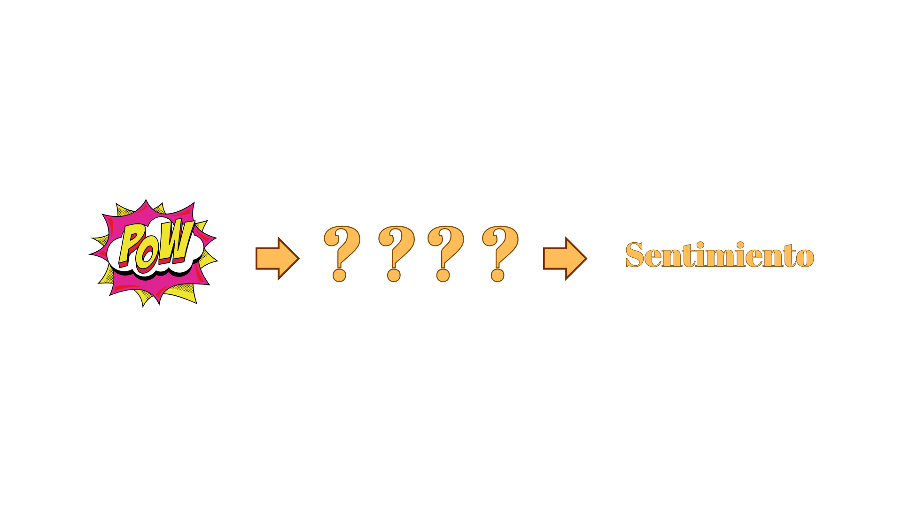
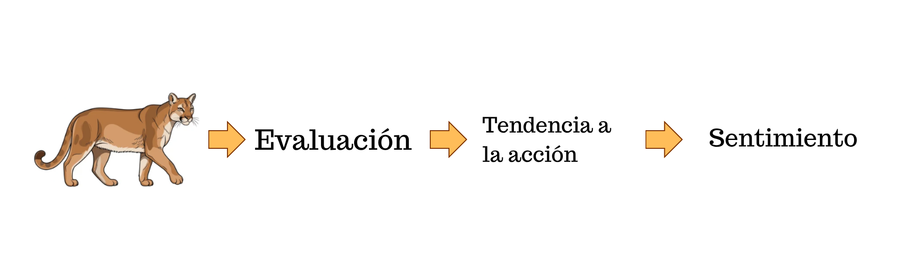
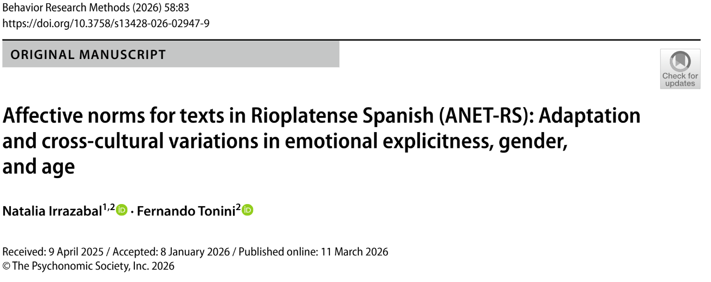

##  {data-background-color="#ffffff"}


<div style="position: absolute; top: 0; right: 0; width: 0; height: 0; border-top: 550px solid #3d3229; border-left: 500px solid transparent; z-index: 0;"></div>


<div style="position: relative; z-index: 1; display: flex; flex-direction: column; justify-content: center; height: 75vh; padding-left: 1em;">

[Psicología de la Emoción]{style="color: #c9a96e; font-size: 0.55em; font-weight: 300; letter-spacing: 0.2em; text-transform: uppercase;"}

[Teorías explicativas]{style="color: #3d3229; font-size: 1.4em; font-weight: 700; font-family: 'Libre Baskerville', serif; line-height: 1.2; display: block;"}

<br>

[Clase 9 · ]{style="color: #a09585; font-size: 0.5em;"}
[Dr. Fernando Tonini]{style="color: #a09585; font-size: 0.5em;"}

</div>

------------------------------------------------------------------------

## Algunos autores... {.slide-titulo}

::: barra-vertical
:::

::: contenido-titulo
   James–Lange · Cannon–Bard · Arnold · Schachter y Singer · Zajonc
:::

------------------------------------------------------------------------

## Componentes de la emoción

:::::: cols-3
::: tarjeta
<h4>Experiencia subjetiva</h4>

<p>Sentimiento o vivencia de la persona: estar [alegre, triste, nervioso]{.dorado}.</p>
:::

::: tarjeta
<h4>Cambios fisiológicos</h4>

<p>Sistema nervioso y endocrino juegan un papel crucial: [sudor, aceleración del ritmo cardíaco]{.dorado}.</p>
:::

::: tarjeta
<h4>Conducta</h4>

<p>Expresión manifiesta de lo que sentimos: [llorar, fruncir el ceño, correr, gritar]{.dorado}.</p>
:::
::::::

::: {.caja-dorada style="margin-top:1em"}
Estos componentes, unidos al **conocimiento que se tenga del estímulo**, ofrecen elementos para identificar y distinguir las emociones.
:::

------------------------------------------------------------------------

##  {data-background-color="#ffffff"}

:::::: {style="display: flex; align-items: center; height: 70vh; padding-left: 0.5em;"}
<div>

::: {style="color: #c9a96e; font-size: 0.45em; letter-spacing: 0.2em; font-weight: 300; text-transform: uppercase; margin-bottom: 0.5em;"}
EMOCIÓN
:::

::: {style="color: #3d3229; font-size: 1.4em; font-family: 'Libre Baskerville', serif; font-weight: 700; line-height: 1.3; border-left: 4px solid #c9a96e; padding-left: 0.5em;"}
Teorías de la emoción
:::

</div>
::::::


------------------------------------------------------------------------

## El problema central

::: {.caja-dorada style="margin-top:0.5em; font-size:0.95em"}
**Objetivo principal:** aclarar la secuencia [estímulo → sentimiento]{.dorado} para conocer los procesos intermedios.
:::

{fig-align="center" width="35%"}

::: {.caja-oscura style="margin-top:0.8em; text-align:center"}
Cada teoría propone qué ocurre en ese **espacio intermedio**.
:::

------------------------------------------------------------------------

##  {data-background-color="#ffffff"}

:::::: {style="display: flex; align-items: center; height: 70vh; padding-left: 0.5em;"}
<div>

::: {style="color: #c9a96e; font-size: 0.45em; letter-spacing: 0.2em; font-weight: 300; text-transform: uppercase; margin-bottom: 0.5em;"}
TEORÍAS EMOCIÓN
:::

::: {style="color: #3d3229; font-size: 1.4em; font-family: 'Libre Baskerville', serif; font-weight: 700; line-height: 1.3; border-left: 4px solid #c9a96e; padding-left: 0.5em;"}
James-Lange - Teoría periférica
:::

</div>
::::::

------------------------------------------------------------------------

## James–Lange: la pregunta inicial

::: subtitulo-slide
¿Cuál es el orden de los hechos?
:::

:::::: {.cols-2 style="margin-top:1.5em"}
::: {.tarjeta style="text-align:center"}
<h4>Opción A</h4>

<p>Porque <strong>huimos</strong>,<br>tenemos <strong>miedo</strong></p>
:::

::: {.tarjeta style="text-align:center"}
<h4>Opción B</h4>

<p>Porque tenemos <strong>miedo</strong>,<br><strong>huimos</strong></p>
:::
::::::


------------------------------------------------------------------------

## James–Lange: la pregunta inicial

::: subtitulo-slide
¿Cuál es el orden de los hechos?
:::

:::::: {.cols-2 style="margin-top:1.5em"}
::: {.tarjeta style="text-align:center"}
<h4>Opción A</h4>

<p>Porque <strong>huimos</strong>,<br>tenemos <strong>miedo</strong></p>
:::

::: {.tarjeta style="text-align:center"}
<h4>Opción B</h4>

<p>Porque tenemos <strong>miedo</strong>,<br><strong>huimos</strong></p>
:::
::::::

::: {.caja-dorada style="margin-top:1em; text-align:center; font-size:0.9em"}
James y Lange responden: [Opción A]{.dorado} —-> la fisiología precede al sentimiento.
:::

------------------------------------------------------------------------

## James–Lange: secuencia

{fig-align="center" width="35%"}

::: {.caja-dorada style="margin-top:1em; font-size:0.85em"}
Las respuestas fisiológicas regresan al cerebro como **sensaciones físicas**, y el patrón singular de feedback sensorial da a cada emoción su carácter único.
:::

:::::: {.cols-3 style="margin-top:0.7em; font-size:0.82em"}
::: tarjeta
<h4>Feedback</h4>

<p>El feedback determina el sentimiento.</p>
:::

::: tarjeta
<h4>Especificidad</h4>

<p>Cada emoción tiene una respuesta fisiológica distinta → feedback distinto.</p>
:::

::: tarjeta
<h4>Diferencia</h4>

<p>La emoción se distingue de otros estados mentales por las respuestas físicas.</p>
:::
::::::

------------------------------------------------------------------------

## James–Lange: emoción = producto físico

:::::: {.cols-2 style="margin-top:0.5em"}
::: tarjeta
<h4>Tesis central</h4>

<p>Los <strong>cambios corporales</strong> son la causa de las experiencias emocionales percibidas.</p>

<p>Los sentimientos son respuestas a los cambios que ocurren en el sistema <strong>nervioso, muscular y glandular</strong>.</p>
:::

::: caja-oscura
<p style="margin:0"><strong style="color:#c9a96e">Conclusión</strong></p>

<p style="margin-top:0.4em">El aspecto mental de la emoción (sentimiento) es <em>esclavo</em> de su fisiología.</p>
:::
::::::

::: {.caja-dorada style="margin-top:1em; text-align:center; font-size:0.95em"}
Porque <span style="border-bottom:2px solid #996b2f">lloramos</span> [(1)]{.dorado}, estamos <span style="border-bottom:2px solid #996b2f">tristes</span> [(2)]{.dorado}.
:::

------------------------------------------------------------------------

##  {data-background-color="#ffffff"}

:::::: {style="display: flex; align-items: center; height: 70vh; padding-left: 0.5em;"}
<div>

::: {style="color: #c9a96e; font-size: 0.45em; letter-spacing: 0.2em; font-weight: 300; text-transform: uppercase; margin-bottom: 0.5em;"}
TEORÍAS EMOCIÓN
:::

::: {style="color: #3d3229; font-size: 1.4em; font-family: 'Libre Baskerville', serif; font-weight: 700; line-height: 1.3; border-left: 4px solid #c9a96e; padding-left: 0.5em;"}
Cannon-Bard - Teoría central
:::

</div>
::::::

------------------------------------------------------------------------

## Cannon–Bard: la pregunta

::: subtitulo-slide
¿Qué tiene prioridad en la secuencia emocional?
:::

:::::: {.cols-2 style="margin-top:1.5em"}
::: {.tarjeta style="text-align:center"}
<h4>Prioridad fisiológica</h4>

<p>La emoción surge del cuerpo<br>(James–Lange)</p>
:::

::: {.tarjeta style="text-align:center"}
<h4>Prioridad de la experiencia consciente</h4>

<p>La emoción surge del<br>procesamiento central</p>
:::
::::::

::: {.caja-dorada style="margin-top:1em; text-align:center; font-size:0.9em"}
Cannon y Bard sostienen la [segunda posición]{.dorado}: lo central no es lo periférico :p
:::

------------------------------------------------------------------------

## Cannon–Bard: secuencia

{fig-align="center" width="50%"}

::: {.caja-dorada style="margin-top:1em; font-size:0.9em"}
Ante un estímulo, los impulsos nerviosos viajan **simultáneamente** en dos direcciones — los cambios corporales y la experiencia consciente son procesos **paralelos**, no causalmente encadenados.
:::

------------------------------------------------------------------------

## Cannon–Bard: emoción = producto "cognitivo"

:::::: {.cols-2 style="margin-top:0.5em"}
::: tarjeta
<h4>Tesis central</h4>

<p>Las reacciones fisiológicas que acompañan a diferentes emociones son <strong>las mismas</strong> → no podríamos depender únicamente de ellas para distinguir una emoción de otra.</p>
:::

::: tarjeta
<h4>Dos vías paralelas</h4>

<p><strong>Corteza</strong> → procesos sofisticados del pensamiento (evaluar al atacante como peligroso basta para producir miedo).</p>

<p><strong>Tálamo</strong> → regula los cambios fisiológicos (reacción de lucha o escape).</p>
:::
::::::

------------------------------------------------------------------------

## Cannon–Bard: críticas a James–Lange

::: {style="font-size:0.86em; margin-top:0.5em"}

1. Sigue habiendo experiencia emocional en pacientes con [lesiones desaferentizadas]{.dorado} (sin retorno sensorial visceral).
2. Los fenómenos corporales [no varían suficientemente]{.dorado} de una emoción a otra y sin embargo reconocemos las emociones.
3. Las actividades viscerales [no son sentidas con precisión]{.dorado}.
4. Los cambios viscerales llevan tiempo, mientras que la experiencia emocional es [inmediata]{.dorado}.
5. La excitación visceral artificial (ej.: inyección de adrenalina) [no produce emoción por sí sola]{.dorado}.

:::

------------------------------------------------------------------------

##  {data-background-color="#ffffff"}

:::::: {style="display: flex; align-items: center; height: 70vh; padding-left: 0.5em;"}
<div>

::: {style="color: #c9a96e; font-size: 0.45em; letter-spacing: 0.2em; font-weight: 300; text-transform: uppercase; margin-bottom: 0.5em;"}
TEORÍAS EMOCIÓN
:::

::: {style="color: #3d3229; font-size: 1.4em; font-family: 'Libre Baskerville', serif; font-weight: 700; line-height: 1.3; border-left: 4px solid #c9a96e; padding-left: 0.5em;"}
Magda Arnold - La emoción congelada
:::

</div>
::::::

------------------------------------------------------------------------

## Arnold: la pregunta

::: subtitulo-slide
¿Alcanza con conocer el estímulo?
:::

:::::: {.cols-2 style="margin-top:1.5em"}
::: {.tarjeta style="text-align:center"}
<h4>Solo percibir</h4>

<p>Percibir el estímulo basta<br>para sentir la emoción</p>
:::

::: {.tarjeta style="text-align:center"}
<h4>No solo percibir</h4>

<p>Hace falta una <strong>evaluación</strong><br>del estímulo</p>
:::
::::::

::: {.caja-dorada style="margin-top:1em; text-align:center; font-size:0.9em"}
Arnold introduce un eslabón clave: la [evaluación (appraisal)]{.dorado}.
:::

------------------------------------------------------------------------

## Arnold: secuencia

{fig-align="center" width="50%"}

::: {.caja-dorada style="margin-top:1em; font-size:0.88em"}
La novedad: entre el estímulo y el sentimiento se interpone una **valoración mental** del daño o beneficio potencial de la situación.
:::

------------------------------------------------------------------------

## Arnold: appraisal y emoción

:::::: {.cols-2 style="margin-top:0.5em"}
::: tarjeta
<h4>Evaluación (appraisal)</h4>

<p>Valoración mental del daño o beneficio potencial de una situación.</p>
:::

::: tarjeta
<h4>Emoción</h4>

<p>Tendencia sentida que conduce a <strong>acercarse</strong> a lo evaluado positivamente o <strong>alejarse</strong> de lo evaluado negativamente.</p>

<p style="font-size:0.88em; font-style:italic">No es la acción ejecutada, sino la tendencia.</p>
:::
::::::

::: {.caja-dorada style="margin-top:0.8em; font-size:0.85em"}
El proceso de evaluación es **inconsciente**, pero sus efectos se graban en la **consciencia** como sentimiento.
:::

------------------------------------------------------------------------

## Arnold: cómo se diferencian las emociones

::: {.caja-oscura style="margin-top:0.5em; text-align:center; font-size:0.95em"}
La emoción se diferencia de otros estados mentales por la presencia de **evaluación** en la secuencia causal.
:::

::: {.formula-box style="margin-top:1em"}
Evaluaciones distintas → Tendencias a la acción distintas → Sentimientos distintos
:::

::: {.caja-dorada style="margin-top:1em; font-size:0.85em"}
Cuando el resultado de la evaluación se graba en la consciencia (como sentimiento), puede recordarse la experiencia emocional y describirse el proceso de evaluación → habilita la investigación por **informes introspectivos**.
:::

------------------------------------------------------------------------

##  {data-background-color="#ffffff"}

:::::: {style="display: flex; align-items: center; height: 70vh; padding-left: 0.5em;"}
<div>

::: {style="color: #c9a96e; font-size: 0.45em; letter-spacing: 0.2em; font-weight: 300; text-transform: uppercase; margin-bottom: 0.5em;"}
TEORÍAS EMOCIÓN
:::

::: {style="color: #3d3229; font-size: 1.4em; font-family: 'Libre Baskerville', serif; font-weight: 700; line-height: 1.3; border-left: 4px solid #c9a96e; padding-left: 0.5em;"}
Schachter y Singer - La pasión razonada
:::

</div>
::::::

------------------------------------------------------------------------

## Schachter y Singer: la pregunta

::: subtitulo-slide
¿La activación fisiológica es específica o inespecífica?
:::

:::::: {.cols-2 style="margin-top:1.5em"}
::: {.tarjeta style="text-align:center"}
<h4>Activación específica</h4>

<p>Cada emoción tiene su propia<br>firma fisiológica<br><em>(James–Lange)</em></p>
:::

::: {.tarjeta style="text-align:center"}
<h4>Activación inespecífica</h4>

<p>La activación es común a todas;<br>otros factores la diferencian<br><em>(Cannon-Bard)</em></p>
:::
::::::

------------------------------------------------------------------------

## La pasión razonada: secuencia

{fig-align="center" width="50%"}

:::::: {.cols-2 style="margin-top:1em; font-size:0.88em"}
::: tarjeta
<h4>Idem James</h4>

<p>El feedback fisiológico está en el origen de la emoción.</p>
:::

::: tarjeta
<h4>Idem Cannon</h4>

<p>El feedback fisiológico <strong>no es específico</strong> para cada emoción.</p>
:::
::::::

::: {.caja-dorada style="margin-top:0.8em; text-align:center; font-size:0.9em"}
Entre la ausencia de especificidad del feedback y la especificidad de la experiencia sentida está la [cognición]{.dorado}.
:::

------------------------------------------------------------------------

## Teoría bifactorial de la emoción

::: {.formula-box style="margin-top:0.5em"}
Emoción = activación (arousal) + evaluación (appraisal)
:::

:::::: {.cols-2 style="margin-top:1em; font-size:0.86em"}
::: tarjeta
<h4>1 · Activación</h4>

<p>La respuesta fisiológica informa al cerebro que existe un estado de activación intensificado. Esta respuesta es <strong>común a todas las emociones</strong> → no permite identificar una emoción específica.</p>
:::

::: tarjeta
<h4>2 · Etiquetado</h4>

<p>Tomando información del <strong>contexto físico y social</strong> + conocimiento sobre el tipo de emoción apropiada para esa situación, clasificamos el estado de activación como una emoción específica.</p>
:::
::::::

::: {.caja-oscura style="margin-top:1em; text-align:center"}
Las emociones son el resultado de la **interpretación cognitiva** de la situación. La clasificación de la activación es lo que determina la emoción que sentimos.
:::

------------------------------------------------------------------------

## Schachter–Singer: emoción = activación + evaluación

:::::: {.cols-2 style="margin-top:0.5em"}
::: tarjeta
<h4>Tesis central</h4>

<p>Las emociones están determinadas por <strong>cualquier clase de excitación fisiológica</strong> (no importa su naturaleza específica) y por su <strong>interpretación</strong> basada en aspectos ambientales.</p>

<p>Las experiencias emocionales son una función conjunta de la excitación fisiológica y de su etiquetación.</p>
:::

::: tarjeta
<h4>Evidencia empírica</h4>

<p><strong>Experimento clásico:</strong> inyección de adrenalina con distintas instrucciones contextuales.</p>

<p><strong>Valins (1966):</strong> falsa retroalimentación con fotos + ritmos cardíacos simulados.</p>
:::
::::::

::: {.caja-dorada style="margin-top:0.8em; font-size:0.85em"}
**Conclusión de Valins:** para que la activación fisiológica intervenga en la experiencia emocional, debe estar [representada cognitivamente]{.dorado}. Es esa representación — y no la activación en sí misma — la que interactúa con el pensamiento sobre la situación para generar la emoción.
:::

------------------------------------------------------------------------

##  {data-background-color="#ffffff"}

:::::: {style="display: flex; align-items: center; height: 70vh; padding-left: 0.5em;"}
<div>

::: {style="color: #c9a96e; font-size: 0.45em; letter-spacing: 0.2em; font-weight: 300; text-transform: uppercase; margin-bottom: 0.5em;"}
TEORÍAS EMOCIÓN
:::

::: {style="color: #3d3229; font-size: 1.4em; font-family: 'Libre Baskerville', serif; font-weight: 700; line-height: 1.3; border-left: 4px solid #c9a96e; padding-left: 0.5em;"}
Zajonc - La mera exposición
:::

</div>
::::::

------------------------------------------------------------------------

## Zajonc: la pregunta

::: subtitulo-slide
¿Es necesario reconocer el estímulo para sentir una emoción?
:::

:::::: {.cols-2 style="margin-top:1.5em"}
::: {.tarjeta style="text-align:center"}
<h4>El reconocimiento es necesario</h4>

<p>Sin cognición previa<br>no hay emoción<br><em>(Lazarus, Arnold)</em></p>
:::

::: {.tarjeta style="text-align:center"}
<h4>El reconocimiento no es necesario</h4>

<p>Puede haber afecto<br>sin cognición consciente<br><em>(Zajonc)</em></p>
:::
::::::

------------------------------------------------------------------------

## Zajonc: secuencia

{fig-align="center" width="50%"}

::: {.caja-dorada style="margin-top:1em; font-size:0.88em"}
La mera exposición (aún fugaz y subliminal) a un estímulo es suficiente para crear preferencia. La reacción afectiva **antecede** a la cognición y se produce **independientemente** de ella.
:::

------------------------------------------------------------------------

## El efecto de mera exposición

::: {style="font-size:0.88em; margin-top:0.5em"}
La exposición repetida a un objeto (sin ganancia de conocimiento) conduce a una actitud más favorable hacia él: [la familiaridad lleva al aprecio]{.dorado}.
:::

:::::: {.cols-2 style="margin-top:0.8em; font-size:0.82em"}
::: tarjeta
<h4>Características</h4>

<ul>
<li>Efecto muy consistente: más de 200 experimentos.</li>
<li>No requiere interacción ni creencias sobre el objeto.</li>
<li>Suele estar asociado a creencias <strong>implícitas</strong>.</li>
</ul>
:::

::: tarjeta
<h4>Requisitos</h4>

<ul>
<li><strong>(a)</strong> Solo se observa con objetos inicialmente neutros o positivos. En objetos percibidos como negativos, produce el efecto contrario.</li>
<li><strong>(b)</strong> <em>Desgaste:</em> la mera exposición es efectiva solo dentro de cierta frecuencia de repetición.</li>
</ul>
:::
::::::

::: {.caja-dorada style="margin-top:0.8em; font-size:0.82em; text-align:center"}
Estudios clásicos: ideogramas chinos, palabras turcas sin sentido, fotografías.
:::

------------------------------------------------------------------------

## El efecto de mera exposición

```{r}

library(tidyverse)

set.seed(123)

n_participantes <- 60

medias_esperadas <- tribble(
  ~frecuencia, ~estimulo, ~media_esperada,
  
  0,  "Palabras sin sentido", 2.65,
  1,  "Palabras sin sentido", 2.85,
  2,  "Palabras sin sentido", 3.35,
  5,  "Palabras sin sentido", 4.05,
  10, "Palabras sin sentido", 5.05,
  25, "Palabras sin sentido", 5.45,
  
  0,  "Caracteres chinos", 2.70,
  1,  "Caracteres chinos", 2.95,
  2,  "Caracteres chinos", 3.40,
  5,  "Caracteres chinos", 3.95,
  10, "Caracteres chinos", 5.15,
  25, "Caracteres chinos", 5.35,
  
  0,  "Fotografías", 2.60,
  1,  "Fotografías", 2.80,
  2,  "Fotografías", 3.15,
  5,  "Fotografías", 3.70,
  10, "Fotografías", 4.90,
  25, "Fotografías", 5.10
)

datos <- expand_grid(
  id = 1:n_participantes,
  frecuencia = c(0, 1, 2, 5, 10, 25),
  estimulo = c(
    "Palabras sin sentido",
    "Caracteres chinos",
    "Fotografías"
  )
) %>%
  left_join(
    medias_esperadas,
    by = c("frecuencia", "estimulo")
  ) %>%
  mutate(
    evaluacion = rnorm(n(), mean = media_esperada, sd = 0.50),
    evaluacion = pmin(pmax(evaluacion, 1), 7)
  )

resumen <- datos %>%
  group_by(frecuencia, estimulo) %>%
  summarise(
    n = sum(!is.na(evaluacion)),
    media = mean(evaluacion, na.rm = TRUE),
    sd = sd(evaluacion, na.rm = TRUE),
    se = sd / sqrt(n),
    ic95 = qt(.975, df = n - 1) * se,
    li = media - ic95,
    ls = media + ic95,
    .groups = "drop"
  )

ggplot() +
  geom_point(
    data = datos,
    aes(
      x = frecuencia,
      y = evaluacion,
      color = estimulo
    ),
    alpha = .15,
    size = 1.6,
    position = position_jitter(width = .25, height = 0)
  ) +
  geom_errorbar(
    data = resumen,
    aes(
      x = frecuencia,
      ymin = li,
      ymax = ls,
      color = estimulo
    ),
    width = .35,
    linewidth = .6
  ) +
  geom_line(
    data = resumen,
    aes(
      x = frecuencia,
      y = media,
      group = estimulo,
      color = estimulo
    ),
    linewidth = .95
  ) +
  geom_point(
    data = resumen,
    aes(
      x = frecuencia,
      y = media,
      color = estimulo
    ),
    size = 2.9
  ) +
  scale_x_continuous(
    breaks = c(0, 1, 2, 5, 10, 25)
  ) +
  scale_y_continuous(
    limits = c(1, 6),
    breaks = 1:6
  ) +
  labs(
    x = "Frecuencia de exposición",
    y = "Preferencia",
    color = "Tipo de estímulo"
  ) +
  theme_classic(base_size = 13) +
  theme(
    legend.position = "top",
    legend.title = element_text(size = 11),
    legend.text = element_text(size = 10),
    axis.title = element_text(size = 12),
    axis.text = element_text(size = 11)
  )

```

------------------------------------------------------------------------

## Zajonc: función adaptativa

::: {.caja-oscura style="margin-top:0.5em; text-align:center"}
Idoneidad biológica del afecto preconsciente
:::

:::::: {.cols-2 style="margin-top:1em; font-size:0.88em"}
::: tarjeta
<h4>Lo familiar</h4>

<p>Es poco probable que represente un peligro para la propia seguridad y salud.</p>
:::

::: tarjeta
<h4>Lo desconocido</h4>

<p>Es potencialmente peligroso → precaución, vacilación, incluso temor.</p>
:::
::::::

::: {.caja-dorada style="margin-top:1em; text-align:center; font-size:0.92em"}
En un modo de funcionamiento muy simple [independiente de la cognición]{.dorado} donde la sola exposición repetida a lo desconocido lo vuelve familiar.
:::

------------------------------------------------------------------------

##  {data-background-color="#ffffff"}

:::::: {style="display: flex; align-items: center; height: 70vh; padding-left: 0.5em;"}
<div>

::: {style="color: #c9a96e; font-size: 0.45em; letter-spacing: 0.2em; font-weight: 300; text-transform: uppercase; margin-bottom: 0.5em;"}
TEORÍAS EMOCIÓN - LAM
:::

::: {style="color: #3d3229; font-size: 1.4em; font-family: 'Libre Baskerville', serif; font-weight: 700; line-height: 1.3; border-left: 4px solid #c9a96e; padding-left: 0.5em;"}
Debate: Cognición vs. Emoción
:::

</div>
::::::

------------------------------------------------------------------------

## Lazarus vs. Zajonc

<table class="tabla-contenido" style="margin-top:0.5em; font-size:0.78em">
<thead>
<tr>
<th style="width:50%">Lazarus</th>
<th style="width:50%">Zajonc</th>
</tr>
</thead>
<tbody>
<tr>
<td>La <strong>evaluación cognitiva</strong> es indispensable para la génesis de la emoción.</td>
<td>Las emociones son <strong>absolutamente independientes</strong> de los fenómenos cognitivos.</td>
</tr>
<tr>
<td>La cognición es condición <strong>necesaria y suficiente</strong> para la aparición de una emoción.</td>
<td>Emoción y cognición son dos fenómenos <strong>independientes</strong>: la experiencia emocional puede anteceder al trabajo cognitivo. Están involucrados <strong>distintos sistemas neurales</strong>.</td>
</tr>
</tbody>
</table>

::: {.caja-dorada style="margin-top:1em; font-size:0.88em; text-align:center"}
Un debate que sigue abierto: ¿se puede sentir antes de pensar?
:::

------------------------------------------------------------------------

## Síntesis comparativa

<table class="tabla-contenido tabla-pequeña" style="margin-top:0.3em">
<thead>
<tr>
<th>Teoría</th>
<th>Eslabón intermedio</th>
<th>Tesis</th>
</tr>
</thead>
<tbody>
<tr>
<td><strong>James–Lange</strong></td>
<td>Cambios corporales</td>
<td>La emoción es producto físico</td>
</tr>
<tr>
<td><strong>Cannon–Bard</strong></td>
<td>Procesamiento central paralelo</td>
<td>Cuerpo y experiencia van en paralelo</td>
</tr>
<tr>
<td><strong>Arnold</strong></td>
<td>Evaluación (appraisal)</td>
<td>La valoración define la emoción</td>
</tr>
<tr>
<td><strong>Schachter–Singer</strong></td>
<td>Activación + etiquetado</td>
<td>Arousal inespecífico + cognición</td>
</tr>
<tr>
<td><strong>Zajonc</strong></td>
<td>Afecto inconsciente</td>
<td>El afecto puede preceder a la cognición</td>
</tr>
</tbody>
</table>

------------------------------------------------------------------------

##  {data-background-color="#ffffff"}

:::::: {style="display: flex; align-items: center; height: 70vh; padding-left: 0.5em;"}
<div>

::: {style="color: #c9a96e; font-size: 0.45em; letter-spacing: 0.2em; font-weight: 300; text-transform: uppercase; margin-bottom: 0.5em;"}
INVESTIGACIÓN EN EMOCIÓN
:::

::: {style="color: #3d3229; font-size: 1.4em; font-family: 'Libre Baskerville', serif; font-weight: 700; line-height: 1.3; border-left: 4px solid #c9a96e; padding-left: 0.5em;"}
Qué hacemos en la actualidad?
:::

</div>
::::::

------------------------------------------------------------------------

## Tres grandes áreas

:::::: {.cols-3 style="margin-top:1.5em"}
::: {.tarjeta style="text-align:center"}
<h4>Inducción emocional</h4>

<p>Métodos para <strong>provocar</strong> estados emocionales en contextos experimentales.</p>
:::

::: {.tarjeta style="text-align:center"}
<h4>Patrones de respuesta</h4>

<p>Instrumentos para <strong>registrar</strong> la experiencia y la fisiología emocional.</p>
:::

::: {.tarjeta style="text-align:center"}
<h4>Efectos de la emoción</h4>

<p>Cómo la emoción <strong>impacta</strong> en otros procesos psicológicos.</p>
:::
::::::

------------------------------------------------------------------------

##  {data-background-color="#ffffff"}

:::::: {style="display: flex; align-items: center; height: 70vh; padding-left: 0.5em;"}
<div>

::: {style="color: #c9a96e; font-size: 0.45em; letter-spacing: 0.2em; font-weight: 300; text-transform: uppercase; margin-bottom: 0.5em;"}
INVESTIGACIÓN EN EMOCIÓN
:::

::: {style="color: #3d3229; font-size: 1.4em; font-family: 'Libre Baskerville', serif; font-weight: 700; line-height: 1.3; border-left: 4px solid #c9a96e; padding-left: 0.5em;"}
Inducción emocional
:::

</div>
::::::

------------------------------------------------------------------------

## Inducción emocional: métodos

<table class="tabla-contenido tabla-pequeña" style="margin-top:0.3em">
<thead>
<tr>
<th>Método</th>
<th>Instrumento</th>
<th>Autor y año</th>
<th>Característica</th>
</tr>
</thead>
<tbody>
<tr>
<td><strong>Frases</strong></td>
<td>Procedimiento de inducción de Velten</td>
<td>Velten, 1968</td>
<td>60 frases en primera persona, contenido alegre, triste o neutro.</td>
</tr>
<tr>
<td><strong>Imágenes</strong></td>
<td>IAPS – International Affective Picture System</td>
<td>Lang, Bradley & Cuthbert, 1995</td>
<td>~1000 imágenes emocionales estandarizadas.</td>
</tr>
<tr>
<td><strong>Sonidos</strong></td>
<td>IADS – International Affective Digital Sounds</td>
<td>Bradley & Lang, 2007</td>
<td>Archivos de sonido con efecto emocional.</td>
</tr>
<tr>
<td><strong>Películas</strong></td>
<td>PIE; baterías de Gross y Schaefer</td>
<td>Fernández et al., 2012; Gross, 1995; Schaefer et al., 2010</td>
<td>Fragmentos comerciales que inducen emociones básicas.</td>
</tr>
<tr>
<td><strong>Expresión facial</strong></td>
<td>Facial Action Coding System</td>
<td>Ekman & Friesen, 1978</td>
<td>Imágenes de expresiones faciales de emociones básicas.</td>
</tr>
<tr>
<td><strong>Recuerdos</strong></td>
<td>Recuerdos autobiográficos</td>
<td>—</td>
<td>El sujeto evoca situaciones emocionalmente significativas de su propia vida.</td>
</tr>
</tbody>
</table>

------------------------------------------------------------------------

## Validación del IAPS en Argentina

{fig-align="center" width="50%"}

<br>

[Artículo](https://rdcu.be/e7UX8) 

::: {.caja-dorada style="margin-top:0.8em; font-size:0.85em; text-align:center"}
La evaluación de los estímulos se distribuye en el espacio afectivo en forma de **boomerang**, mostrando resultados consistentes con la versión original y con validaciones en otros países.
:::

------------------------------------------------------------------------

##  {data-background-color="#ffffff"}

:::::: {style="display: flex; align-items: center; height: 70vh; padding-left: 0.5em;"}
<div>

::: {style="color: #c9a96e; font-size: 0.45em; letter-spacing: 0.2em; font-weight: 300; text-transform: uppercase; margin-bottom: 0.5em;"}
INVESTIGACIÓN EN EMOCIÓN
:::

::: {style="color: #3d3229; font-size: 1.4em; font-family: 'Libre Baskerville', serif; font-weight: 700; line-height: 1.3; border-left: 4px solid #c9a96e; padding-left: 0.5em;"}
Registro de patrones: subjetivos y objetivos
:::

</div>
::::::

------------------------------------------------------------------------

## Registro subjetivo: autoinformes

<table class="tabla-contenido tabla-pequeña" style="margin-top:0.3em">
<thead>
<tr>
<th>Instrumento</th>
<th>Autor y año</th>
<th>Descripción</th>
</tr>
</thead>
<tbody>
<tr>
<td><strong>MACL</strong><br>Mood Adjective Checklist</td>
<td>Nowlis, 1965</td>
<td>Lista de adjetivos para describir estados afectivos en escala Likert de 4 puntos.</td>
</tr>
<tr>
<td><strong>POMS</strong><br>Profile of Mood States</td>
<td>McNair, Lorr & Droppleman, 1971</td>
<td>65 adjetivos en escala de 5 puntos. 6 factores: tensión-ansiedad, depresión-melancolía, cólera-hostilidad, vigor-actividad, fatiga-inercia, confusión-desorientación.</td>
</tr>
<tr>
<td><strong>DES</strong><br>Differential Emotions Scale</td>
<td>Izard, Dougherty, Bloxom & Kotsch, 1974</td>
<td>Valora 10 emociones (alegría, sorpresa, ira, asco, desprecio, vergüenza, culpa, interés, tristeza). 3 ítems por emoción, escala de 5 puntos.</td>
</tr>
<tr>
<td><strong>PANAS</strong><br>Positive and Negative Affect Schedule</td>
<td>Watson & Clark, 1994</td>
<td>Dos subescalas (afecto positivo y negativo), 10 ítems cada una, formato verdadero/falso.</td>
</tr>
<tr>
<td><strong>SAM</strong><br>Self Assessment Manikins</td>
<td>Bradley & Lang, 1994</td>
<td>Mide la respuesta emocional desde una perspectiva dimensional mediante pictogramas. Tres escalas: valencia, activación y control.</td>
</tr>
</tbody>
</table>

------------------------------------------------------------------------

## Registros objetivos

:::::: {.cols-2 style="margin-top:0.5em"}
::: tarjeta
<h4>A · Electromiografía (EMG)</h4>

<p>Registra la actividad de los músculos faciales involucrados en la <strong>expresión emocional</strong>.</p>
:::

::: tarjeta
<h4>B · Medidas fisiológicas</h4>

<p>Respuesta <strong>electrodérmica</strong>, <strong>frecuencia cardíaca</strong>, presión arterial, respiración.</p>
:::
::::::

:::::: {.cols-2 style="margin-top:0.8em"}
::: tarjeta
<h4>C · Neuroimagen</h4>

<p>fMRI, PET — identifican <strong>regiones cerebrales</strong> activas durante la experiencia emocional.</p>
:::

::: tarjeta
<h4>D · Electroencefalograma (EEG)</h4>

<p>Mide la <strong>actividad cerebral eléctrica</strong> con alta resolución temporal.</p>
:::
::::::

::: {.caja-dorada style="margin-top:0.8em; text-align:center; font-size:0.88em"}
Cada técnica captura una dimensión distinta del fenómeno emocional.
:::

------------------------------------------------------------------------

## EEG: potenciales evocados (ERPs)

:::::: {.cols-2 style="margin-top:0.5em"}
::: tarjeta
<h4>Procesamiento de emociones desde caras y palabras medido por ERPs</h4>

<p style="font-size:0.85em">Juuse, L., Kreegipuu, K., Põldver, N. et al. (2023). <em>Cognition and Emotion</em>.</p>

<p style="font-size:0.82em">DOI: 10.1080/02699931.2023.2223906</p>
:::

::: tarjeta
<h4>Hallazgos</h4>

<p style="font-size:0.82em">N = 116 participantes. Se analizaron ERPs evocados por las <strong>seis emociones básicas</strong> (ira, asco, miedo, alegría, tristeza, sorpresa) frente a estímulos neutros.</p>

<p style="font-size:0.82em">Los aspectos afectivos del estímulo se procesan [rápidamente y antes de la atribución cognitiva]{.dorado}, incluso para estímulos verbales — antes de lo que se creía.</p>
:::
::::::

::: {.caja-oscura style="margin-top:0.8em; text-align:center; font-size:0.88em"}
Tanto las emociones faciales como el significado de las palabras disparan procesamiento y respuestas en etapas **muy tempranas** del procesamiento.
:::

------------------------------------------------------------------------

##  {data-background-color="#ffffff"}

:::::: {style="display: flex; align-items: center; height: 70vh; padding-left: 0.5em;"}
<div>

::: {style="color: #c9a96e; font-size: 0.45em; letter-spacing: 0.2em; font-weight: 300; text-transform: uppercase; margin-bottom: 0.5em;"}
INVESTIGACIÓN EN EMOCIÓN
:::

::: {style="color: #3d3229; font-size: 1.4em; font-family: 'Libre Baskerville', serif; font-weight: 700; line-height: 1.3; border-left: 4px solid #c9a96e; padding-left: 0.5em;"}
Próximas clases
:::

</div>
::::::

------------------------------------------------------------------------

## Efectos de la emoción

:::::: {.cols-2 style="margin-top:1em"}
::: tarjeta
<h4>¿Cómo intervienen las emociones en la memoria?</h4>

<p style="font-size:0.85em; margin-top:0.5em">Madan, C. R., Scott, S. M. E. & Kensinger, E. A. (2019). Positive emotion enhances association-memory. <em>Emotion, 19</em>(4), 733–740.</p>

<p style="font-size:0.82em; font-style:italic">¿La valencia y la activación modulan la formación de asociaciones en la memoria?</p>
:::

::: tarjeta
<h4>¿Cómo afectan los estados emocionales a la toma de decisiones?</h4>

<p style="font-size:0.85em; margin-top:0.5em">Bognar, M., Gyurkovics, M., van Steenbergen, H. & Aczel, B. (2023). Phasic affective signals by themselves do not regulate cognitive control. <em>Cognition and Emotion</em>.</p>

<p style="font-size:0.82em; font-style:italic">¿Las señales afectivas fásicas alcanzan para modular el control cognitivo?</p>
:::
::::::

::: {.caja-dorada style="margin-top:1em; text-align:center; font-size:0.92em"}
La próxima clase: la emoción como **moduladora** de otros procesos psicológicos.
:::
