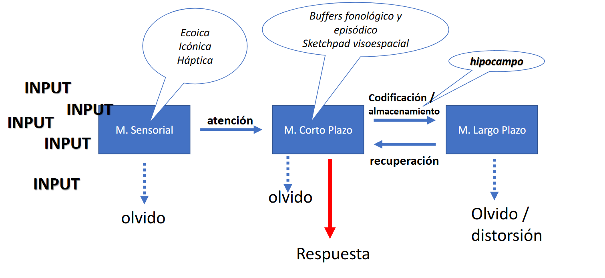
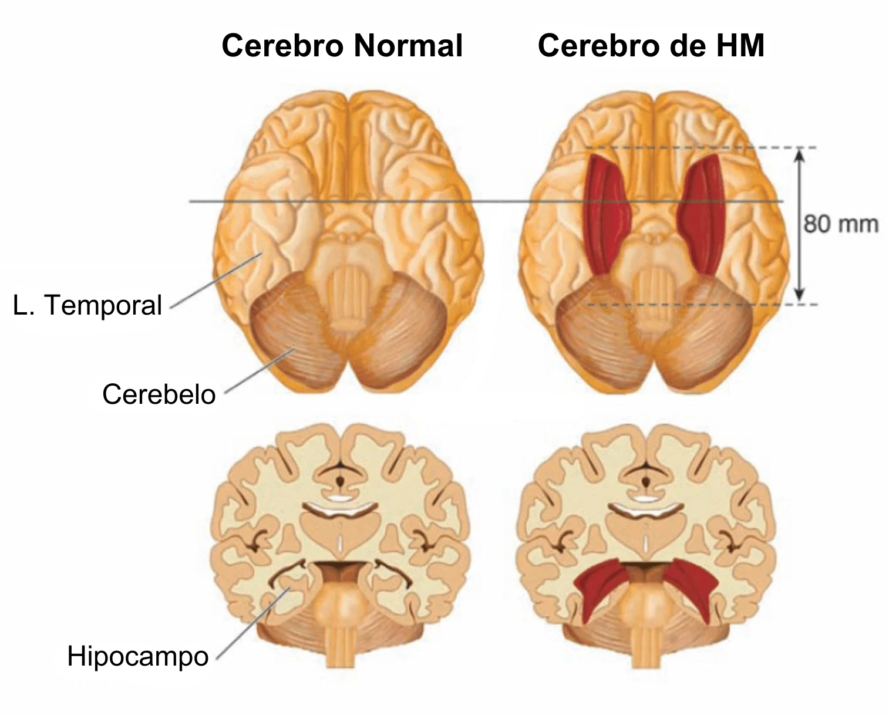
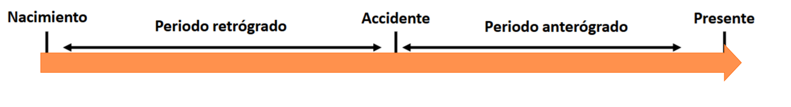
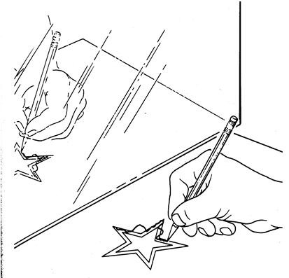
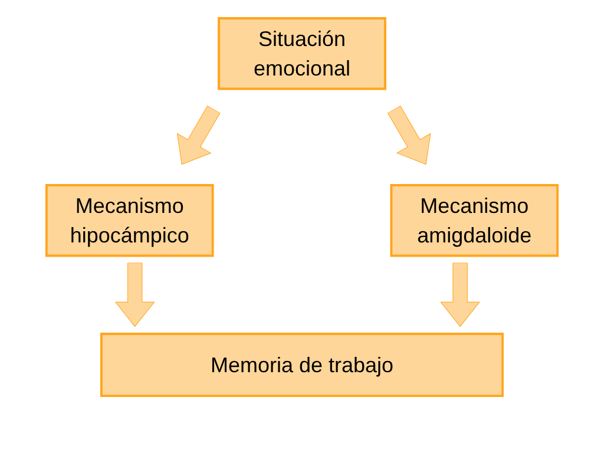
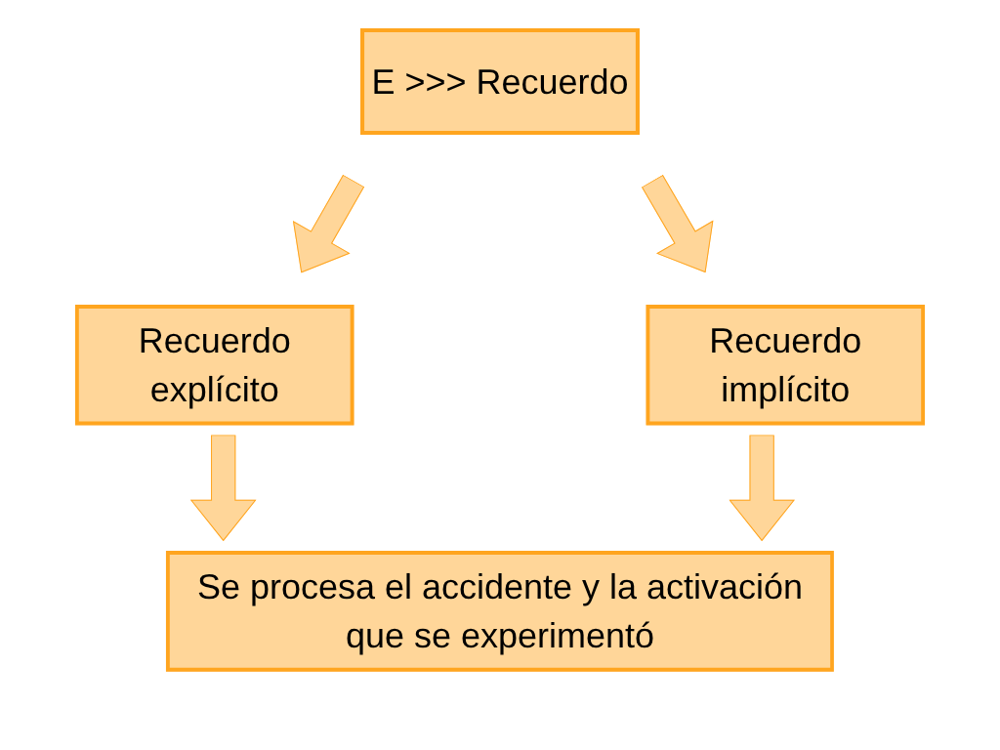
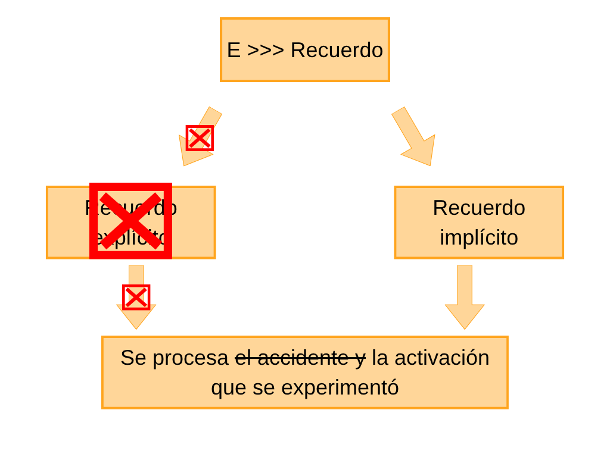

##  {data-background-color="#ffffff"}


<div style="position: absolute; top: 0; right: 0; width: 0; height: 0; border-top: 550px solid #3d3229; border-left: 500px solid transparent; z-index: 0;"></div>


<div style="position: relative; z-index: 1; display: flex; flex-direction: column; justify-content: center; height: 75vh; padding-left: 1em;">

[Psicología de la Emoción]{style="color: #c9a96e; font-size: 0.55em; font-weight: 300; letter-spacing: 0.2em; text-transform: uppercase;"}

[Emoción y Memoria]{style="color: #3d3229; font-size: 1.4em; font-weight: 700; font-family: 'Libre Baskerville', serif; line-height: 1.2; display: block;"}

<br>

[Clase 10 · ]{style="color: #a09585; font-size: 0.5em;"}
[Dr. Fernando Tonini]{style="color: #a09585; font-size: 0.5em;"}

</div>

------------------------------------------------------------------------

##  {data-background-color="#ffffff"}

:::::: {style="display: flex; align-items: center; height: 70vh; padding-left: 0.5em;"}
<div>

::: {style="color: #c9a96e; font-size: 0.45em; letter-spacing: 0.2em; font-weight: 300; text-transform: uppercase; margin-bottom: 0.5em;"}
Memoria emocional
:::

::: {style="color: #3d3229; font-size: 1.4em; font-family: 'Libre Baskerville', serif; font-weight: 700; line-height: 1.3; border-left: 4px solid #c9a96e; padding-left: 0.5em;"}
Una pregunta clínica
:::

</div>
::::::


------------------------------------------------------------------------

## Ginebra, 1911

::: {.cols-2 style="margin-top:0.5em"}

::: {style="font-size:0.92em"}
**Édouard Claparède** atiende a una paciente con amnesia anterógrada profunda. No puede formar nuevos recuerdos: cada visita es, para ella, la primera.

Un día, Claparède esconde una [chinche]{.dorado} en su mano antes de saludarla. La paciente siente el dolor.

En la visita siguiente, Claparède no la conoce, pero ella **retira la mano** antes del saludo.

No sabe por qué. No lo recuerda. Pero algo en ella sí.
:::

::: {style="font-size:0.85em; padding-top:0.5em"}
::: {.caja-dorada}
*"Si se me pregunta por qué no le doy la mano, le diría que hay personas que esconden chinches en la mano."*

— La paciente de Claparède
:::
:::

:::

------------------------------------------------------------------------

## ¿Cómo se recuerda sin recordar?

::: {style="text-align:center; margin-top:1.2em; font-size:1.05em"}
La paciente de Claparède inaugura, sin saberlo, **una pregunta que organiza buena parte de la psicología de la memoria del siglo XX**.
:::

::: {.cols-3 style="margin-top:1em"}

::: tarjeta
<h4>Disociación</h4>
Algo se almacena sin que la persona pueda acceder conscientemente a ello.
:::

::: tarjeta
<h4>Conducta</h4>
Ese "algo" guía la acción presente —> retirar la mano, evitar.
:::

::: tarjeta
<h4>Afecto</h4>
Se activa una respuesta emocional sin recuerdo declarativo que la justifique.
:::

:::

::: {style="margin-top:1.2em; text-align:center; font-size:0.85em; color:var(--texto-claro)"}
La clase de hoy es, en buena medida, una respuesta a esta paciente.
:::

------------------------------------------------------------------------

##  {data-background-color="#ffffff"}

:::::: {style="display: flex; align-items: center; height: 70vh; padding-left: 0.5em;"}
<div>

::: {style="color: #c9a96e; font-size: 0.45em; letter-spacing: 0.2em; font-weight: 300; text-transform: uppercase; margin-bottom: 0.5em;"}
Memoria emocional
:::

::: {style="color: #3d3229; font-size: 1.4em; font-family: 'Libre Baskerville', serif; font-weight: 700; line-height: 1.3; border-left: 4px solid #c9a96e; padding-left: 0.5em;"}
La arquitectura de la memoria
:::

</div>
::::::
------------------------------------------------------------------------

## La Memoria no es modular

::: {style="margin-top:0.5em; font-size:0.92em"}
Lo que llamamos *memoria* es en realidad **un conjunto de sistemas** con distintos sustratos neurales, capacidades, duraciones y formas de acceso.
:::

::: {.cols-2 style="margin-top:1em; font-size:0.85em"}

::: tarjeta
<h4>Modelo multialmacén</h4>
<p>Atkinson y Shiffrin (1968) propusieron tres almacenes con propiedades distintas: <strong>sensorial</strong>, <strong>corto plazo</strong> y <strong>largo plazo</strong>.</p>
<p>La información fluye entre ellos mediante procesos: atención, codificación, recuperación.</p>
:::

::: tarjeta
<h4>Lo que importa para hoy</h4>
<p>La MLP no es homogénea. Dentro de ella conviven sistemas que <strong>requieren conciencia</strong> y sistemas que <strong>operan sin ella</strong>.</p>
<p>Esa distinción explícito vs. implícito es la que organiza la relación entre emoción y memoria.</p>
:::

:::

------------------------------------------------------------------------

## Modelo multialmacén

{fig-align="center" width="75%"}

::: {style="font-size:0.7em; text-align:center; color:var(--texto-claro); margin-top:0.6em"}
Atkinson y Shiffrin (1968)
:::

------------------------------------------------------------------------

## Memoria a largo plazo — taxonomía

::: {.cols-2 style="margin-top:0.7em; font-size:0.86em"}

::: {.caja-dorada}
<h4 style="margin-top:0; color:var(--marron)">Explícita / declarativa</h4>
<p>Recuerdos accesibles a la conciencia. Se pueden verbalizar.</p>
<ul style="margin:0.3em 0 0 1em">
<li><strong>Episódica</strong> —> ver a Argentina ganar la Copa</li>
<li><strong>Semántica</strong> —> saber la capital de Buenos Aires</li>
</ul>
:::

::: {.caja-oscura}
<h4 style="margin-top:0; color:var(--dorado)">Implícita / no declarativa</h4>
<p>Operan sin acceso consciente. Se expresan en la acción.</p>
<ul style="margin:0.3em 0 0 1em">
<li><strong>Procedimental</strong> —> atarse los cordones</li>
<li><strong>Emocional</strong> —> el malestar del paciente de Claparède</li>
</ul>
:::

:::

::: {style="margin-top:1em; text-align:center; font-size:0.82em"}
La paciente de Claparède tenía intacta la **memoria emocional implícita**, pero comprometida la **memoria explícita**.
:::

------------------------------------------------------------------------

## Causas frecuentes de amnesia

::: {style="margin-top:0.4em; font-size:0.9em"}
Más allá del caso particular de H. M., la amnesia puede tener orígenes muy distintos:
:::

::: {.cols-2 style="margin-top:0.7em; font-size:0.85em"}

::: tarjeta
<h4>Lesionales</h4>
<ul style="margin:0 0 0 1em">
<li><strong>Traumatismo craneal</strong></li>
<li><strong>Daño al hipocampo</strong> y a estructuras talámicas</li>
<li><strong>Enfermedad de Alzheimer</strong></li>
</ul>
:::

::: tarjeta
<h4>Metabólicas y farmacológicas</h4>
<ul style="margin:0 0 0 1em">
<li><strong>Síndrome de Korsakoff</strong> —> deficiencia severa de vitamina B1, frecuente en alcoholismo crónico</li>
<li><strong>TEC</strong> —> terapia electroconvulsiva</li>
<li><strong>Midazolam</strong> —> benzodiacepina que produce amnesia anterógrada transitoria</li>
</ul>
:::

:::

::: {style="margin-top:0.7em; text-align:center; font-size:0.84em; color:var(--texto-claro)"}
Causas distintas, pero un patrón común: el sistema de **consolidación hipocámpica** está comprometido.
:::

------------------------------------------------------------------------

## ¿Cómo se mide cada una?

<table class="tabla-contenido" style="font-size:0.78em; margin-top:0.5em">
<thead>
<tr>
<th>Medidas directas</th>
<th>Memoria</th>
<th>Medidas indirectas</th>
<th>Memoria</th>
</tr>
</thead>
<tbody>
<tr>
<td>Pruebas de reconocimiento</td>
<td><strong>Explícita</strong></td>
<td>Pruebas de conocimiento perceptual</td>
<td><strong>Implícita</strong></td>
</tr>
<tr>
<td>Pruebas de evocación</td>
<td><strong>Explícita</strong></td>
<td>Pruebas de conocimiento procedimental</td>
<td><strong>Implícita</strong></td>
</tr>
<tr>
<td>Recuerdo serial / libre</td>
<td><strong>Explícita</strong></td>
<td>Prueba de respuesta evaluadora</td>
<td><strong>Implícita</strong></td>
</tr>
</tbody>
</table>

::: {style="margin-top:0.8em; font-size:0.82em"}
- Las **directas** preguntan: *"¿recordás esto?"* — requieren acceso consciente.
- Las **indirectas** preguntan indirectamente: facilitación, tiempo de reacción, conducta en una tarea.
:::

------------------------------------------------------------------------

## Pacientes amnésicos vs. controles

```{r}
#| fig-width: 8
#| fig-height: 4
#| fig-align: center
#| dev: png
#| dev-args: !expr list(bg = "white")

library(ggplot2)

datos_recuerdos <- data.frame(
  tarea = factor(rep(c("Directa", "Indirecta"), each = 2),
                 levels = c("Directa", "Indirecta")),
  grupo = factor(rep(c("Amnésico", "Normal"), times = 2),
                 levels = c("Amnésico", "Normal")),
  prop  = c(0.35, 0.71, 0.55, 0.62)
)

ggplot(datos_recuerdos, aes(x = tarea, y = prop, fill = grupo)) +
  geom_col(position = position_dodge(width = 0.75), width = 0.65) +
  scale_fill_manual(values = c("Amnésico" = "#a09585", "Normal" = "#c9a96e")) +
  scale_y_continuous(
    limits = c(0, 0.8),
    breaks = seq(0, 0.8, 0.2),
    expand = expansion(mult = c(0, 0.02))
  ) +
  labs(
    x = "Tipo de tarea",
    y = "Proporción de recuerdos",
    fill = "Grupo"
  ) +
  theme_minimal(base_size = 13) +
  theme(
    plot.title = element_text(size = 14, face = "bold", color = "#3d3229",
                              margin = margin(b = 15)),
    axis.title.x = element_text(margin = margin(t = 10), color = "#3d3229"),
    axis.title.y = element_text(margin = margin(r = 10), color = "#3d3229"),
    axis.text = element_text(color = "#2a2a2a"),
    panel.grid.major.x = element_blank(),
    panel.grid.minor = element_blank(),
    panel.grid.major.y = element_line(color = "#e8d5b0", linewidth = 0.3),
    legend.position = "right",
    legend.title = element_text(face = "bold", color = "#3d3229"),
    legend.text = element_text(color = "#2a2a2a")
  )
```

::: {style="margin-top:0.6em; font-size:0.85em; text-align:center"}
En tareas **directas**, los amnésicos rinden muy por debajo de los controles. En tareas **indirectas**, su rendimiento es prácticamente equivalente.
:::

::: {style="margin-top:0.8em; text-align:center; font-size:0.92em"}
[La memoria implícita no está dañada.]{.dorado}
:::

------------------------------------------------------------------------

##  {data-background-color="#ffffff"}

:::::: {style="display: flex; align-items: center; height: 70vh; padding-left: 0.5em;"}
<div>

::: {style="color: #c9a96e; font-size: 0.45em; letter-spacing: 0.2em; font-weight: 300; text-transform: uppercase; margin-bottom: 0.5em;"}
Memoria emocional
:::

::: {style="color: #3d3229; font-size: 1.4em; font-family: 'Libre Baskerville', serif; font-weight: 700; line-height: 1.3; border-left: 4px solid #c9a96e; padding-left: 0.5em;"}
El caso H. M.
:::

</div>
::::::

------------------------------------------------------------------------

## Henry Molaison (1926–2008)

::: {.cols-2 style="margin-top:0.6em; font-size:0.88em"}

::: {style="padding-right:0.5em"}
<p>H. M. padecía una epilepsia severa que no respondía a la medicación.</p>

<p>En 1953, a sus 27 años, William Scoville le practicó una <strong>lobectomía temporal medial bilateral</strong>: extirpación del hipocampo, la amígdala y la corteza adyacente en ambos hemisferios.</p>

<p>Las convulsiones disminuyeron. Pero el costo fue inesperado:</p>

::: {.caja-dorada style="margin-top:0.5em; font-size:0.92em"}
<strong>Amnesia anterógrada profunda</strong> + amnesia retrógrada parcial.
:::

<p style="margin-top:0.5em">Su CI siguió por encima de la media. Su pensamiento, intacto. Pero **no podía formar nuevos recuerdos**.</p>
:::

::: {style="text-align:center"}
{width="85%"}

<p style="font-size:0.75em; color:var(--texto-claro); margin-top:0.4em">Comparación: cerebro normal vs. cerebro de H. M.</p> [Artículo](https://www.nature.com/articles/ncomms4122) 
:::

:::

------------------------------------------------------------------------

## Retrógrada y anterógrada

::: {style="text-align:center; margin-top:0.5em"}
{width="85%"}
:::

::: {.cols-2 style="margin-top:1em; font-size:0.86em"}

::: tarjeta
<h4>Amnesia retrógrada</h4>
Dificultad para recordar información **previa a la lesión**.
:::

::: tarjeta
<h4>Amnesia anterógrada</h4>
Dificultad para **formar nuevos recuerdos** posteriores a la lesión.
:::

:::

::: {style="margin-top:0.8em; font-size:0.8em; text-align:center; color:var(--texto-claro)"}
H. M. presentaba ambas, con predominio anterógrada. Como la paciente de Claparède.
:::

------------------------------------------------------------------------

## H. M. — Primera disociación

::: {style="margin-top:0.5em; font-size:0.9em"}
H. M. **podía** retener información unos segundos en memoria de corto plazo. Lo que no podía era **consolidar** esa información en MLP.
:::

::: {.cols-2 style="margin-top:1em; font-size:0.85em"}

::: tarjeta
<h4>Memoria de corto plazo</h4>
<p style="margin:0"><span class="dorado">Intacta.</span></p>
<p>Podía repetir una serie de números, mantener una conversación, retener instrucciones por algunos segundos.</p>
:::

::: tarjeta
<h4>Memoria de largo plazo</h4>
<p style="margin:0"><span class="dorado">Consolidación dañada.</span></p>
<p>La información no se transfería desde el corto plazo. La recuperación de recuerdos previos a la cirugía estaba relativamente intacta.</p>
:::

:::

::: {style="margin-top:0.8em; text-align:center; font-size:0.85em"}
El problema no era toda la memoria. Lo que no podía era **fijar lo nuevo**.
:::

------------------------------------------------------------------------

## H. M. — Segunda disociación

::: {style="margin-top:0.5em; font-size:0.88em"}
H. M. fue evaluado durante décadas. Al principio, parecía que su amnesia era **global**. Hasta que apareció esta tarea:
:::

::: {.cols-2 style="margin-top:0.7em; font-size:0.85em; align-items:center"}

::: {style="text-align:center"}
{width="50%"}

<p style="font-size:0.8em; color:var(--texto-claro); margin-top:0.3em">Dibujar dentro del doble contorno, mirando solo el reflejo en un espejo, con la mano no dominante.</p>
:::

::: {style="padding-left:0.5em"}
<p>Cada día, H. M. recibía las instrucciones <strong>como si fuera la primera vez</strong>: no recordaba haber hecho la tarea antes.</p>

<p>Pero su <strong>desempeño mejoraba sesión tras sesión</strong>.</p>

::: {.caja-dorada style="margin-top:0.5em; font-size:0.9em"}
Aprendía sin saber que estaba aprendiendo.
:::
:::

:::

------------------------------------------------------------------------

## Mejora en escritura en espejo

```{r}
#| fig-width: 8
#| fig-height: 4.2
#| fig-align: center
#| dev: png
#| dev-args: !expr list(bg = "white")

library(ggplot2)

# Datos: errores por intento, en tres días sucesivos
datos_espejo <- data.frame(
  intento = rep(1:10, times = 3),
  dia     = factor(rep(c("1", "2", "3"), each = 10),
                   levels = c("1", "2", "3")),
  errores = c(
    29, 29, 23, 28, 26, 25, 27, 21, 27, 27,   # Día 1
    20, 22, 24, 18, 20, 24, 25, 16, 20, 21,   # Día 2
    14,  6, 15, 14,  6, 10,  9, 14,  9, 13    # Día 3
  )
)

ggplot(datos_espejo, aes(x = intento, y = errores, color = dia, group = dia)) +
  geom_line(linewidth = 0.9) +
  geom_point(size = 2.4) +
  scale_color_manual(values = c("1" = "#a09585",
                                "2" = "#c9a96e",
                                "3" = "#3d3229")) +
  scale_x_continuous(breaks = seq(2.5, 10, 2.5)) +
  scale_y_continuous(limits = c(0, 30), breaks = seq(0, 30, 10)) +
  labs(
    x = "Cantidad de intentos",
    y = "Cantidad de errores",
    color = "Día"
  ) +
  theme_minimal(base_size = 13) +
  theme(
    plot.title = element_text(size = 14, face = "bold", color = "#3d3229",
                              margin = margin(b = 15)),
    axis.title.x = element_text(margin = margin(t = 10), color = "#3d3229"),
    axis.title.y = element_text(margin = margin(r = 10), color = "#3d3229"),
    axis.text = element_text(color = "#2a2a2a"),
    panel.grid.minor = element_blank(),
    panel.grid.major = element_line(color = "#e8d5b0", linewidth = 0.3),
    legend.position = "right",
    legend.title = element_text(face = "bold", color = "#3d3229"),
    legend.text = element_text(color = "#2a2a2a")
  )
```

::: {style="margin-top:0.5em; font-size:0.85em; text-align:center"}
Los errores disminuyen a lo largo de los días. Pese a esto H. M. nunca recordaba haber practicado.
:::

::: {style="margin-top:0.6em; text-align:center; font-size:0.9em"}
[Memoria procedimental >>> intacta. Memoria declarativa >>> ausente.]{.dorado}
:::
------------------------------------------------------------------------

##  {data-background-color="#ffffff"}

:::::: {style="display: flex; align-items: center; height: 70vh; padding-left: 0.5em;"}
<div>

::: {style="color: #c9a96e; font-size: 0.45em; letter-spacing: 0.2em; font-weight: 300; text-transform: uppercase; margin-bottom: 0.5em;"}
Memoria emocional
:::

::: {style="color: #3d3229; font-size: 1.4em; font-family: 'Libre Baskerville', serif; font-weight: 700; line-height: 1.3; border-left: 4px solid #c9a96e; padding-left: 0.5em;"}
El modelo neurocognitivo de LeDoux
:::

</div>
::::::
------------------------------------------------------------------------

## Joseph LeDoux

::: {.cols-2 style="margin-top:0.5em; font-size:0.9em"}

::: {style="padding-right:1em"}
<p>Neurocientífico estadounidense (n. 1949). Investigó durante décadas los circuitos cerebrales del miedo en ratas.</p>

<p>Su aporte central: mostrar que <strong>amígdala</strong> e <strong>hipocampo</strong> procesan en paralelo dos versiones distintas de la misma experiencia emocional.</p>

::: {.caja-dorada style="margin-top:0.6em; font-size:0.95em"}
Una situación emocional **no se almacena una vez**: se almacena dos veces, en dos sistemas distintos.
:::
:::

::: {style="text-align:center; padding-top:0.5em"}
<blockquote style="font-size:0.88em; margin:0">
"La amígdala recuerda el significado emocional del estímulo; el hipocampo recuerda los hechos."
</blockquote>
<p style="font-size:0.78em; color:var(--texto-claro); margin-top:0.4em">— LeDoux, *The Emotional Brain* (1996)</p>
:::

:::

------------------------------------------------------------------------

## Codificación: dos vías en paralelo

::: {style="text-align:center; margin-top:0.5em"}
{width="20%"}
:::

::: {style="margin-top:0.7em; font-size:0.86em"}
Ante una **situación emocional** como por ejemplo, un accidente automovilístico existen dos mecanismos que la procesan en simultáneo:
:::

::: {.cols-2 style="margin-top:0.6em; font-size:0.84em"}

::: tarjeta
<h4>Mecanismo amigdaloide</h4>
Almacena la **activación fisiológica**: el miedo, la taquicardia, la sudoración, la tensión.
:::

::: tarjeta
<h4>Mecanismo hipocámpico</h4>
Almacena la **información declarativa**: dónde, cuándo, con quién, qué se dijo.
:::

:::

------------------------------------------------------------------------

## Recuperación normal

::: {style="text-align:center; margin-top:0.4em"}
{width="20%"}
:::

::: {style="margin-top:0.6em; font-size:0.86em"}
En condiciones normales, las dos vías **convergen en la memoria de trabajo**.
:::

::: {.caja-dorada style="margin-top:0.5em; font-size:0.88em"}
La persona puede **describir** lo ocurrido y, simultáneamente, **revive** la activación fisiológica del momento. El recuerdo no recordar que sentiste mideo. Es la activación del nuevo haciendose presente.
:::

------------------------------------------------------------------------

## Cuando solo se activa la vía implícita

::: {style="text-align:center; margin-top:0.4em"}
{width="20%"}
:::

::: {style="margin-top:0.6em; font-size:0.88em"}
Hay situaciones donde la **amígdala se activa**, pero **el hipocampo no produce un recuerdo declarativo** asociado.
:::

::: {style="margin-top:0.5em; text-align:center; font-size:0.92em"}
[La persona siente, pero no sabe qué recuerda.]{.dorado}
:::

::: {style="margin-top:0.7em; text-align:center; font-size:0.84em; color:var(--texto-claro)"}
Volvemos, por una vía teórica, a la paciente de Claparède.
:::

------------------------------------------------------------------------

## Tres ventanas a este fenómeno

::: {.cols-3 style="margin-top:1.5em"}

::: tarjeta
<h4>Amnesia infantil</h4>
<p>El hipocampo madura hacia los 3 años. La amígdala, antes.</p>
<p style="font-size:0.85em; color:var(--texto-claro); margin:0">Vivencias tempranas que solo se almacenan en su versión implícita.</p>
:::

::: tarjeta
<h4>Memoria de impacto</h4>
<p>Eventos de alta activación emocional. La adrenalina refuerza la huella amigdaloide.</p>
<p style="font-size:0.85em; color:var(--texto-claro); margin:0">El cuerpo reacciona ante estímulos asociados al trauma, sin recuerdo consciente.</p>
:::

::: tarjeta
<h4>Aprendizaje en consonancia con el estado</h4>
<p>Lo aprendido bajo cierta emoción se recupera mejor bajo esa misma emoción.</p>
<p style="font-size:0.85em; color:var(--texto-claro); margin:0">Estar triste activa otras escenas tristes.</p>
:::

:::

------------------------------------------------------------------------

## Amnesia infantil

::: {style="margin-top:0.5em; font-size:0.9em"}
El **hipocampo** no completa su desarrollo hasta aproximadamente los **3 años**. La **amígdala**, en cambio, está funcionalmente operativa desde el nacimiento.
:::

::: {.cols-2 style="margin-top:0.8em; font-size:0.85em; align-items:center"}

::: {style="padding-right:0.5em"}
<p>Las vivencias emocionales tempranas **se almacenan en su versión implícita** —activación, regulación, vínculo— pero **no en su versión declarativa**.</p>

<p>Por eso una persona puede sentirse activada por determinado estímulo (un olor, un tono de voz, una situación) sin poder reconstruir conscientemente por qué.</p>
:::

::: {.caja-oscura style="font-size:0.92em"}
<p style="margin:0; color:#fff">No es que la experiencia temprana se haya perdido.</p>
<p style="margin:0.4em 0 0 0; color:var(--dorado)">Se almacenó por una sola vía.</p>
:::

:::

------------------------------------------------------------------------

## Memoria de impacto

::: {style="text-align:center; margin-top:0.3em"}
{width="25%"}
:::

::: {style="margin-top:0.7em; font-size:0.86em"}
En situaciones de **emocionalidad extrema**, la activación del SNA libera **adrenalina**, que refuerza la consolidación en la amígdala.
:::

::: {.caja-dorada style="margin-top:0.5em; font-size:0.85em"}
Posteriormente, cualquier estímulo asociado (un sonido, una imagen, un contexto) puede **disparar la activación fisiológica original** sin que el sujeto reconozca explícitamente la conexión.
:::

::: {style="margin-top:0.5em; text-align:center; font-size:0.84em; color:var(--texto-claro)"}
Mecanismo central en cuadros de estrés postraumático.
:::

------------------------------------------------------------------------

## Aprendizaje en consonancia con el estado

::: {style="margin-top:0.5em; font-size:0.9em"}
Si una persona codifica información **mientras experimenta una emoción**, esa emoción y esa información quedan asociadas en la MLP.
:::

::: {.cols-2 style="margin-top:0.8em; font-size:0.85em"}

::: tarjeta
<h4>Codificación</h4>
<p>Una persona triste lee, vive, conversa. Lo que codifica queda <strong>etiquetado</strong> con esa tonalidad afectiva.</p>
:::

::: tarjeta
<h4>Recuperación</h4>
<p>Cuando vuelve a experimentar tristeza, el nodo emocional <strong>activa preferentemente</strong> los recuerdos asociados a ese estado.</p>
:::

:::

::: {.caja-dorada style="margin-top:0.7em; font-size:0.88em"}
Una persona triste tiende a recordar más fácilmente otros momentos tristes. La emoción funciona como **clave de acceso**.
:::

------------------------------------------------------------------------

##  {data-background-color="#ffffff"}

:::::: {style="display: flex; align-items: center; height: 70vh; padding-left: 0.5em;"}
<div>

::: {style="color: #c9a96e; font-size: 0.45em; letter-spacing: 0.2em; font-weight: 300; text-transform: uppercase; margin-bottom: 0.5em;"}
Memoria emocional
:::

::: {style="color: #3d3229; font-size: 1.4em; font-family: 'Libre Baskerville', serif; font-weight: 700; line-height: 1.3; border-left: 4px solid #c9a96e; padding-left: 0.5em;"}
Resumiendo
:::

</div>
::::::

------------------------------------------------------------------------

## Volviendo a Claparède

::: {style="margin-top:0.7em; font-size:0.92em"}
La paciente de 1911 retiraba la mano sin saber por qué. Hoy podemos describir lo que le pasaba:
:::

::: {style="margin-top:0.6em; font-size:0.88em"}
- Su **hipocampo** —dañado— no podía consolidar el recuerdo declarativo del pinchazo.
- Su **amígdala** —intacta— sí almacenaba la asociación emocional implícita.
- En la visita siguiente, **un estímulo** (la mano extendida) activaba la vía implícita **sin** la vía explícita.
:::

::: {.caja-dorada style="margin-top:0.7em; font-size:0.92em"}
La pregunta de Claparède *¿cómo se recuerda sin recordar?* recibe, casi un siglo después, una respuesta anatómica y funcional.
:::

------------------------------------------------------------------------

## Por qué importa para la clínica

::: {.cols-2 style="margin-top:0.6em; font-size:0.85em"}

::: tarjeta
<h4>Trauma</h4>
<p>Reacciones intensas ante estímulos aparentemente neutros se explican por activación amigdaloide sin reconstrucción hipocámpica.</p>
<p style="font-size:0.85em; color:var(--texto-claro); margin:0">La persona no está exagerando. Está respondiendo a un recuerdo implícito.</p>
:::

::: tarjeta
<h4>Intervenciones</h4>
<p>Algunas terapias trabajan principalmente sobre la vía implícita —reprocesamiento, regulación somática, exposición—; otras, sobre la vía declarativa.</p>
<p style="font-size:0.85em; color:var(--texto-claro); margin:0">Saber qué sistema está alterado orienta la elección.</p>
:::

:::

------------------------------------------------------------------------

## Síntesis

::: {style="margin-top:0.6em; font-size:0.92em"}
**Memoria no es modular.** Es un conjunto de sistemas que pueden funcionar de manera disociada.
:::

::: {style="margin-top:0.5em; font-size:0.88em"}
- La distinción **explícito / implícito** organiza la relación entre emoción y memoria.
- **H. M.** mostró que estos sistemas tienen sustratos neurales diferenciables.
- **LeDoux** mostró que ante un evento emocional, ambos sistemas procesan en paralelo.
- Cuando solo se activa la vía implícita, aparecen fenómenos clínicamente relevantes: **amnesia infantil**, **memoria de impacto**, **aprendizaje en consonancia con el estado**.
:::

::: {.caja-dorada style="margin-top:0.8em; font-size:0.95em; text-align:center"}
Sentimos cosas que no podemos explicar. Hay razones neurocognitivas que pueden explicarlo.
:::

------------------------------------------------------------------------

## {.slide-cita}

::: caja-cita
<p>"El miedo es el legado de millones de años de evolución. La amígdala lo conoce mucho antes de que la corteza lo nombre."</p>
<p style="margin-top:0.8em; font-size:0.7em; font-style:normal">— Joseph LeDoux</p>
:::
