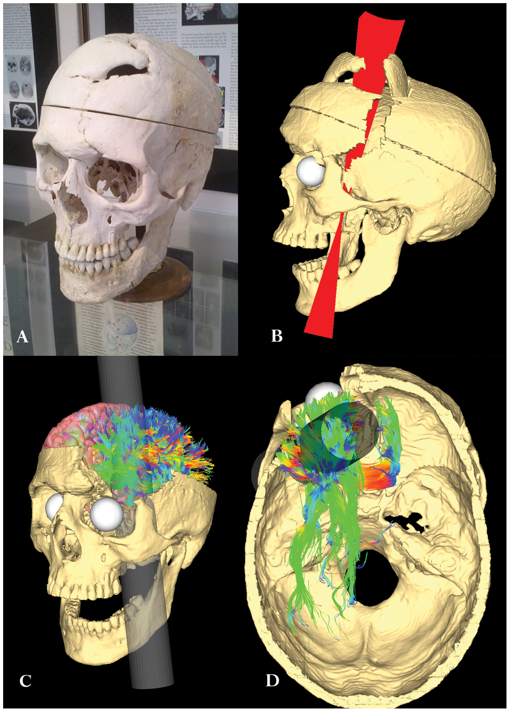

##  {data-background-color="#ffffff"}


<div style="position: absolute; top: 0; right: 0; width: 0; height: 0; border-top: 550px solid #3d3229; border-left: 500px solid transparent; z-index: 0;"></div>


<div style="position: relative; z-index: 1; display: flex; flex-direction: column; justify-content: center; height: 75vh; padding-left: 1em;">

[Psicología de la Emoción]{style="color: #c9a96e; font-size: 0.55em; font-weight: 300; letter-spacing: 0.2em; text-transform: uppercase;"}

[Emoción y Proceso decisorio]{style="color: #3d3229; font-size: 1.4em; font-weight: 700; font-family: 'Libre Baskerville', serif; line-height: 1.2; display: block;"}

<br>

[Clase 11 · ]{style="color: #a09585; font-size: 0.5em;"}
[Dr. Fernando Tonini]{style="color: #a09585; font-size: 0.5em;"}

</div>

------------------------------------------------------------------------

## Hoja de ruta {.subtitulo-slide}

<div class="subtitulo-slide">Lo que vamos a ver hoy</div>

:::::: cols-2
::: tarjeta
<h4>Casos clínicos</h4>
<p>Phineas Gage (1848) y Elliot (Damasio, 1994): qué nos enseñan las lesiones frontomediales sobre la relación entre emoción y razón.</p>
:::

::: tarjeta
<h4>Hipótesis del marcador somático</h4>
<p>Una teoría neurobiológica sobre cómo las emociones guían la toma de decisiones en contextos de incertidumbre.</p>
:::
::::::

:::::: {.cols-2 style="margin-top:0.8em"}
::: tarjeta
<h4>Evidencia experimental</h4>
<p>Tres experimentos de Damasio y colaboradores que pusieron a prueba la hipótesis.</p>
:::

::: tarjeta
<h4>Implicancias</h4>
<p>La emoción ya no como interferencia, sino como condición de posibilidad de la decisión adaptativa.</p>
:::
::::::

------------------------------------------------------------------------

##  {data-background-color="#ffffff"}

:::::: {style="display: flex; align-items: center; height: 70vh; padding-left: 0.5em;"}
<div>

::: {style="color: #c9a96e; font-size: 0.45em; letter-spacing: 0.2em; font-weight: 300; text-transform: uppercase; margin-bottom: 0.5em;"}
Emociones y proceso decisorio
:::

::: {style="color: #3d3229; font-size: 1.4em; font-family: 'Libre Baskerville', serif; font-weight: 700; line-height: 1.3; border-left: 4px solid #c9a96e; padding-left: 0.5em;"}
Dos casos que cambiaron la historia
:::

</div>
::::::

------------------------------------------------------------------------

## Phineas Gage (1848)

:::::: {.cols-2 style="gap:2em; align-items:center"}
::: {style="font-size:0.9em"}
- Obrero ferroviario, **25 años**
- Accidente: barra de hierro atraviesa su cráneo de abajo hacia arriba
- **Lesión:** lóbulo frontal, daño bilateral
- Consciente en todo momento, habló a los pocos minutos
- Sobrevivió 12 años más

::: {.caja-dorada style="margin-top:0.8em"}
**El cambio.** De obrero responsable y confiable pasó a ser irregular, irreverente, impaciente. "Ya no era Gage."
:::
:::

::: caja-cita
<p style="margin-top:0.8em; font-size:0.7em; font-style:italic">"...the powder exploded. The iron entered on the side of his face, shattering the upper jaw, and passing back of the left eye, and out at the top of the head. The most singular circumstances connected with this melancholy affair is, that he was alive at two o’clock this afternoon, and in full possession of his reason, and free from pain."</p>
<p style="margin-top:0.8em; font-size:0.7em; font-style:normal">— Free Soil Union -14/09/1848</p>
:::
::::::

------------------------------------------------------------------------

## Phineas Gage (1848)

:::::: {.cols-2 style="gap:2em; align-items:center"}
::: {style="font-size:0.9em"}
- Obrero ferroviario, **25 años**
- Accidente: barra de hierro atraviesa su cráneo de abajo hacia arriba
- **Lesión:** lóbulo frontal, daño bilateral (principalmente izquierdo)
- Consciente en todo momento, habló a los pocos minutos
- Sobrevivió 12 años más

::: {.caja-dorada style="margin-top:0.8em"}
**El cambio.** De obrero responsable y confiable pasó a ser irregular, irreverente, impaciente. "Ya no era Gage."
:::
:::

::: {style="text-align:center"}
{width="50%"}

<p style="font-size:0.55em; color:#a09585; margin-top:0.5em">
Reconstrucción 3D de la trayectoria —[ Van Horn et al. (2012)](https://journals.plos.org/plosone/article?id=10.1371/journal.pone.0037454)
</p>
:::
::::::

------------------------------------------------------------------------

## Caso Elliot (Damasio, 1994)

:::::: {.cols-2 style="gap:2em"}
::: {style="font-size:0.88em"}
<h4 style="color:#3d3229; margin-top:0">Perfil clínico</h4>

- **30 años**, ejecutivo exitoso
- **Lesión:** meningioma que comprime lóbulo frontal bilateral
- **Cirugía:** extirpación del meningioma + tejido frontal dañado
- **Después:** vuelco en la personalidad
:::

::: {style="font-size:0.88em"}
<h4 style="color:#3d3229; margin-top:0">Consecuencias</h4>

- Pérdida de objetivos
- Detallismo improductivo
- Mala toma de decisiones
- No evalúa riesgos
- Diagnóstico: deterioro en competencia para **toma de decisiones y planificación ejecutiva**
:::
::::::

------------------------------------------------------------------------

## Elliot: evaluación neuropsicológica

:::::: {.cols-2 style="gap:1.8em; font-size:0.85em"}
::: tarjeta
<h4>Funciones preservadas</h4>

<p>WAIS · Examen multilingüe de afasia · Reconocimiento de rostros · Construcción · Memoria ejecutiva · Atención · Wisconsin · Estimación con material incompleto · MMPI</p>

<p style="margin-top:0.6em"><em>Todo dentro de parámetros normales.</em></p>
:::

::: {.caja-oscura style="font-size:0.9em"}
**Emoción**

Controlado emocionalmente. Describe situaciones con distancia afectiva:

> [*"Sabe pero no siente."*]{style="font-style:italic; color:white"}
:::
::::::

------------------------------------------------------------------------

## Elliot: evaluación especial

<p style="font-size:0.88em; margin-bottom:0.6em">Pruebas de razonamiento social y moral: <span class="dorado">resultados normales.</span></p>

:::::: {.cols-2 style="gap:1.5em; font-size:0.8em"}
::: tarjeta
<h4>Acertijos y dilemas</h4>
<p>Resuelve acertijos financieros y dilemas éticos con normalidad. <em>Ej.: ¿robaría si le aseguran que no será descubierto?</em></p>
:::

::: tarjeta
<h4>Convenciones sociales</h4>

- Genera soluciones alternativas
- Conoce las consecuencias de transgredir normas
- Identifica relaciones medios-fines
- Predice consecuencias sociales
- Resuelve dilemas morales estándar
:::
::::::

::: {.caja-dorada style="margin-top:0.7em; font-size:0.85em"}
**La paradoja.** Elliot **sabe** qué hacer. Pero en la vida real **no puede decidir** bien.
:::

------------------------------------------------------------------------

## ¿Cómo interpretar este patrón?

::: {.caja-oscura style="font-size:0.9em; padding:1em 1.5em"}
La alteración en toma de decisiones <span style="color:#e8d5a8">**no** se basa</span> en:

- falta de conocimiento social
- acceso deficitario al conocimiento
- deterioro de funciones cognitivas
:::

<p style="text-align:center; font-size:1.4em; color:#996b2f; margin:0.6em 0">↓</p>

::: {.caja-dorada style="font-size:0.95em"}
La **frialdad afectiva** le impide asignar valores adecuados a las opciones. Su "sangre fría" convierte el espacio mental en algo demasiado cambiante y fugaz para permitir la elección correcta.
:::

------------------------------------------------------------------------

##  {data-background-color="#ffffff"}

:::::: {style="display: flex; align-items: center; height: 70vh; padding-left: 0.5em;"}
<div>

::: {style="color: #c9a96e; font-size: 0.45em; letter-spacing: 0.2em; font-weight: 300; text-transform: uppercase; margin-bottom: 0.5em;"}
Emociones y proceso decisorio
:::

::: {style="color: #3d3229; font-size: 1.4em; font-family: 'Libre Baskerville', serif; font-weight: 700; line-height: 1.3; border-left: 4px solid #c9a96e; padding-left: 0.5em;"}
La hipótesis del marcador somático
:::

</div>
::::::

------------------------------------------------------------------------

## Razonar es decidir

<p style="font-size:0.92em">Decidir = <span class="dorado">seleccionar una opción</span> entre muchas posibilidades, en un momento, en relación con una situación determinada.</p>

<p style="font-size:0.88em; margin-top:0.6em">Esto supone conocer:</p>

::: {style="font-size:0.85em; margin-left:1em"}
- la situación
- las opciones de respuesta
- las consecuencias inmediatas y futuras
- la estrategia lógica para generar inferencias válidas
- los mecanismos del proceso de razonamiento (MT, atención, etc.)
:::

:::::: {.cols-2 style="margin-top:0.7em; gap:1.2em; font-size:0.82em"}
::: tarjeta
<h4>Razón pura</h4>
<p>Resolver un problema matemático.</p>
:::

::: tarjeta
<h4>Razón práctica</h4>
<p>Elegir una carrera o con quién casarse.</p>
:::
::::::

------------------------------------------------------------------------

## Toma de decisiones: la concepción racional tradicional

<p style="font-size:0.92em">La lógica formal ofrece la mejor solución para todo problema.</p>

<p style="font-size:0.92em; margin-top:0.4em">⇒ Para obtener la mejor solución, <span class="dorado">**dejar fuera las emociones**</span>.</p>

:::::: {.cols-2 style="margin-top:1em; gap:2em; align-items:center"}
::: {style="font-size:0.88em"}
**Procedimiento:**

- Separar los escenarios posibles
- Analizar relación costo-beneficio
- Inferir las consecuencias
:::

::: {.caja-oscura style="font-size:0.9em"}
**Problemas**

Mucho tiempo. Supera la capacidad de la memoria de trabajo.

*(El caso Elliot.)*
:::
::::::

------------------------------------------------------------------------

## Toma de decisiones: la hipótesis del marcador somático

<p style="font-size:0.9em">Antes de analizar el costo-beneficio, cada vez que aparece la posibilidad de una mala elección se activa <span class="dorado">**fugazmente un sentimiento visceral displacentero**</span>.</p>

<p style="text-align:center; font-size:1.4em; color:#996b2f; margin:0.5em 0">↓</p>

::: {.caja-dorada style="font-size:0.92em"}
**Marcador somático.** Obliga a focalizar la atención en el resultado negativo de una acción determinada (señal de alarma).
:::

::: {style="margin-top:0.7em; font-size:0.88em"}
- Funciona como **señal de alarma**: hace que rechacemos la opción negativa
- Reduce el proceso de razonamiento a **un menor número de opciones**
:::

<p style="font-size:0.88em; margin-top:0.6em">El marcador somático <span class="dorado">**aumenta la precisión y eficiencia**</span> en la toma de decisión. Su ausencia la disminuye.</p>

------------------------------------------------------------------------

## El marcador somático como emoción secundaria

<p style="font-size:0.9em">Emoción conectada mediante aprendizaje a futuros resultados previsibles ⇒ <span class="dorado">alarma o incentivador</span> (dispositivo de sesgo).</p>

```{mermaid}
%%{init: {'theme':'base', 'themeVariables': {'primaryColor':'#faf7f2','primaryBorderColor':'#c9a96e','primaryTextColor':'#3d3229','lineColor':'#996b2f','fontFamily':'Inter'}}}%%
flowchart LR
  MS[Marcador<br/>somático] --> A[Cerebro normal]
  MS --> B[Entorno cultural<br/>y social normal]
```

:::::: {.cols-2 style="margin-top:0.7em; gap:1.5em; font-size:0.78em"}
::: tarjeta
<h4>a · Sistema interno de preferencias</h4>
<p>Disposiciones reguladoras innatas para la supervivencia: reducción de estados corporales displacenteros y logro de estados homeostáticos.</p>
:::

::: tarjeta
<h4>b · Circunstancias externas</h4>
<p>Conjunto de opciones, premios, castigos. El entorno cultural y social que enmarca cada decisión.</p>
:::
::::::

<p style="font-size:0.82em; margin-top:0.6em; font-style:italic; color:#5a4a3a">La interacción amplía el repertorio de estímulos automáticamente marcados: <span class="dorado">proceso de aprendizaje continuo</span>.</p>

------------------------------------------------------------------------

##  {data-background-color="#ffffff"}

:::::: {style="display: flex; align-items: center; height: 70vh; padding-left: 0.5em;"}
<div>

::: {style="color: #c9a96e; font-size: 0.45em; letter-spacing: 0.2em; font-weight: 300; text-transform: uppercase; margin-bottom: 0.5em;"}
Emociones y proceso decisorio
:::

::: {style="color: #3d3229; font-size: 1.4em; font-family: 'Libre Baskerville', serif; font-weight: 700; line-height: 1.3; border-left: 4px solid #c9a96e; padding-left: 0.5em;"}
Poniendo a prueba la hipótesis
:::

</div>
::::::


------------------------------------------------------------------------

## ¿Cómo se mide un marcador somático?

<p style="font-size:0.9em">El marcador somático conlleva un cambio integral de estado corporal (vísceras, sistema musculoesquelético), inducido por señales químicas y neurales. ⇒ <span class="dorado">**respuestas del sistema nervioso autónomo**</span>.</p>

::: {.caja-dorada style="margin-top:0.7em; font-size:0.88em"}
**Respuesta de conductibilidad dérmica (SCR).** Fácil de provocar, de registrar, confiable, sin molestia para el sujeto.
:::

```{mermaid}
%%{init: {'theme':'base', 'themeVariables': {'primaryColor':'#faf7f2','primaryBorderColor':'#c9a96e','primaryTextColor':'#3d3229','lineColor':'#996b2f','fontFamily':'Inter'}}}%%
flowchart LR
  P[Pensamiento] --> S[Cambio en<br/>estado somático]
  S --> SNA[SNA: secreción<br/>glándulas sudoríparas]
  SNA --> R[Reducción de<br/>resistencia de la piel]
  R --> SCR[SCR registrable]
```

<p style="font-size:0.78em; margin-top:0.6em; font-style:italic; color:#5a4a3a">Ante estímulos que infaliblemente producen SCR (ej. asustar), los tres grupos responden igual.</p>

------------------------------------------------------------------------

## Experimento 1 · Pregunta y diseño

<p style="font-size:0.88em">¿Los pacientes con lesión frontal generan respuestas dermoconductivas ante estímulos que requieren <span class="dorado">**evaluar su contenido emocional**</span>?</p>

:::::: {.cols-2 style="margin-top:0.7em; gap:1.5em; font-size:0.82em"}
::: tarjeta
<h4>Sujetos</h4>

- Lesionados frontales
- Controles sanos
- Pacientes con daño en otras áreas

<p style="margin-top:0.4em"><em>Edad y nivel educacional pareados.</em></p>
:::

::: tarjeta
<h4>Procedimiento</h4>

- Polígrafo registra SCR
- Sucesión de imágenes: banales vs. inquietantes
- Observar inmóviles y en silencio
- Después: contar qué vieron y qué sintieron
:::
::::::

------------------------------------------------------------------------

## Experimento 1 · Resultados

```{r}


library(ggplot2)
library(dplyr)

# Paleta del curso
marron       <- "#3d3229"
dorado       <- "#c9a96e"
dorado_claro <- "#e8d5a8"
crema        <- "#faf7f2"
gris_calido  <- "#a09585"

# Tema base reutilizable
theme_emocion <- function(base_size = 13) {
  theme_minimal(base_size = base_size, base_family = "Inter") +
    theme(
      plot.title       = element_text(family = "Libre Baskerville",
                                      face   = "bold",
                                      size   = rel(1.15),
                                      color  = marron),
      plot.subtitle    = element_text(color = gris_calido,
                                      size  = rel(0.85),
                                      margin = margin(b = 10)),
      axis.title       = element_text(color = marron, face = "bold"),
      axis.text        = element_text(color = marron),
      panel.grid.major = element_line(color = "#e8e0d2"),
      panel.grid.minor = element_blank(),
      legend.title     = element_text(face = "bold", color = marron),
      legend.text      = element_text(color = marron),
      plot.background  = element_rect(fill = "white", color = NA),
      panel.background = element_rect(fill = "white", color = NA)
    )
}

# ── Exp 1: SCR ante estímulos emocionales y neutros ────────────
df_exp1 <- data.frame(
  grupo   = rep(c("Control", "Lesión no frontal", "Lesión prefrontal"),
                each = 2),
  estimulo = rep(c("Emocional", "Neutro"), 3),
  scr      = c(1.2, 0.3, 1.1, 0.4, 0.4, 0.3),
  error    = c(0.15, 0.12, 0.13, 0.10, 0.08, 0.09)
)

df_exp1$grupo <- factor(df_exp1$grupo,
  levels = c("Control", "Lesión no frontal", "Lesión prefrontal"))

p1 <- ggplot(df_exp1, aes(x = grupo, y = scr, fill = estimulo)) +
  geom_col(position = position_dodge(0.8), width = 0.7) +
  geom_errorbar(aes(ymin = scr - error, ymax = scr + error),
                position = position_dodge(0.8), width = 0.2,
                color = marron) +
  geom_text(aes(label = scr),
            position = position_dodge(0.8),
            vjust = -2.2, size = 4, color = marron, fontface = "bold") +
  scale_fill_manual(values = c("Emocional" = marron, "Neutro" = dorado)) +
  labs(
    title    = "Respuesta galvánica ante estímulos emocionales y neutros",
    subtitle = "Comparación entre grupos: control, lesión no frontal y prefrontal",
    x = NULL, y = "SCR (microsiemens)", fill = "Tipo de estímulo"
  ) +
  ylim(0, 1.5) +
  theme_emocion()


# ggsave("img/exp1-scr-emocional.png", p1,
#        width = 10, height = 5.5, dpi = 200, bg = "white")

# ── Exp 2: IGT — proporción de elecciones por bloque ───────────
df_exp2 <- data.frame(
  bloque     = rep(1:5, 4),
  grupo      = rep(c("Control", "Control",
                     "Lesión prefrontal", "Lesión prefrontal"),
                   each = 5),
  tipo_mazo  = rep(c("Buenos (C+D)", "Malos (A+B)",
                     "Buenos (C+D)", "Malos (A+B)"),
                   each = 5),
  proporcion = c(0.41, 0.60, 0.67, 0.83, 0.86,   # control buenos
                 0.61, 0.40, 0.30, 0.17, 0.14,   # control malos
                 0.46, 0.46, 0.45, 0.46, 0.43,   # lesion buenos
                 0.54, 0.46, 0.50, 0.52, 0.57)   # lesion malos
)

p2 <- ggplot(df_exp2,
             aes(x = bloque, y = proporcion,
                 color = grupo, linetype = tipo_mazo,
                 group = interaction(grupo, tipo_mazo))) +
  geom_line(linewidth = 1.2) +
  geom_point(size = 3) +
  scale_color_manual(values = c("Control" = marron,
                                "Lesión prefrontal" = dorado)) +
  scale_linetype_manual(values = c("Buenos (C+D)" = "solid",
                                   "Malos (A+B)"  = "dashed")) +
  scale_x_continuous(breaks = 1:5,
                     labels = paste("Bloque", 1:5)) +
  labs(
    title    = "Iowa Gambling Task: proporción de elecciones por bloque",
    subtitle = "Mazos ventajosos (C+D) vs. desventajosos (A+B)",
    x = NULL, y = "Proporción de elecciones",
    color = "Grupo", linetype = "Tipo de mazo"
  ) +
  ylim(0.10, 0.95) +
  theme_emocion()

# ggsave("img/exp2-igt-proporciones.png", p2,
#        width = 10, height = 5.5, dpi = 200, bg = "white")

# ── Exp 3: SCR anticipatoria antes de elegir carta ─────────────
df_exp3 <- data.frame(
  tipo_mazo = rep(c("Buenos (C+D)", "Malos (A+B)"), 2),
  grupo     = rep(c("Control", "Lesión prefrontal"), each = 2),
  scr       = c(0.12, 0.38, 0.13, 0.15)
)

df_exp3$tipo_mazo <- factor(df_exp3$tipo_mazo,
  levels = c("Buenos (C+D)", "Malos (A+B)"))

p3 <- ggplot(df_exp3, aes(x = tipo_mazo, y = scr, fill = grupo)) +
  geom_col(position = position_dodge(0.75), width = 0.65) +
  geom_text(aes(label = scr),
            position = position_dodge(0.75),
            vjust = -0.5, size = 4.5,
            color = marron, fontface = "bold") +
  scale_fill_manual(values = c("Control" = marron,
                               "Lesión prefrontal" = dorado)) +
  labs(
    title    = "SCR anticipatoria antes de elegir carta",
    subtitle = "Señal somática que precede a la decisión consciente",
    x = "Tipo de mazo", y = "Respuesta galvánica anticipatoria",
    fill = "Grupo"
  ) +
  ylim(0, 0.45) +
  theme_emocion()

# ggsave("img/exp3-scr-anticipatoria.png", p3,
#        width = 9, height = 5.5, dpi = 200, bg = "white")

p1

```
------------------------------------------------------------------------

## Experimento 1 · Interpretación

:::::: {.cols-2 style="gap:1.5em; font-size:0.85em"}
::: tarjeta
<h4>Sin daño frontal</h4>
<p>Abundantes SCR ante imágenes inquietantes. Ninguna ante las banales.</p>
:::

::: tarjeta
<h4>Con daño frontal</h4>
<p><strong>Ninguna reacción dermoconductiva</strong> — aunque verbalmente describen miedo o desagrado.</p>
:::
::::::

::: {.caja-oscura style="margin-top:0.7em; font-size:0.9em"}
> [*"Saber no significa necesariamente sentir, aun cuando comprendas que lo que sabes debería hacerte sentir de una manera determinada."*]{style="color:#e8d5a8; font-style:italic"}
:::

<p style="font-size:0.85em; margin-top:0.6em">Los pacientes tenían disponible el rango completo de conocimientos, <span class="dorado">excepto el conocimiento disposicional</span> que confronta un hecho con el mecanismo para activar la respuesta emocional.</p>

------------------------------------------------------------------------

## Experimento 2 · Apuestas experimentales

<p style="font-size:0.9em">Una situación que se parece a la toma de decisiones natural:</p>

:::::: {.cols-3 style="margin-top:0.5em; font-size:0.82em"}
::: tarjeta
<h4>Tiempo real</h4>
<p>El sujeto decide ensayo a ensayo.</p>
:::

::: tarjeta
<h4>Riesgo e incertidumbre</h4>
<p>No puede predecir el resultado ni llevar la contabilidad.</p>
:::

::: tarjeta
<h4>Opciones</h4>
<p>Cuatro barajas (A, B, C, D) con perfiles de ganancia y pérdida distintos.</p>
:::
::::::

::: {.caja-dorada style="margin-top:0.7em; font-size:0.85em"}
**Única instrucción:** dar vuelta las cartas y tratar de ganar lo más posible. Dinero ficticio.
:::

------------------------------------------------------------------------

## Las cuatro barajas

<table style="width:100%; font-size:0.82em; margin-top:0.5em; border-collapse:separate; border-spacing:8px; text-align:center">
  <thead>
    <tr>
      <th style="background:#3d3229; color:#fff; padding:0.8em; border-radius:6px">Baraja A</th>
      <th style="background:#3d3229; color:#fff; padding:0.8em; border-radius:6px">Baraja B</th>
      <th style="background:#c9a96e; color:#3d3229; padding:0.8em; border-radius:6px">Baraja C</th>
      <th style="background:#c9a96e; color:#3d3229; padding:0.8em; border-radius:6px">Baraja D</th>
    </tr>
  </thead>
  <tbody>
    <tr>
      <td style="background:#faf7f2; padding:1em; border:1.5px solid #e8d5b0; border-radius:6px">Paga: <strong>$100</strong><br/>Cobra: hasta <strong>$1250</strong></td>
      <td style="background:#faf7f2; padding:1em; border:1.5px solid #e8d5b0; border-radius:6px">Paga: <strong>$100</strong><br/>Cobra: hasta <strong>$1250</strong></td>
      <td style="background:#faf7f2; padding:1em; border:1.5px solid #e8d5b0; border-radius:6px">Paga: <strong>$50</strong><br/>Cobra: hasta <strong>$150</strong></td>
      <td style="background:#faf7f2; padding:1em; border:1.5px solid #e8d5b0; border-radius:6px">Paga: <strong>$50</strong><br/>Cobra: hasta <strong>$150</strong></td>
    </tr>
    <tr>
      <td colspan="2" style="background:#3d3229; color:#e8d5a8; padding:0.6em; border-radius:6px; font-size:0.92em"><strong>Desventajosas</strong> · pagan más, pero cobran mucho más</td>
      <td colspan="2" style="background:#c9a96e; color:#3d3229; padding:0.6em; border-radius:6px; font-size:0.92em"><strong>Ventajosas</strong> · pagan menos, cobran menos</td>
    </tr>
  </tbody>
</table>

<p style="font-size:0.78em; margin-top:0.7em; font-style:italic; color:#5a4a3a; text-align:center">A largo plazo, C y D producen ganancia neta. A y B producen pérdida neta.</p>

------------------------------------------------------------------------

## Experimento 2 · Resultados

```{r}

p2

```

------------------------------------------------------------------------

## Experimento 2 · Interpretación

:::::: {.cols-2 style="gap:1.5em; font-size:0.85em"}
::: tarjeta
<h4>Controles sanos</h4>

- Muestreo general al principio
- Primero eligen A y B
- Luego se desplazan hacia C y D
- **Beneficio a largo plazo**
:::

::: tarjeta
<h4>Lesionados frontales</h4>

- Muestreo general inicial
- Persisten en A y B sistemáticamente
- Tras pagar evitan brevemente, pero **retornan**
- **Pierden el dinero**
:::
::::::

::: {.caja-oscura style="margin-top:0.7em; font-size:0.88em"}
Los pacientes con lesión frontal **siguen siendo sensibles a premio y castigo**. Pero ninguna de las dos contribuye a la marcación automática ni al despliegue continuado de predicciones de resultados futuros. ⇒ Prefieren la <span style="color:#e8d5a8">**gratificación inmediata**</span>.
:::

------------------------------------------------------------------------

## Experimento 3 · La pregunta clave

<p style="font-size:0.92em">¿Existe alguna <span class="dorado">**señal somática anticipatoria**</span> antes de que el sujeto elija una carta?</p>

::: {.caja-dorada style="margin-top:0.7em; font-size:0.88em"}
Se registra la SCR **en el momento previo** a dar vuelta cada carta, mientras el sujeto está deliberando.
:::

<p style="font-size:0.85em; margin-top:0.7em">Si la hipótesis del marcador somático es correcta, deberíamos ver SCR anticipatorias selectivas para los mazos desventajosos en los controles, pero no en los lesionados.</p>

------------------------------------------------------------------------

## Experimento 3 · Resultados

```{r}

p3

```

------------------------------------------------------------------------

## Experimento 3 · Interpretación

:::::: {.cols-2 style="gap:1.5em; font-size:0.85em"}
::: tarjeta
<h4>Controles sanos</h4>
<p>El cerebro <strong>aprendía algo</strong> sobre la situación e intentaba <span class="dorado">señalar anticipadamente</span> lo desventajoso. La SCR aparece <em>antes</em> del conocimiento explícito.</p>
:::

::: tarjeta
<h4>Lesionados frontales</h4>
<p>Ninguna respuesta anticipatoria. Los sistemas neurales que les habrían permitido aprender qué evitar o preferir <strong>funcionan mal</strong>. Incapaces de desarrollar respuestas adecuadas ante situaciones nuevas.</p>
:::
::::::

------------------------------------------------------------------------

##  {.slide-frase}

::: caja-frase
"No somos máquinas pensantes que nos emocionamos. Somos máquinas emocionales que pensamos."

[— Antonio Damasio, *El error de Descartes* (1994)]{style="display:block; font-size:0.55em; font-style:normal; margin-top:1em; color:#e8d5a8; letter-spacing:0.05em"}
:::


------------------------------------------------------------------------

## Cierre · Lo que queda

:::::: cols-2
::: tarjeta
<h4>El giro damasiano</h4>
<p>El modelo racionalista clásico postulaba la emoción como ruido. Los casos clínicos y los experimentos del IGT mostraron lo contrario: <strong>sin marcadores somáticos, no hay decisión adaptativa</strong>.</p>
:::

::: tarjeta
<h4>Implicancias</h4>
<p>El marcador somático articula <strong>cuerpo, emoción y cognición</strong> como un sistema integrado. La corteza prefrontal ventromedial es la pieza clave que conecta el conocimiento factual con el conocimiento disposicional.</p>
:::
::::::

::: {.caja-dorada style="margin-top:0.7em; font-size:0.85em"}
**Para la próxima clase.** Repaso general de emoción - Dudas - Hablamos del segundo parcial
:::


