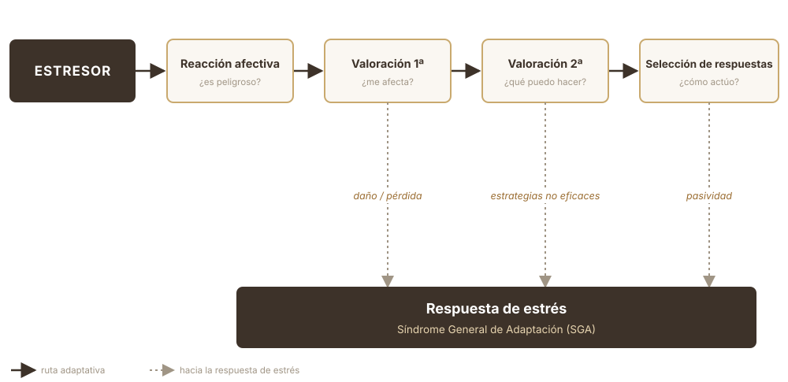

##  {data-background-color="#ffffff"}


<div style="position: absolute; top: 0; right: 0; width: 0; height: 0; border-top: 550px solid #3d3229; border-left: 500px solid transparent; z-index: 0;"></div>


<div style="position: relative; z-index: 1; display: flex; flex-direction: column; justify-content: center; height: 75vh; padding-left: 1em;">

[Motivación, emoción y estrés]{style="color: #c9a96e; font-size: 0.55em; font-weight: 300; letter-spacing: 0.2em; text-transform: uppercase;"}

[Estrés: Desencadenantes - ]{style="color: #3d3229; font-size: 1.4em; font-weight: 700; font-family: 'Libre Baskerville', serif; line-height: 1.2; display: block;"}

[Proceso - Respuesta]{style="color: #3d3229; font-size: 1.4em; font-weight: 700; font-family: 'Libre Baskerville', serif; line-height: 1.2; display: block;"}

<br>

[Clase 12 · ]{style="color: #a09585; font-size: 0.5em;"}
[Dr. Fernando Tonini]{style="color: #a09585; font-size: 0.5em;"}

</div>


------------------------------------------------------------------------

## ¿Qué es el estrés?

::: {.subtitulo-slide}
Un fenómeno adaptativo
:::

::: {.caja-dorada style="font-size:1.05em; margin-top:0.6em"}
Proceso psicológico que **moviliza energía** para sostener conductas cuando una demanda del ambiente **supera la activación habitual**.
:::

El organismo necesita esa activación extra para afrontar algo que, de otro modo, no podría. La energía está al servicio de la adaptación.

------------------------------------------------------------------------

## El estrés no es una emoción

Puede **generar** motivos y emociones, pero no es ninguno de los dos: cualquier estímulo lo dispara y su respuesta es siempre la misma.

|  | Emoción | Estrés |
|---|---|---|
| **Desencadenante** | Específico | Cualquier cambio del entorno |
| **Efectos subjetivos** | Específicos | Inespecíficos |
| **Expresión facial** | Específica | Inespecífica |
| **Afrontamiento** | Específico | Múltiple |

------------------------------------------------------------------------

## Un caso para acompañar la clase

::: {.subtitulo-slide}
Lucía
:::

:::::: {.cols-2 style="margin-top:0.5em"}
::: {.tarjeta}
<h4>La situación</h4>

<p>Está en semana de finales. Se mudó hace dos semanas. Hoy el subte está de paro y va por su tercer café del día. Mañana rinde la materia que más le cuesta.</p>
:::

::: {.tarjeta}
<h4>Seguimiento</h4>

<p>Vamos a retomar a Lucía al cerrar cada bloque, para mirar el mismo caso desde los <span class="dorado">desencadenantes</span>, el <span class="dorado">procesamiento</span> y las <span class="dorado">consecuencias</span>.</p>
:::
::::::

------------------------------------------------------------------------

##  {data-background-color="#ffffff"}

:::::: {style="display: flex; align-items: center; height: 70vh; padding-left: 0.5em;"}
<div>

::: {style="color: #c9a96e; font-size: 0.45em; letter-spacing: 0.2em; font-weight: 300; text-transform: uppercase; margin-bottom: 0.5em;"}
Estrés
:::

::: {style="color: #3d3229; font-size: 1.4em; font-family: 'Libre Baskerville', serif; font-weight: 700; line-height: 1.3; border-left: 4px solid #c9a96e; padding-left: 0.5em;"}
Desencadenantes
:::

</div>
::::::

------------------------------------------------------------------------

## Estresores únicos

::: {.subtitulo-slide}
Según el cambio en las condiciones de vida
:::

Eventos de **efecto traumático**, físico o psicológico, cuyas consecuencias se mantienen de forma prolongada.

:::::: {.cols-2 style="margin-top:0.4em"}
::: {.tarjeta}
<h4>Ejemplos</h4>

<p>Guerra · terrorismo · catástrofe natural · enfermedad terminal · violencia</p>
:::

::: {.tarjeta}
<h4>Efecto típico</h4>

<p>Son causantes de patrones de <span class="dorado">estrés postraumático</span>.</p>
:::
::::::

------------------------------------------------------------------------

## Estresores múltiples

::: {.subtitulo-slide}
Según el cambio en las condiciones de vida
:::

Acontecimientos fuera del control de la persona que provocan un **cambio vital**: alteran conductas ya automatizadas y sostienen la respuesta de estrés hasta que se produce la acomodación.

::: {.caja-dorada style="margin-top:0.4em; font-size:0.92em"}
**Vida conyugal** (pareja, separación, duelo) · **crianza** (un hijo, su cuidado o enfermedad) · **trabajo/estudio** (desempleo, jubilación, dificultades) · **entorno** (mudanza) · **desarrollo** (adolescencia, adultez)
:::

------------------------------------------------------------------------

## Estresores cotidianos

::: {.subtitulo-slide}
Según el cambio en las condiciones de vida
:::

**Micro-sucesos** que alteran la rutina: responsabilidades domésticas, problemas prácticos (tránsito, subte), imprevistos (una lluvia, algo que se rompe), roces sociales (una discusión, una decepción).


------------------------------------------------------------------------

## Estresores cotidianos

::: {.subtitulo-slide}
Según el cambio en las condiciones de vida
:::

**Micro-sucesos** que alteran la rutina: responsabilidades domésticas, problemas prácticos (tránsito, subte), imprevistos (una lluvia, algo que se rompe), roces sociales (una discusión, una decepción).

::: {.caja-oscura style="margin-top:0.5em"}
Dato contraintuitivo: estadísticamente generan un porcentaje [mayor]{.clarito} de estrés acumulado que los estresores únicos y múltiples.
:::

------------------------------------------------------------------------

## Estresores biogénicos

::: {.subtitulo-slide}
Según el cambio en las condiciones de vida
:::

Actúan **directamente sobre el organismo** y disparan la respuesta de estrés **sin evaluación cognitiva** previa.

:::::: {.cols-2 style="margin-top:0.4em"}
::: {.tarjeta}
<h4>Sustancias</h4>

<p>Anfetaminas · cafeína</p>
:::

::: {.tarjeta}
<h4>Causas físicas</h4>

<p>Dolor · temperatura extrema</p>
:::
::::::

::: {.caja-dorada style="margin-top:0.6em; font-size:0.9em"}
¿Cuántos tipos de estresor podés reconocer en tu semana? ¿De qué clase es cada uno?
:::

------------------------------------------------------------------------

##  {data-background-color="#ffffff"}

:::::: {style="display: flex; align-items: center; height: 70vh; padding-left: 0.5em;"}
<div>

::: {style="color: #c9a96e; font-size: 0.45em; letter-spacing: 0.2em; font-weight: 300; text-transform: uppercase; margin-bottom: 0.5em;"}
Estrés
:::

::: {style="color: #3d3229; font-size: 1.4em; font-family: 'Libre Baskerville', serif; font-weight: 700; line-height: 1.3; border-left: 4px solid #c9a96e; padding-left: 0.5em;"}
Proceso
:::

</div>
::::::

------------------------------------------------------------------------

## El modelo de Lazarus y Folkman

El estrés se despliega en dos bloques: una **valoración automática** y una **evaluación** de lo que la situación puede provocar y la manera de afrontar al estresor.

{width="92%"}

------------------------------------------------------------------------

## Reacción afectiva

Una primera estimación **automática**: ¿esto es peligroso?

:::::: {.cols-2 style="margin-top:0.5em"}
::: {.tarjeta}
<h4>Respuesta de orientación</h4>

<p>Si no es nocivo ni demasiado intenso: se orientan los canales perceptivos para procesar la situación.</p>
:::

::: {.tarjeta}
<h4>Respuesta de defensa</h4>

<p>Si es peligroso o muy intenso: el individuo se repliega y rechaza el estímulo para protegerse.</p>
:::
::::::

------------------------------------------------------------------------

## Valoración primaria

::: {.subtitulo-slide}
¿Esto me afecta?
:::

:::::: {.cols-3 style="margin-top:0.4em"}
::: {.tarjeta}
<h4>Irrelevante</h4>

<p>Sin consecuencias. El proceso finaliza.</p>
:::

::: {.tarjeta}
<h4>Benigno–positivo</h4>

<p>Favorece las metas. Finaliza y puede generar una emoción positiva.</p>
:::

::: {.tarjeta}
<h4>Estresante</h4>

<p>Daño-pérdida, amenaza o desafío. El proceso continúa.</p>
:::
::::::

::: {.caja-dorada style="margin-top:0.5em; font-size:0.88em"}
**Amenaza vs. desafío:** la diferencia es la incertidumbre. En el **desafío** se percibe control sobre la situación; en la **amenaza**, el evento negativo todavía es evitable, pero incierto. El **daño-pérdida** ya ocurrió: lleva directo a la respuesta de estrés.
:::

------------------------------------------------------------------------

## Valoración secundaria

::: {.subtitulo-slide}
¿Qué puedo hacer?
:::

El foco pasa a los **recursos**: ¿tengo estrategias eficaces para afrontar esto?

:::::: {.cols-2 style="margin-top:0.4em"}
::: {.tarjeta}
<h4>Estrategias eficaces</h4>

<p>Se selecciona una respuesta concreta (o se genera una nueva), se actúa y se controla la situación.</p>
:::

::: {.tarjeta}
<h4>Estrategias no eficaces</h4>

<p>Si no se cuenta con una respuesta posible, se activa la respuesta de estrés.</p>
:::
::::::

::: {.caja-dorada style="margin-top:0.5em; font-size:0.88em"}
La respuesta de estrés es siempre el **último recurso**: queda disponible cuando la evaluación es daño-pérdida o cuando no hay estrategias eficaces.
:::

------------------------------------------------------------------------

## Estilos de afrontamiento

En la elección intervienen factores de **personalidad**.

:::::: {.cols-2 style="margin-top:0.4em"}
::: {.tarjeta}
<h4>Estrategia vs. estilo</h4>

<p>La <span class="dorado">estrategia</span> es la conducta puntual ante una situación. El <span class="dorado">estilo</span> es el modo estable (activo, evitativo, pasivo) que se desarrolla a lo largo de la vida.</p>
:::

::: {.tarjeta}
<h4>¿Dónde se pone el foco?</h4>

<p>En el <span class="dorado">problema</span> o en la <span class="dorado">emoción</span> que la situación provoca. Una misma persona puede combinarlos.</p>
:::
::::::

::: {.caja-dorada style="margin-top:0.5em; font-size:0.88em"}
Tendemos a repetir el estilo que mejor funcionó. Cuando no es el adecuado para la situación, suma carga al afrontamiento.
:::

------------------------------------------------------------------------

## Patrón de conducta tipo A (PCTA)

Urgencia, competitividad, hostilidad y muchas metas en simultáneo. Se le suma un estilo activo centrado en el problema.

::: {.caja-oscura style="margin-top:0.5em"}
Personas proactivas y a menudo exitosas, pero procesar así los estresores [triplica el riesgo de enfermedad coronaria]{.clarito}.
:::

::: {.caja-dorada style="margin-top:0.6em; font-size:0.9em"}
El final de mañana, el partido del domingo, la presentaión laboral... ¿se vive como amenaza o como desafío? ¿De qué depende? ¿Qué estrategias eficaces se tienen a mano?
:::

------------------------------------------------------------------------

##  {data-background-color="#ffffff"}

:::::: {style="display: flex; align-items: center; height: 70vh; padding-left: 0.5em;"}
<div>

::: {style="color: #c9a96e; font-size: 0.45em; letter-spacing: 0.2em; font-weight: 300; text-transform: uppercase; margin-bottom: 0.5em;"}
Estrés
:::

::: {style="color: #3d3229; font-size: 1.4em; font-family: 'Libre Baskerville', serif; font-weight: 700; line-height: 1.3; border-left: 4px solid #c9a96e; padding-left: 0.5em;"}
Respuesta - Consecuencia
:::

</div>
::::::

------------------------------------------------------------------------

## El Síndrome General de Adaptación

La respuesta de estrés activa el sistema nervioso autónomo, simpático y somático para liberar energía. Selye describe **tres fases**:

```{r}
#| fig-width: 10.5
#| fig-height: 4.6
#| fig-align: center

library(ggplot2)

marron <- "#3d3229"; dorado <- "#c9a96e"; crema <- "#faf7f2"
gris   <- "#a09585"; borde  <- "#e8d5b0"

pts <- data.frame(
  x = c(0, 0.4, 0.8, 1.2, 1.6, 2.2, 2.8, 3.4, 4.2, 5.0, 5.8, 6.5, 7.2, 8.0, 8.8, 9.5, 10),
  y = c(1.0, 0.7, 0.55, 0.7, 1.3, 1.85, 2.0, 1.9, 1.6, 1.45, 1.5, 1.55, 1.45, 1.2, 0.85, 0.45, 0.2)
)
curva <- as.data.frame(spline(pts$x, pts$y, n = 500))

ggplot(curva, aes(x, y)) +
  annotate("rect", xmin = 7.2, xmax = 10, ymin = -Inf, ymax = Inf,
           fill = marron, alpha = 0.05) +
  geom_hline(yintercept = 1.0, linetype = "dashed", color = gris, linewidth = 0.7) +
  geom_vline(xintercept = c(3.4, 7.2), color = borde, linewidth = 0.7) +
  geom_vline(xintercept = 1.2, linetype = "dotted", color = gris, linewidth = 0.5) +
  geom_line(color = marron, linewidth = 1.9, lineend = "round") +
  annotate("text", x = 1.7, y = 2.32, label = "ALARMA",
           fontface = "bold", color = marron, size = 4.4) +
  annotate("text", x = 5.3, y = 2.32, label = "RESISTENCIA",
           fontface = "bold", color = marron, size = 4.4) +
  annotate("text", x = 8.6, y = 2.32, label = "AGOTAMIENTO",
           fontface = "bold", color = marron, size = 4.4) +
  annotate("text", x = 0.85, y = 0.28, label = "choque",
           color = gris, size = 3, hjust = 1) +
  annotate("text", x = 1.55, y = 0.28, label = "contra-choque",
           color = gris, size = 3, hjust = 0) +
  scale_y_continuous(breaks = c(0.45, 1.0, 1.85),
                     labels = c("Baja", "Normal", "Alta"),
                     limits = c(0.15, 2.45)) +
  scale_x_continuous(breaks = NULL, limits = c(-0.1, 10.1),
                     expand = expansion(mult = c(0.01, 0.01))) +
  labs(x = "Tiempo  →", y = "Resistencia al estrés") +
  theme_minimal(base_size = 15) +
  theme(
    panel.grid = element_blank(),
    axis.text.y = element_text(color = marron, face = "bold"),
    axis.text.x = element_blank(),
    axis.title = element_text(color = marron),
    axis.title.x = element_text(hjust = 1, size = 12),
    plot.background = element_rect(fill = crema, color = NA),
    panel.background = element_rect(fill = crema, color = NA),
    plot.margin = margin(8, 14, 6, 8)
  )
```

------------------------------------------------------------------------

## Reacción de alarma

La fase inicial: el organismo se activa para conseguir energía.

:::::: {.cols-2 style="margin-top:0.5em"}
::: {.tarjeta}
<h4>Choque</h4>

<p>Se activan el sistema nervioso <span class="dorado">simpático</span> y el <span class="dorado">somático</span>.</p>
:::

::: {.tarjeta}
<h4>Contra-choque</h4>

<p>Entra el <span class="dorado">parasimpático</span> y modera esa activación.</p>
:::
::::::

::: {.caja-dorada style="margin-top:0.5em; font-size:0.9em"}
Si acá se controla la situación, el proceso termina (incluso con una emoción positiva). Si no alcanza, se pasa a la resistencia.
:::

------------------------------------------------------------------------

## Resistencia y agotamiento

:::::: {.cols-2 style="margin-top:0.3em"}
::: {.tarjeta}
<h4>Resistencia</h4>

<p>La activación se sostiene y desaparece el efecto positivo. Se activa el eje <span class="dorado">hipotálamo-hipófisis-adrenal</span> y se segrega <span class="dorado">cortisol</span>. Aparecen emociones de valencia negativa.</p>
:::

::: {.tarjeta}
<h4>Agotamiento</h4>

<p>El organismo ya **no** dispone de recursos. Cae la glucosa en sangre y aparecen las <span class="dorado">"enfermedades de adaptación"</span> de Selye: hipertensión, asma, trastornos cardíacos, úlceras. En el extremo, la muerte.</p>
:::
::::::

::: {.caja-dorada style="margin-top:0.5em; font-size:0.9em"}
Si la semana  de parciales se estira a un tres semanas y recuperatorios... ¿En qué fase del SGA estaría?
:::

------------------------------------------------------------------------

## Intervenciones

Cada momento del proceso admite un tipo de intervención.

:::::: {.cols-3 style="margin-top:0.5em"}
::: {.tarjeta}
<h4>Desencadenantes</h4>

<p>Técnicas <span class="dorado">conductuales</span>: control de estímulos, autocontrol.</p>
:::

::: {.tarjeta}
<h4>Valoración</h4>

<p>Técnicas <span class="dorado">cognitivas</span>: solución de problemas, reestructuración cognitiva.</p>
:::

::: {.tarjeta}
<h4>Consecuencias</h4>

<p>Técnicas de <span class="dorado">activación</span>: desactivación, biofeedback.</p>
:::
::::::
