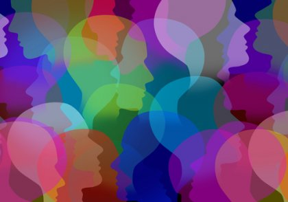

---

## {.slide-transicion}

  

  <h2>¿Qué es la psicología sistémica?</h2>

---

## Diferencia con los otros enfoques

La diferencia principal respecto a enfoques psicodinámicos, cognitivos y conductuales es el **énfasis en los sistemas**.

  La psicología sistémica hace foco en los <strong>sistema abierto</strong> y sus elementos.

Aspectos importantes de la clase: diferenciar este enfoque de los anteriores · definir sistema · clasificar sistemas · comprender los axiomas de la comunicación.

---

## {.slide-transicion}

  

  <h2>Definición y tipos de sistemas</h2>

---

## Definición de sistema

  <strong>[Sistema]{style="color:#f5f0e8; font-weight:700"}</strong> 
  Conjunto de elementos en interacción dinámica, en el cual el estado de cada uno de los elementos está determinado por el estado de cada uno de los otros.

  <strong>Ejemplos</strong> 
  Una familia, un grupo de amigos, una organización, una empresa…

---

## Tipos de sistemas y conceptos clave

  <h4>Sistemas cerrados</h4>
  
Sin intercambios con el contexto.

  <h4>Sistemas abiertos</h4>
  
Con intercambios con el contexto. La familia es un sistema abierto. 
  <em>Ecosistema = sistema + entorno</em>

  <h4>Totalidad</h4>
  
El sistema es más que la suma de sus partes. El todo tiene propiedades que los elementos individuales no tienen. <em>Ej: el agua es H₂O — el hidrógeno y el oxígeno por separado no quitan la sed.</em>

  <h4>Circularidad</h4>
  
Siempre hay acción y reacción de manera continua. Una se retroalimenta de la otra.

  <h4>Equifinalidad</h4>
  
Un mismo efecto puede tener diferentes causas. Característica de los sistemas abiertos.

---

## {.slide-transicion}

  

  <h2>Axiomas de la comunicación</h2>

---

## 

::: {.caja-verde style="margin-bottom:0.8em; font-size:0.95em; text-align:center"}
[Comunicación = Conducta]{style="color:#f5f0e8; font-weight:700"}
:::

 

  <h4>Nivel sintáctico</h4>
  
<em>¿Cómo se comunica?</em> 
  La forma en que se transmite el mensaje: el canal, el código, la estructura.

  <h4>Nivel semántico</h4>
  
<em>¿Qué se dice?</em> 
  El significado del mensaje: el contenido y su interpretación.

  <h4>Nivel pragmático</h4>
  
<em>¿Qué efectos produce?</em> 
  Las consecuencias de la comunicación en la conducta de los participantes.

---

## Los 5 axiomas

La comunicación es clave para la interacción entre los elementos del sistema. La psicología sistémica propone **5 axiomas**:

  <strong>1.</strong> Es imposible no comunicar.

  <strong>2.</strong> Toda comunicación tiene dos aspectos: el <em>contenido</em> y la <em>relación</em>.

  <strong>3.</strong> La secuencia de una relación depende de la puntuación de las secuencias de comunicación entre los participantes.

  <strong>4.</strong> Toda comunicación puede ser digital o analógica.

  <strong>5.</strong> Todo intercambio es simétrico (basado en la igualdad) o complementario (basado en la diferencia).

---

## Axioma 1 — Es imposible no comunicar

  Todo comportamiento es una forma de comunicación y toda comunicación es conducta.

Incluso el silencio, ignorar un mensaje o no responder comunica algo. No existe la no-comunicación.

---

## Axioma 2 — Contenido y relación

  <h4>Aspecto índice</h4>
  
El <strong>contenido</strong> del mensaje — lo que se dice.

  <h4>Aspecto de orden</h4>
  
La <strong>relación</strong> entre los participantes — cómo se entiende ese contenido.

  <strong>Ejemplo 1:</strong> "Esto está sucio" no es el mismo mensaje si lo dice un amigo que si lo dice un supervisor laboral.

  <strong>Ejemplo 2:</strong> Un tono sarcástico al decir "che vos sos re capo" puede indicar desaprobación, a pesar de que las palabras sean positivas.

---

## Axioma 3 — Puntuación de secuencias

Cada participante <strong>punctúa</strong> la secuencia de comunicación desde su propio punto de vista, interpretando su conducta como respuesta a la del otro.

  Esto genera <strong>ciclos de culpabilidad</strong> donde cada uno siente que reacciona al otro, sin que ninguno perciba que es también causa.

---

## Axioma 4 — Comunicación digital y analógica

<table style="margin-top:0.6em; font-size:0.78em">
  <thead>
    <tr>
      <th>Tipo</th>
      <th>Canal</th>
      <th>Ejemplo</th>
      <th>Soporte</th>
    </tr>
  </thead>
  <tbody>
    <tr>
      <td><strong>Digital</strong></td>
      <td>Verbal</td>
      <td>Palabra, escritura</td>
      <td>Fonético, gráfico</td>
    </tr>
    <tr>
      <td rowspan="2"><strong>Analógica</strong></td>
      <td>Paraverbal</td>
      <td>Suspiros, modulaciones</td>
      <td>Vocal</td>
    </tr>
    <tr>
      <td>No verbal</td>
      <td>Gestos, postura</td>
      <td>Kinésico</td>
    </tr>
  </tbody>
</table>

  <strong>Ej. digital:</strong> decir "Estoy triste".

  <strong>Ej. analógico:</strong> llorar o tener una expresión facial triste. O decir "todo bien" con cara que dice todo lo contrario.

---

## Axioma 5 — Simetría y complementariedad

  <h4>Relación simétrica</h4>
  
Los participantes tienden a la <strong>igualdad</strong> / comportamiento en espejo. 
  Riesgo: <em>escalada simétrica</em> (competencia intensa). 
  Ej: si uno lleva a su hijo a Disney, el otro lo lleva a Europa (ya no es por los hijos sino por competir) 

  <h4>Relación complementaria</h4>
  
Los participantes intensifican las <strong>diferencias</strong> / la conducta de uno complementa la del otro. 
  Riesgo: <em>complementariedad rígida</em>. 
  Ej: el empleado intensifica su dependencia y el jefe intensifica su mando.

---

## {.slide-transicion}

  

  <h2>Comunicación patológica y paradójica</h2>

---

## Interacción humana como sistema

Las interacciones no ocurren en el vacío. Cada intercambio de información es mediado por el **contexto**, la **historia de las relaciones** y las **dinámicas de poder** existentes. Cambios en un elemento del sistema pueden provocar cambios en otros.

  <h4>Efecto mariposa en relaciones</h4>
  
Un pequeño malentendido entre dos amigos afecta gradualmente a todo su círculo social, alterando la dinámica del grupo.

  <h4>Retroalimentación negativa</h4>
  
Un miembro de la pareja intenta compensar el alejamiento del otro siendo más atento, lo que lleva al otro a alejarse más — ciclo vicioso.

---

## {.slide-transicion}

  

  <h2>Veamos un ejemplo de estudio de eficacia desde este enfoque</h2>

  <a href="https://toninif.quarto.pub/clase_5/#/hablemos-sobre-este-art%C3%ADculo" target="_blank" style="color:var(--verde-medio)">Ver ejemplo →</a>

