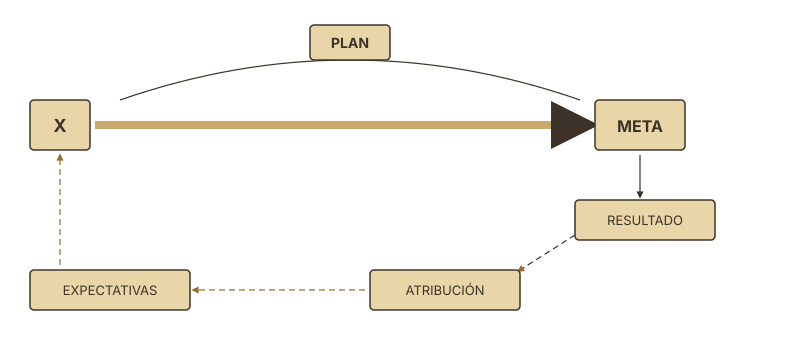
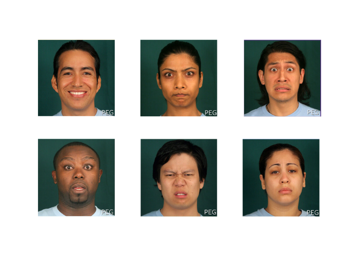
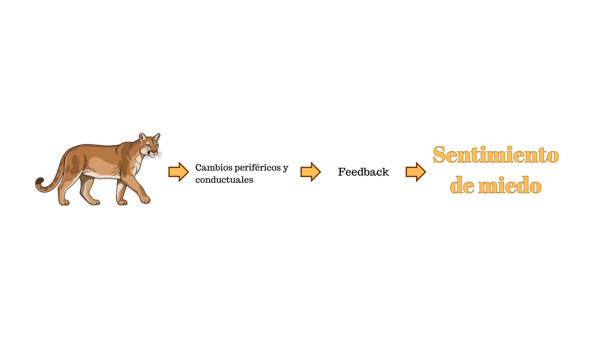
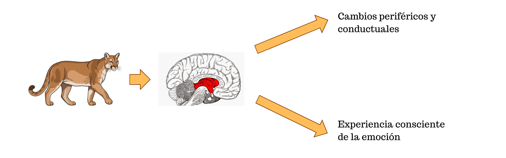

##  {.slide-transicion}

:::: transicion-inner
::: barra-acento
:::

<h2>Por qué alguien hace lo que hace?</h2>
::::

------------------------------------------------------------------------

## ¿Qué es la motivación?

::: {.cols-2 style="margin-top:1em"}
::: {.tarjeta}
<h4>Energía</h4>
<p>El componente que <strong>activa</strong> y <strong>sostiene</strong> el comportamiento.</p>
:::

::: {.tarjeta}
<h4>Dirección</h4>
<p>El componente que <strong>orienta</strong> el comportamiento hacia una meta específica.</p>
:::
:::

::: {.caja-crema style="margin-top:1.2em"}
La motivación responde a la pregunta sobre el **porqué** y el **hacia dónde** de la conducta.
:::

------------------------------------------------------------------------

## Cuatro lecturas posibles

:::::: {.cols-2 style="margin-top:0.6em; font-size:0.9em"}
::: tarjeta
<h4>Psicoanálisis</h4>
<p>La conducta se explica por <strong>motivos y deseos inconscientes</strong>.</p>
:::

::: tarjeta
<h4>Conductismo</h4>
<p>La conducta se adquiere mediante <strong>programas de reforzamiento</strong> (premios y castigos).</p>
:::

::: tarjeta
<h4>Humanismo</h4>
<p>La conducta se orienta a la <strong>satisfacción de necesidades básicas</strong> (ej.: Maslow).</p>
:::

::: tarjeta
<h4>Cognitivismo</h4>
<p>La conducta se relaciona con el <strong>pensamiento</strong> de la persona (mini teorías).</p>
:::
::::::

------------------------------------------------------------------------

##  {.slide-transicion}

:::: transicion-inner
::: barra-acento
:::

<h2>Modelo Humanista: Maslow</h2>
::::

------------------------------------------------------------------------

## Maslow (1955; 1971)

**Modelo de la jerarquía de necesidades**

```{mermaid}
%%{init: {'theme':'base', 'themeVariables': {'primaryColor':'#52b788', 'primaryTextColor':'#1c2b22', 'primaryBorderColor':'#1a3d2b', 'lineColor':'#2d6a4f', 'fontSize':'18px'}}}%%
flowchart LR
  N[Necesidad] --> T[Tensión] --> C[Conducta]
  C --> E[Éxito] --> AT[Alivio<br/>tensión]
  C --> F[Fracaso] --> PT[Persiste<br/>tensión]
```

------------------------------------------------------------------------

## Jerarquía de necesidades

::: {.cols-2 style="margin-top:0.5em; align-items:center"}
::: {style="text-align:center"}
<div style="background:var(--verde-oscuro); color:var(--crema); padding:0.5em 1.2em; margin:0.2em auto; width:50%; border-bottom:2px solid var(--acento); font-size:0.85em; border-radius:4px">Autorrealización</div>
<div style="background:var(--verde-oscuro); color:var(--crema); padding:0.5em 1.2em; margin:0.2em auto; width:60%; border-bottom:2px solid var(--acento); font-size:0.85em; border-radius:4px">Reconocimiento</div>
<div style="background:var(--verde-oscuro); color:var(--crema); padding:0.5em 1.2em; margin:0.2em auto; width:70%; border-bottom:2px solid var(--acento); font-size:0.85em; border-radius:4px">Afiliación</div>
<div style="background:var(--verde-oscuro); color:var(--crema); padding:0.5em 1.2em; margin:0.2em auto; width:80%; border-bottom:2px solid var(--acento); font-size:0.85em; border-radius:4px">Seguridad</div>
<div style="background:var(--verde-oscuro); color:var(--crema); padding:0.5em 1.2em; margin:0.2em auto; width:90%; font-size:0.85em; border-radius:4px">Fisiología</div>
:::

::: {.caja-crema}
Las necesidades se organizan **jerárquicamente**: las inferiores deben satisfacerse antes de que emerjan las superiores como fuente de motivación.
:::
:::

------------------------------------------------------------------------

## Supuestos básicos (1)

:::::: {.cols-2 style="margin-top:0.5em; font-size:0.86em"}
::: tarjeta
<h4>A. Organización jerárquica</h4>
<p>Las necesidades se ordenan en niveles, de las más básicas (fisiológicas) a las más elevadas (autorrealización).</p>
:::

::: tarjeta
<h4>B. Déficit vs. crecimiento</h4>
<p>Las inferiores son <strong>de déficit</strong> (responden a una carencia); las superiores son <strong>de crecimiento</strong> (impulsan el desarrollo).</p>
:::

::: tarjeta
<h4>C. Necesidad satisfecha no motiva</h4>
<p>Una vez cubierta, deja de operar como fuente de motivación.</p>
:::

::: tarjeta
<h4>D. Motivaciones simultáneas</h4>
<p>Varias necesidades pueden estar activas al mismo tiempo, aunque con distinta intensidad.</p>
:::
::::::

------------------------------------------------------------------------

## Supuestos básicos (2)

:::::: {.cols-2 style="margin-top:0.7em; font-size:0.9em"}
::: tarjeta
<h4>E. Hipótesis progresiva de la satisfacción</h4>
<p>A medida que una necesidad se satisface progresivamente, comienza a emerger la siguiente en la jerarquía.</p>
:::

::: tarjeta
<h4>F. Diversidad de satisfacción</h4>
<p>Las necesidades superiores se satisfacen de modo <strong>más diverso</strong> que las inferiores: hay muchas más formas de autorrealizarse que de calmar la sed.</p>
:::
::::::

------------------------------------------------------------------------

##  {.slide-transicion}

:::: transicion-inner
::: barra-acento
:::

<h2>Teorías homeostáticas</h2>
::::

------------------------------------------------------------------------

## Teorías homeostáticas

::: {.caja-crema style="margin-top:0.5em"}
La función del comportamiento es **satisfacer necesidades corporales** y mantener el equilibrio del organismo.
:::

:::::: {.cols-2 style="margin-top:1em"}
::: tarjeta
<h4>Cannon</h4>
<p>Introduce el concepto de <strong>homeostasis</strong>: el organismo tiende a mantener constantes sus variables internas.</p>
:::

::: tarjeta
<h4>Hull (1943)</h4>
<p>Formaliza la teoría del impulso: la necesidad genera un <strong>drive</strong> que activa la conducta hasta restablecer el equilibrio.</p>
:::
::::::

------------------------------------------------------------------------

## Motivos primarios (biológicos)

:::::: {.cols-2 style="font-size:0.86em; margin-top:0.4em"}
::: {style="padding-right:0.5em"}
- **Innatos**
- **Base biológica**
- **Centrales** (no derivados)
- Garantizan la **integridad del organismo**
- Presentes en **todas las especies**
:::

::: {.caja-verde}
[Motivos innatos y biogénicos, centrales, que desde el nacimiento están funcionalmente relacionados con la subsistencia del individuo y la especie.]{style="color:#f5f0e8"}

[— Madsen, 1980]{style="color:#e8dfc9; font-size:0.75em; display:block; margin-top:0.5em"}
:::
::::::

------------------------------------------------------------------------

## Homeostasis y autorregulación

::: {.caja-crema style="margin-top:0.4em"}
**Homeostasis:** proceso de autorregulación del organismo. Las variables del medio interno tienden al punto óptimo, pero el intercambio con el medio externo no permite estabilidad permanente.
:::

::: {.tarjeta style="margin-top:0.7em"}
<h4>Autorregulación</h4>
<p>Combinación de <strong>ajustes fisiológicos automáticos</strong> y <strong>mecanismos conductuales</strong>. Operan a través de un mecanismo de <strong>retroacción negativa</strong>: cuando se restablece el equilibrio, el proceso se detiene.</p>
:::

::: {.caja-verde style="margin-top:0.5em; font-size:0.85em"}
[**Motivación:** el individuo busca permanentemente el punto óptimo que garantice máxima adaptación y rendimiento.]{style="color:#f5f0e8"}
:::

------------------------------------------------------------------------

## Ejemplos de motivos primarios

:::::: {.cols-3 style="margin-top:1.5em"}
::: tarjeta
<h4>Sueño</h4>
<p>Restauración de funciones neurofisiológicas y consolidación de procesos cognitivos.</p>
:::

::: tarjeta
<h4>Hambre</h4>
<p>Regulación de los niveles de energía y nutrientes necesarios para el funcionamiento del organismo.</p>
:::

::: tarjeta
<h4>Sed</h4>
<p>Mantenimiento del equilibrio hidroelectrolítico y la función celular.</p>
:::
::::::

------------------------------------------------------------------------

##  {.slide-transicion}

:::: transicion-inner
::: barra-acento
:::

<h2>Teoría de la activación</h2>
::::

------------------------------------------------------------------------

## Ley de Yerkes-Dodson

::: {.caja-crema style="margin-top:0.4em; font-size:0.9em"}
Existe un **nivel de activación ideal** (moderado) necesario para lograr un desempeño óptimo.
:::

```{r}
#| fig-width: 8
#| fig-height: 3.5
#| fig-align: center
library(ggplot2)
df <- data.frame(
  x = c(1, 2, 3, 4, 5),
  y = c(1, 4, 6, 4, 1),
  label = c("Baja", "", "Moderada", "", "Alta")
)
ggplot(df, aes(x = x, y = y)) +
  geom_line(color = "#1a3d2b", linewidth = 1.4) +
  geom_point(color = "#52b788", size = 4) +
  annotate("text", x = 3, y = 6.6, label = "Rendimiento óptimo",
           fontface = "italic", size = 4.5, color = "#2d6a4f") +
  scale_x_continuous(breaks = 1:5, labels = df$label) +
  scale_y_continuous(limits = c(0, 7.2)) +
  labs(x = "Nivel de activación", y = "Rendimiento") +
  theme_minimal(base_size = 13) +
  theme(
    panel.grid.minor = element_blank(),
    panel.grid.major.x = element_blank(),
    axis.text.y = element_blank(),
    axis.title.x = element_text(face = "bold", margin = margin(t = 8)),
    axis.title.y = element_text(face = "bold"),
    plot.background = element_rect(fill = "#f5f0e8", color = NA),
    panel.background = element_rect(fill = "#f5f0e8", color = NA)
  )
```

::: {style="font-size:0.78em; margin-top:0.4em"}
Tareas **simples** requieren niveles altos de activación · Tareas **complejas** requieren niveles más bajos.
:::

------------------------------------------------------------------------

##  {.slide-transicion}

:::: transicion-inner
::: barra-acento
:::

<h2>El proceso motivacional</h2>
::::

------------------------------------------------------------------------

## Componentes del proceso motivacional



::: {.caja-crema style="margin-top:1em; font-size:0.88em"}
La perspectiva **cognitiva** entiende la motivación como un proceso dinámico. Lo que ocurre tras una acción retroalimenta las metas y expectativas futuras.
:::

------------------------------------------------------------------------

## Cada componente

:::::: {.cols-2 style="font-size:0.85em"}
::: tarjeta
<h4>Meta</h4>
<p>Representación mental del <strong>estado deseado</strong>. Define el "hacia dónde" de la conducta.</p>
:::

::: tarjeta
<h4>Plan</h4>
<p>Secuencia de pasos o estrategia para <strong>alcanzar la meta</strong>. Articula medios y fines.</p>
:::

::: tarjeta
<h4>Atribución</h4>
<p>Explicación que la persona se da del <strong>resultado obtenido</strong>: ¿lo logró por su esfuerzo, capacidad, suerte, dificultad de la tarea?</p>
:::

::: tarjeta
<h4>Expectativas</h4>
<p>Anticipaciones sobre <strong>resultados futuros</strong>. Construidas a partir de experiencias previas y atribuciones, modulan la motivación posterior.</p>
:::
::::::

------------------------------------------------------------------------

##  {.slide-transicion}

:::: transicion-inner
::: barra-acento
:::

<h2>Emoción</h2>
::::


------------------------------------------------------------------------

## Qué emoción es? {visibility="uncounted"}





------------------------------------------------------------------------

##  {.slide-transicion}

:::: transicion-inner
::: barra-acento
:::

<h2>Clasificación de las emociones</h2>
::::

------------------------------------------------------------------------

## Dos modos de clasificar

:::::: {.cols-2 style="margin-top:0.6em; font-size:0.88em"}
::: tarjeta
<h4>Dimensiones · Wundt</h4>
<p>La experiencia emocional se describe combinando <strong>distintas dimensiones</strong> continuas:</p>
<ul style="margin-top:0.3em">
<li>Agrado vs. Desagrado (hedonismo)</li>
<li>Calma vs. Excitación (activación)</li>
<li>Relajación vs. Tensión</li>
</ul>
:::

::: tarjeta
<h4>Estados discretos · Ekman</h4>
<p>Existen <strong>emociones primarias</strong> diferenciadas y compartidas por todos los seres humanos. Ekman identificó <strong>seis</strong>:</p>
<ul style="margin-top:0.3em">
<li>Enojo · Temor · Asco</li>
<li>Sorpresa · Felicidad · Tristeza</li>
</ul>
:::
::::::

------------------------------------------------------------------------

## Criterios de Ekman para emociones básicas

:::{.subtitulo-slide}
Criterios para su identificación
:::

:::::: {.cols-2 style="margin-top:0.5em; font-size:0.85em;"}

<div>

1. Señales distintivas universales
2. Fisiología distintiva
3. Evaluación automática
4. Eventos precedentes universales
5. Presencia en otros primates
6. Inicio rápido y duración breve

</div>

<div>

7. Ocurrencia involuntaria
8. Pensamientos, imágenes y memorias distintivas
9. Períodos refractarios para el filtrado de información
10. Objetivos irrestrictos
11. Pueden suscitarse en forma constructiva o destructiva

</div>

::::::

<p style="text-align:right; font-size:0.75em; color:#7a6a55; margin-top:0.6em;">Ekman, P. (1993, 2003, 2011)</p>

------------------------------------------------------------------------

## Las seis emociones básicas

::: {style="text-align:center; margin-top:0.5em"}

:::

------------------------------------------------------------------------

##  {.slide-transicion}

:::: transicion-inner
::: barra-acento
:::

<h2>Modelos explicativos</h2>
::::

------------------------------------------------------------------------

## Tres teorías sobre el mecanismo emocional

::: {.caja-crema style="margin-top:0.4em; font-size:0.9em"}
Las teorías anteriores eran **descriptivas**: clasificaban las emociones. Las que siguen son **explicativas**: dan cuenta del mecanismo por el cual surge la emoción.
:::

:::::: {.cols-3 style="margin-top:0.9em; font-size:0.83em"}
::: tarjeta
<h4>James-Lange</h4>
<p>Teoría <strong>periférica</strong> de la emoción.</p>
:::

::: tarjeta
<h4>Cannon-Bard</h4>
<p>Lo fisiológico y la experiencia consciente ocurren <strong>en paralelo</strong>.</p>
:::

::: tarjeta
<h4>Schachter</h4>
<p>Teoría de la <strong>etiqueta cognitiva</strong>: activación + interpretación.</p>
:::
::::::

------------------------------------------------------------------------

## Teoría de James-Lange

::: {.cols-2 style="margin-top:0.5em; font-size:0.9em"}
::: {.caja-verde style="text-align:center"}
[¿Huimos porque tenemos miedo?]{style="color:#f5f0e8"}
:::

::: {.caja-verde style="text-align:center"}
[¿O tenemos miedo porque huimos?]{style="color:#f5f0e8"}
:::
:::

------------------------------------------------------------------------

## Teoría de James-Lange


{fig-align="center" width="50%"}

::: {.caja-crema style="margin-top:0.7em; font-size:0.85em"}
Para James-Lange, **primero ocurren los cambios corporales** y la emoción consciente es la *percepción* de esos cambios.
:::

------------------------------------------------------------------------

## Teoría de Cannon-Bard

{fig-align="center" width="50%"}

::: {.caja-crema style="margin-top:0.6em; font-size:0.85em"}
La percepción del estímulo dispara **simultáneamente** la respuesta fisiológica y la experiencia emocional consciente: ninguna depende de la otra.
:::

::: {style="margin-top:0.5em; font-size:0.8em"}
**Argumento clave:** el sistema nervioso autónomo responde de manera similar a estímulos emocionales muy distintos. Si la emoción dependiera solo de la activación corporal, habría una sola emoción posible.
:::

------------------------------------------------------------------------

## Teoría de la etiqueta cognitiva (Schachter)

{fig-align="center" width="50%"}

:::::: {.cols-2 style="margin-top:0.7em; font-size:0.85em"}
::: tarjeta
<h4>Activación inespecífica</h4>
<p>El cuerpo responde con un patrón de activación <strong>general</strong>, no diferenciado por emoción.</p>
:::

::: tarjeta
<h4>Etiquetado cognitivo</h4>
<p>La persona <strong>interpreta</strong> esa activación según el contexto, y le pone un nombre: miedo, alegría, enojo.</p>
:::
::::::

::: {.caja-verde style="margin-top:0.6em; font-size:0.85em; text-align:center"}
[La emoción es el resultado de **activación + interpretación contextual**.]{style="color:#f5f0e8"}
:::
