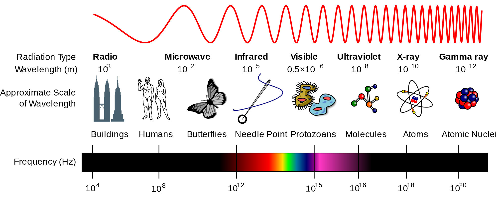
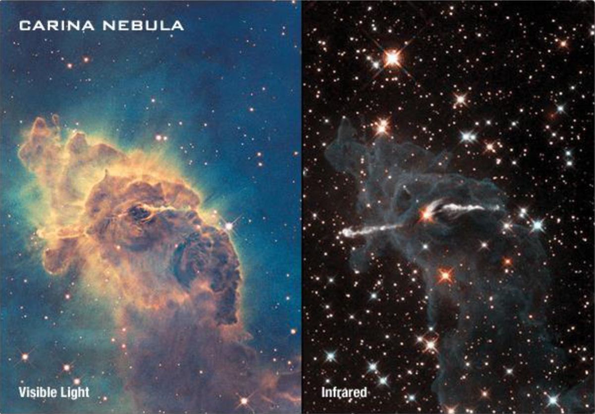
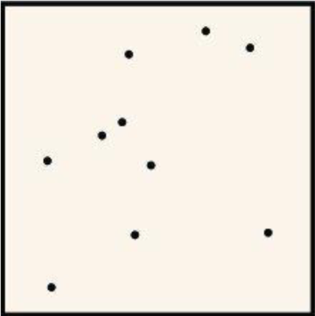
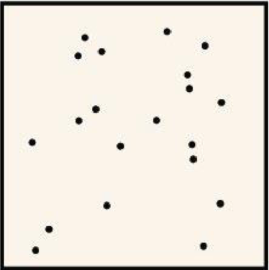
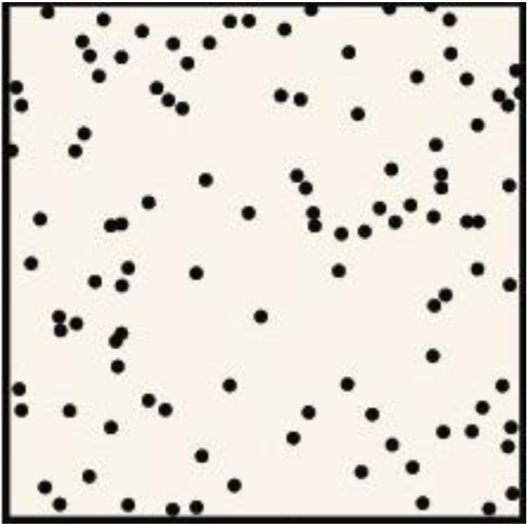
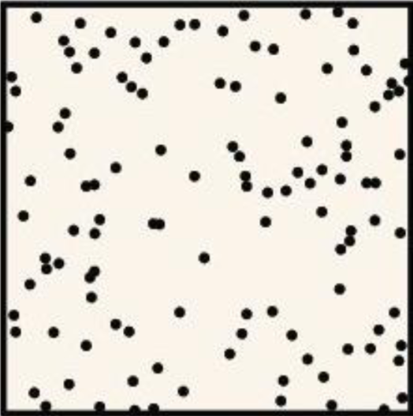
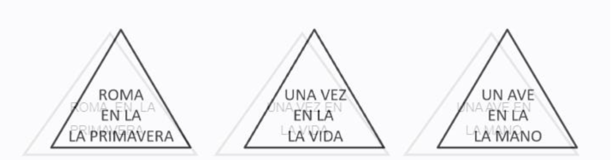
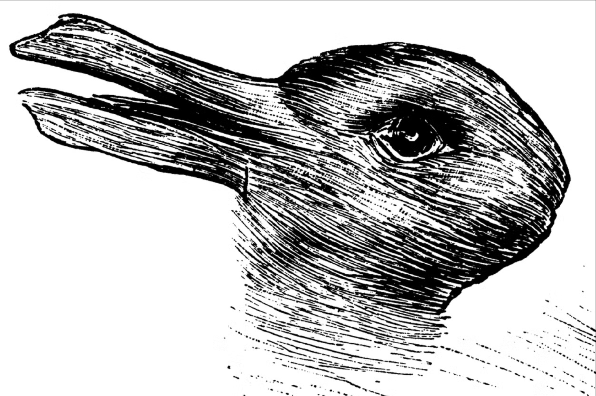
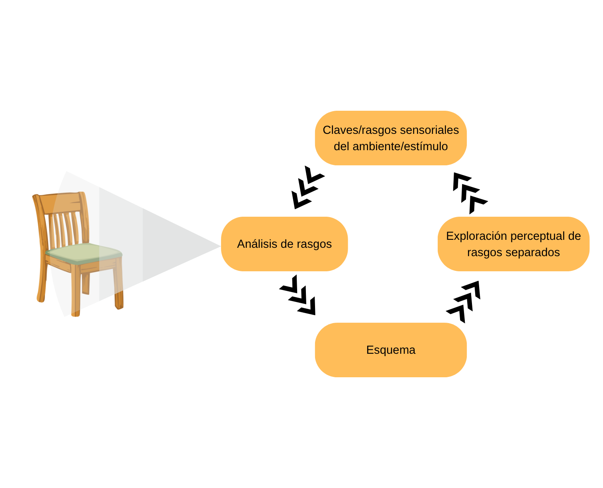

------------------------------------------------------------------------

##  {.slide-transicion}

:::: transicion-inner
::: barra-acento
:::

<h2>Sensación</h2>
::::

------------------------------------------------------------------------

## ¿Qué es lo "real"?



------------------------------------------------------------------------

## ¿Qué es lo "real"?

::: {.caja-verde style="margin-top:1em; font-size:0.95em"}
[¿Cómo definir lo que **es** real? Si hablamos de aquello que podemos sentir, oler, saborear y ver, entonces lo real son simplemente señales eléctricas interpretadas por el cerebro.]{style="color:#f5f0e8"}
:::

La pregunta abre un problema central: lo que llamamos "realidad" no nos llega de forma directa, sino mediada por nuestros sistemas sensoriales.

------------------------------------------------------------------------

## Sensación y percepción: dos procesos

:::::: {.cols-2 style="margin-top:0.8em"}
::: tarjeta
<h4>Sensación</h4>

Proceso <strong>físico</strong>: estimulación de los órganos sensoriales por la energía del entorno.

:::

::: tarjeta
<h4>Percepción</h4>

Proceso <strong>psicológico</strong>: organización e interpretación de esa información.

:::
::::::

::: {.caja-crema style="margin-top:0.9em; font-size:0.85em"}
La sensación es la condición necesaria para que se produzca la percepción.
:::

------------------------------------------------------------------------

## No percibimos la realidad objetiva

- No percibimos la realidad objetiva, sino **nuestra propia construcción** de la realidad.
- Los órganos de los sentidos reúnen información que el cerebro **modifica y ordena**.
- Esa entrada altamente filtrada se compara con recuerdos y expectativas, hasta que la conciencia construye la **mejor conjetura** sobre la realidad.
- Cada sistema sensorial responde solo a un tipo particular de estímulo: funciona como un **sistema de reducción de datos**.

------------------------------------------------------------------------

## Un ejemplo: el espectro electromagnético

Solo vemos una pequeña porción del espectro electromagnético. La mayor parte es **invisible** para nosotros.

{width="78%"}

::: {style="font-size:0.72em; color:#3d5247; margin-top:0.4em"}
Existen ondas de radio, calor, rayos X... pero no hay forma natural de verlas con nuestros ojos.
:::

------------------------------------------------------------------------

## Un ejemplo: el espectro electromagnético

{width="50%"}

------------------------------------------------------------------------

## Tres tipos de receptores

:::::: {.cols-3 style="margin-top:0.8em"}
::: tarjeta
<h4>Exteroceptores</h4>

Informan sobre el <strong>ambiente externo</strong>. Los cinco sentidos tradicionales: vista, oído, olfato, gusto y tacto.

:::

::: tarjeta
<h4>Interoceptores</h4>

Informan sobre el <strong>ambiente interno</strong>. Receptores del interior del organismo: glucosa en sangre, oxígeno, energía.

:::

::: tarjeta
<h4>Propioceptores</h4>

Informan sobre la <strong>posición del cuerpo</strong> en el espacio y sus movimientos: sentido cinestésico y vestibular.

:::
::::::

------------------------------------------------------------------------

## Características de un sistema sensorial

- Responde a una **forma particular de energía** y tiene un órgano del sentido: primer punto de entrada que "atrapa" la información.
- Posee **receptores sensoriales** (transductores): células especializadas que convierten esa energía en impulsos nerviosos —el único lenguaje que el cerebro maneja.
- Implica una **parte especializada del cerebro** que interpreta los mensajes y produce la conciencia de algo: un sabor, un sonido, un objeto.
- Tiene un **umbral absoluto**: una estimulación mínima necesaria antes de que ocurra cualquier experiencia sensorial.

------------------------------------------------------------------------

## Los sistemas sensoriales

| Modalidad | Órgano | Receptor | Área cerebral |
|-----------|--------|----------|---------------|
| Visión | Ojos | Bastones y conos | Lóbulo occipital |
| Audición | Oído (externo, medio e interno) | Células pilosas | Lóbulo temporal |
| Gusto | Lengua | Botones y papilas gustativas | Lóbulo temporal |
| Olfato | Nariz | Mucosa olfativa | Lóbulo temporal y zonas cercanas a la amígdala |
| Tacto | Piel | Sensores de tacto y temperatura | Lóbulo parietal y cerebelo |
| Propiocepción | Oído interno | Sensores vestibulares (otolitos) | Cerebelo (vía vestibular) |

------------------------------------------------------------------------

##  {.slide-transicion}

:::: transicion-inner
::: barra-acento
:::

<h2>Umbrales sensoriales</h2>
::::

------------------------------------------------------------------------

## Umbral absoluto

- Es necesario un **monto mínimo de estímulo** para que ocurra cualquier experiencia sensorial.
- Estos umbrales **varían** según las características de cada sujeto.
- Y varían en un **mismo sujeto**, según su estado físico, motivacional y la manera en que se presenta el estímulo.

::: {.caja-crema style="margin-top:0.8em; font-size:0.85em"}
Aunque existan como objetos físicos, no vemos los virus ni las bacterias: están por debajo de nuestro umbral.
:::

------------------------------------------------------------------------

## Umbral diferencial: Weber–Fechner

La **ley de Weber–Fechner** se pregunta cuál es la diferencia mínima necesaria para discriminar entre dos estímulos.

- Esa diferencia mínima **varía según la modalidad sensorial**.
- Para distinguir el peso de dos bolsas se necesita, aproximadamente, un mínimo de **1/10 del peso**.
- Si la diferencia es **menor a ese umbral**, no logramos discriminar entre los estímulos.

::: {.caja-crema style="margin-top:0.6em; font-size:0.8em"}
Demostración en clase: prueba con sobres de azúcar.
:::

------------------------------------------------------------------------

## ¿Dónde hay más puntos?

:::::: {.cols-2 style="margin-top:0.6em"}
::: {style="text-align:center"}
{width="50%"}

:::

::: {style="text-align:center"}
{width="50%"}

:::
::::::

------------------------------------------------------------------------

## ¿Dónde hay más puntos?

:::::: {.cols-2 style="margin-top:0.6em"}
::: {style="text-align:center"}
{width="50%"}

[**10 puntos**]{style="font-size:0.8em"}
:::

::: {style="text-align:center"}
{width="50%"}

[**20 puntos**]{style="font-size:0.8em"}
:::
::::::

::: {style="font-size:0.78em; color:#3d5247; margin-top:0.5em; text-align:center"}
La diferencia de 10 puntos se nota con facilidad.
:::

------------------------------------------------------------------------

## ¿Y ahora?

:::::: {.cols-2 style="margin-top:0.6em"}
::: {style="text-align:center"}
{width="50%"}

:::

::: {style="text-align:center"}
{width="50%"}

:::
::::::

------------------------------------------------------------------------

## ¿Y ahora?

:::::: {.cols-2 style="margin-top:0.6em"}
::: {style="text-align:center"}
{width="50%"}

[**110 puntos**]{style="font-size:0.8em"}
:::

::: {style="text-align:center"}
{width="50%"}

[**120 puntos**]{style="font-size:0.8em"}
:::
::::::

::: {.caja-crema style="margin-top:0.5em; font-size:0.8em"}
La **misma** diferencia de 10 puntos ahora es imperceptible: el umbral diferencial es **proporcional** al estímulo, no absoluto.
:::

------------------------------------------------------------------------

##  {.slide-transicion}

:::: transicion-inner
::: barra-acento
:::

<h2>Percepción</h2>
::::

------------------------------------------------------------------------

## Un ejercicio

::: {.caja-verde style="margin-top:1em; font-size:0.9em"}
[**Lean lo más rápido posible** las frases de la próxima diapositiva. Apenas cambie, arrancan.]{style="color:#f5f0e8"}
:::

Se necesita un voluntario o voluntaria —aunque pueden hacerlo todos.

------------------------------------------------------------------------

## Lean rápido

{width="100%"}

------------------------------------------------------------------------

## ¿Qué pasó?

Si no lo notaron a la primera, ese es el **efecto de la percepción**: no vemos la realidad objetiva.

- La percepción **"editó"** una parte de la realidad —el artículo repetido— que recién viste después, y tal vez con ayuda.
- Es un fenómeno **normal y natural**: el proceso perceptivo siempre actúa así, acomodando la realidad para nosotros.

------------------------------------------------------------------------

## Percepción: definición

- En general, las definiciones aclaran que existe una **diferencia entre sensación y percepción**.
- Según **Gregory**, la percepción no se determina simplemente por los patrones de estímulo: es una **búsqueda dinámica** de la mejor interpretación de los datos disponibles.
- Percibir implica **ir más allá** de la evidencia dada de manera inmediata por los sentidos.

------------------------------------------------------------------------

## Gibson vs. Gregory

:::::: {.cols-2 style="margin-top:0.8em"}
::: tarjeta
<h4>Gibson abajo-arriba</h4>

La percepción es un proceso <strong>directo</strong>, ecológico, controlado por los datos del ambiente.

:::

::: tarjeta
<h4>Gregory arriba-abajo</h4>

La percepción es un proceso <strong>indirecto</strong>, conceptualmente dirigido por expectativas y memoria.

:::
::::::

::: {.caja-crema style="margin-top:0.9em; font-size:0.85em"}
Ambos son **empiristas**: la percepción es consecuencia del aprendizaje y la experiencia.
:::

------------------------------------------------------------------------

## La diferencia de fondo

La diferencia fundamental está en el **papel que atribuyen a la cognición** en el proceso perceptivo.

:::::: {.cols-2 style="margin-top:0.8em"}
::: {.caja-crema style="font-size:0.82em"}
**Gibson** — la percepción está determinada principalmente por la información que proviene del **mundo externo**.
:::

::: {.caja-crema style="font-size:0.82em"}
**Gregory** — la percepción está fuertemente influida por el **conocimiento previo**, las expectativas y la memoria.
:::
::::::

------------------------------------------------------------------------

## Gibson — procesos abajo-arriba

:::::: {.cols-2 style="margin-top:0.8em"}
::: tarjeta
<h4>Caminar por terreno irregular</h4>

Ajustamos la marcha de manera intuitiva y directa, basándonos en la percepción visual del terreno.

:::

::: tarjeta
<h4>Dispositivos sin instrucciones</h4>

Al usar un aparato nuevo entendemos sus funciones sin leer el manual: el diseño da "pistas" directas.

:::
::::::

------------------------------------------------------------------------

## Gregory — procesos arriba-abajo

**Ilusiones ópticas:** una misma imagen puede interpretarse de dos maneras distintas.

Lo que percibimos depende de nuestra **interpretación cognitiva** y de qué figura estamos buscando ver.

{width="50%"}

------------------------------------------------------------------------

## Una posible síntesis

:::::: {.cols-2 style="margin-top:0.6em; font-size:0.92em"}
::: {style=""}
**Semejanzas**

- La percepción visual está mediada por la luz reflejada en superficies y objetos.
- Se necesita algún tipo de sistema psicológico para percibir.
- La percepción es un **proceso activo**.
:::

::: {style=""}
**Diferencias**

- Gregory: las claves sensoriales sin sentido deben complementarse con memoria, hábito y experiencia.
- Gibson: el ambiente da **toda** la información necesaria para vivir en el mundo.
:::
::::::

::: {.caja-crema style="margin-top:0.6em; font-size:0.78em"}
Gibson: "un organismo que percibe es más como un lector de un mapa que como una cámara".
:::

------------------------------------------------------------------------

## Una posible síntesis: Neisser

La percepción es un **proceso interactivo**: combina análisis de abajo-arriba de los rasgos con expectativas de arriba-abajo.

{width="50%"}

------------------------------------------------------------------------

## El ciclo perceptivo de Neisser

Un análisis inicial de las claves sensoriales sugiere una hipótesis: por ejemplo, "esto es una silla".

- Esa hipótesis inicia la **búsqueda de rasgos esperados** —cuatro patas y un respaldo—, guiada por el esquema de "silla".
- Si el ambiente **refuta** la hipótesis (tiene tres patas y sin respaldo), se genera una nueva ("quizá sea un banco") y se activa otro esquema.

::: {.caja-verde style="margin-top:0.7em; font-size:0.82em"}
[La percepción nunca ocurre en un vacío: el muestreo de rasgos sensoriales **siempre** es guiado por nuestro conocimiento y experiencia previa.]{style="color:#f5f0e8"}
:::

------------------------------------------------------------------------

##  {.slide-transicion}

:::: transicion-inner
::: barra-acento
:::

<h2>Síntesis de la clase</h2>
::::

------------------------------------------------------------------------

## Para llevarse

- La **sensación** es física; la **percepción**, psicológica. No percibimos la realidad objetiva, sino una construcción.
- Los **umbrales** —absoluto y diferencial— marcan los límites de lo que podemos sentir y discriminar.
- **Gibson** (abajo-arriba) y **Gregory** (arriba-abajo) ofrecen dos miradas opuestas sobre el peso de la cognición.
- **Neisser** las integra: la percepción es un **ciclo interactivo** entre datos y expectativas.

