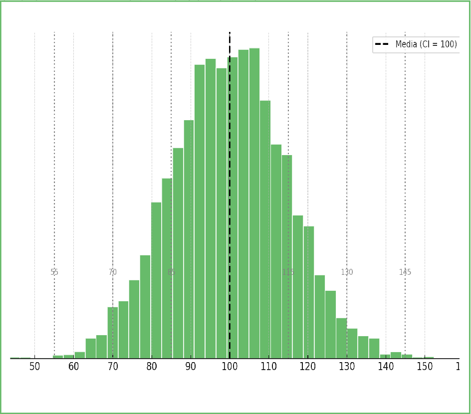
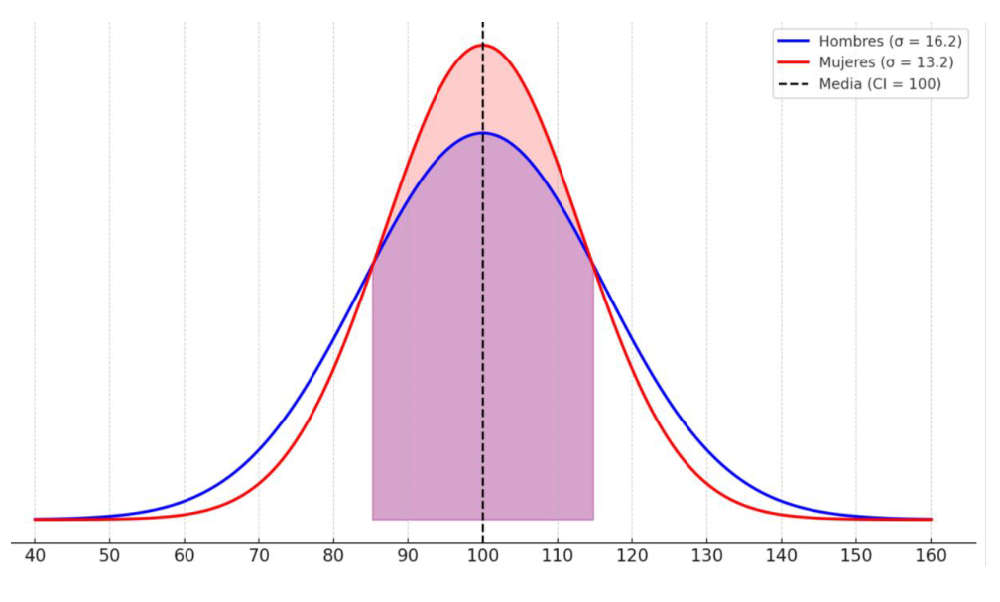
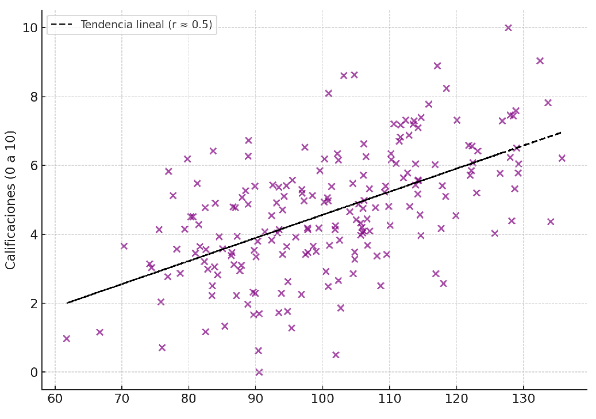

------------------------------------------------------------------------

##  {.slide-transicion}

:::: transicion-inner
::: barra-acento
:::

<h2>Definiciones de inteligencia</h2>
::::

------------------------------------------------------------------------

## Pensemos juntos

::: {.caja-verde style="margin-top:1em; font-size:0.95em"}
[Tratemos de armar **entre todos** una definición de inteligencia.]{style="color:#f5f0e8"}
:::

- ¿Qué es la inteligencia **para ustedes**?
- Si tuvieran que describir a alguien inteligente, ¿qué dirían?

------------------------------------------------------------------------

## Un concepto esquivo

- El concepto de inteligencia es uno de los más **esquivos** de la psicología.
- No hay una definición con la que la **mayoría** de los psicólogos esté de acuerdo.
- Sin embargo, es una de las diferencias individuales **más investigadas**.

::: {.caja-crema style="margin-top:0.8em; font-size:0.85em"}
No solo por interés científico: también porque se utiliza para la **selección educativa y ocupacional**.
:::

------------------------------------------------------------------------

## El enfoque psicométrico

Las teorías **psicométricas** parten de una suposición básica.

:::::: {.cols-2 style="margin-top:0.8em"}
::: tarjeta
<h4>La suposición</h4>

<p>La inteligencia es una <strong>característica de la persona</strong> y puede medirse mediante pruebas.</p>
:::

::: tarjeta
<h4>La consecuencia</h4>

<p>Los individuos pueden <strong>diferenciarse</strong> entre sí: unos tendrán más inteligencia, otros menos.</p>
:::
::::::

::: {.caja-crema style="margin-top:0.8em; font-size:0.82em"}
También llamado enfoque de la **"medición mental"**. Se basa en analizar las puntuaciones de pruebas tomadas por una enorme cantidad de personas.
:::

------------------------------------------------------------------------

## El análisis factorial

El **análisis factorial** es la técnica estadística clave del enfoque psicométrico.

- Busca determinar si las variables se **asocian entre sí**, formando agrupamientos o "racimos".
- Las variables que se agrupan tienen **algo en común**.
- En el caso de la inteligencia, ese algo en común sería una **capacidad básica** subyacente.

------------------------------------------------------------------------

## Pensemos juntos: medir inteligencia

::: {.caja-verde style="margin-top:1em; font-size:0.95em"}
[De ahora en más son **científicos y científicas**. Si tuvieran que diseñar una prueba para medir la inteligencia...]{style="color:#f5f0e8"}
:::

<p style="margin-top:1em; font-size:0.9em; color:#3d5247">¿Qué tipo de <strong>preguntas o tareas</strong> incluirían?</p>

------------------------------------------------------------------------

## Toda prueba: confiabilidad y validez

:::::: {.cols-2 style="margin-top:0.8em"}
::: tarjeta
<h4>Confiabilidad</h4>

<p>¿La prueba mide de forma <strong>consistente</strong>?</p>

<p>Medición 1 vs. Medición 2.<br/>Versión 1 vs. Versión 2.</p>
:::

::: tarjeta
<h4>Validez</h4>

<p>¿La prueba mide <strong>lo que dice medir</strong>?</p>

<p>De contenido y de criterio.</p>
:::
::::::

------------------------------------------------------------------------

## Validez de criterio

Cuando comparamos la prueba con un **criterio externo** —por ejemplo, el rendimiento académico.

:::::: {.cols-2 style="margin-top:0.8em"}
::: {.caja-crema style="font-size:0.85em"}
**Concurrente** — medir inteligencia y medir el rendimiento académico **ahora**, en primer año.
:::

::: {.caja-crema style="font-size:0.85em"}
**Predictiva** — medir inteligencia ahora y medir el rendimiento académico **al terminar** la carrera.
:::
::::::

------------------------------------------------------------------------

##  {.slide-transicion}

:::: transicion-inner
::: barra-acento
:::

<h2>Los factores de la inteligencia</h2>
::::

------------------------------------------------------------------------

## La estructura jerárquica

El análisis factorial revela un **factor general (g)** del que dependen factores más específicos.

```{mermaid}
%%{init: {'theme':'base', 'themeVariables': {'primaryColor':'#e8dfc9','primaryTextColor':'#1a3d2b','primaryBorderColor':'#2d6a4f','lineColor':'#2d6a4f','fontSize':'15px'}}}%%
flowchart TD
  G[Factor g]
  G --> RF[Razonamiento<br/>fluido]
  G --> RC[Razonamiento<br/>cuantitativo]
  G --> CO[Conocimiento]
  G --> PV[Procesamiento<br/>visoespacial]
  G --> MT[Memoria de<br/>trabajo]
```

------------------------------------------------------------------------

## Qué mide cada factor

:::::: {.cols-3 style="margin-top:0.6em"}
::: tarjeta
<h4>Razonamiento fluido</h4>

<p>Analogías · completar la forma faltante.</p>
:::

::: tarjeta
<h4>Razonamiento cuantitativo</h4>

<p>Operaciones · predicción de valores.</p>
:::

::: tarjeta
<h4>Conocimiento</h4>

<p>Cultura general · definiciones.</p>
:::
::::::

:::::: {.cols-2 style="margin-top:0.6em"}
::: tarjeta
<h4>Procesamiento visoespacial</h4>

<p>Cubos · matrices.</p>
:::

::: tarjeta
<h4>Memoria de trabajo</h4>

<p>Retención de dígitos · aritmética.</p>
:::
::::::

------------------------------------------------------------------------

## ¿Y si fueran otros factores?

¿Cómo sabemos que estos son **los** factores y no otros?

::: {.caja-verde style="margin-top:0.9em; font-size:0.9em"}
[**Probémoslo.** Simulación de análisis factorial para la medición de la inteligencia.]{style="color:#f5f0e8"}
:::

<iframe src="https://ftonin.shinyapps.io/simulacion_factorial/" width="100%" height="420px" style="border:none; border-radius:6px; margin-top:0.6em;"></iframe>

------------------------------------------------------------------------

##  {.slide-transicion}

:::: transicion-inner
::: barra-acento
:::

<h2>El Coeficiente Intelectual</h2>
::::

------------------------------------------------------------------------

## ¿Qué es el CI?

:::::: {.cols-2 style="margin-top:0.8em"}
::: {style=""}
**¿Qué es?**

Una comparación entre la **edad mental** y la **edad cronológica**.

**¿Cómo se calcula?**

Se mide la "edad mental" (aquello que se mide) y se aplica la fórmula.

::: {.caja-verde style="margin-top:0.6em; text-align:center; font-size:1em"}
[CI = (EM / EC) × 100]{style="color:#f5f0e8; font-weight:700"}
:::
:::

::: {style="text-align:center"}
{width="92%"}

[Distribución del CI · media = 100]{style="font-size:0.72em; color:#3d5247"}
:::
::::::

------------------------------------------------------------------------

## CI en hombres y mujeres

:::::: {.cols-2 style="margin-top:0.8em"}
::: {style="text-align:center"}
{width="95%"}
:::

::: {style=""}
**¿Hay diferencias?**

- **No** en términos de inteligencia.
- **Sí** en términos sociales: aptitudes y roles de género.

::: {.caja-crema style="margin-top:0.6em; font-size:0.8em"}
Las distribuciones difieren levemente en su dispersión, no en su media.
:::
:::
::::::

------------------------------------------------------------------------

## CI y éxito

:::::: {.cols-2 style="margin-top:0.8em"}
::: {style="text-align:center"}
{width="95%"}
:::

::: {style=""}
**¿Hay causalidad?**

- ¡No! Es una **correlación** (r ≈ .5).
- El CI solo predice **qué tan buenos somos resolviendo pruebas de inteligencia**.
:::
::::::

::: {.caja-verde style="margin-top:0.6em; font-size:0.85em"}
[En el éxito intervienen muchos otros factores: **motivación y recursos**, entre ellos.]{style="color:#f5f0e8"}
:::

------------------------------------------------------------------------

##  {.slide-transicion}

:::: transicion-inner
::: barra-acento
:::

<h2>Alternativas al modelo psicométrico</h2>
::::

------------------------------------------------------------------------

## Definiciones biológicas

La inteligencia entendida como **adaptación al ambiente**.

- **Piaget** la estudia como un **proceso**, no como un conjunto de capacidades.
- El foco está en la inteligencia **en sí misma**, no en las diferencias entre personas.
- Representa un enfoque **cualitativo**.

------------------------------------------------------------------------

## Definiciones cognitivas

La inteligencia como **procesamiento de la información** a través de distintas funciones mentales.

:::::: {.cols-3 style="margin-top:0.8em"}
::: tarjeta
<h4>Neurológica</h4>

<p>Base biológica del procesamiento.</p>
:::

::: tarjeta
<h4>Experiencial</h4>

<p>Aprendizaje a partir de la experiencia.</p>
:::

::: tarjeta
<h4>Reflexiva</h4>

<p>Habilidades <strong>metacognitivas</strong>.</p>
:::
::::::

::: {.caja-crema style="margin-top:0.8em; font-size:0.82em"}
Se pueden medir aspectos de la inteligencia mediante **evaluaciones cognitivas**.
:::

------------------------------------------------------------------------

## Modelos computacionales

La inteligencia modelada a través de **redes neuronales**.

- Entrenamiento de modelos: aprendizaje **supervisado**, **no supervisado**, y otros.

::: {.caja-verde style="margin-top:0.9em; font-size:0.9em"}
[Y a estos modelos... ¿cómo les va en las técnicas que estuvimos viendo?]{style="color:#f5f0e8"}
:::

------------------------------------------------------------------------

## ¿Inteligencia en los LLM?

{width="72%"}

::: {style="font-size:0.7em; color:#3d5247; margin-top:0.4em; text-align:center"}
Ilić & Gignac (2024). *Intelligence*, 106, 101858.
:::

------------------------------------------------------------------------

## El estudio: método y resultados

:::::: {.cols-2 style="margin-top:0.8em"}
::: tarjeta
<h4>Método</h4>

<p>Se analizaron <strong>600 LLM</strong> con técnicas que miden razonamiento fluido, conocimiento cuantitativo, comprensión lectora y conocimiento específico.</p>
:::

::: tarjeta
<h4>Resultados</h4>

<p>La media de correlaciones entre tests fue <strong>r = .73</strong> (mayor que en humanos, ~.45). Se identificó algo parecido a un <strong>factor g</strong>: a más parámetros, mayor g.</p>
:::
::::::

------------------------------------------------------------------------

## El estudio: conclusiones

- Los LLM que rinden bien en una tarea tienden a rendir bien en otras: sugiere un **proceso cognitivo generalizado artificial**.
- Pero se trata más de **logro artificial** que de una inteligencia general genuina: los modelos actuales carecen de **conciencia, flexibilidad y autoevaluación**.
- Su estructura **refleja aspectos** de la cognición humana, pero todavía no equivale a una inteligencia genuina.

------------------------------------------------------------------------

## Inteligencias múltiples

El modelo de **Gardner** (1983) fue muy influyente en la psicología educativa. Pero recibe **críticas serias**.

:::::: {.cols-2 style="margin-top:0.7em; font-size:0.92em"}
::: {.caja-crema style="font-size:0.82em"}
**Falta de evidencia empírica** — no hay pruebas psicométricas validadas que midan las "inteligencias" por separado; los estudios factoriales no las encuentran como constructos independientes.
:::

::: {.caja-crema style="font-size:0.82em"}
**Confusión conceptual** — mezcla habilidades, talentos y estilos. Redefinir la inteligencia para abarcar toda habilidad valiosa **diluye** su significado.
:::

::: {.caja-crema style="font-size:0.82em"}
**Difícil de operacionalizar** — sin instrumentos estandarizados, su aplicación en investigación y su validez científica quedan limitadas.
:::

::: {.caja-crema style="font-size:0.82em"}
**Carencia de falsabilidad** — no permite hipótesis refutables experimentalmente; se aleja del método científico según criterios popperianos.
:::
::::::

::: {.caja-verde style="margin-top:0.5em; font-size:0.8em"}
[Aprobación popular ≠ validación científica: que se use mucho en las aulas no lo vuelve empíricamente sólido.]{style="color:#f5f0e8"}
:::

------------------------------------------------------------------------

##  {.slide-transicion}

:::: transicion-inner
::: barra-acento
:::

<h2>Síntesis de la clase</h2>
::::

------------------------------------------------------------------------

## Para llevarse

- La inteligencia es un concepto **esquivo**: no hay una definición consensuada.
- El **enfoque psicométrico** la mide con pruebas y la analiza con análisis factorial, que revela un **factor g** y factores específicos.
- El **CI** compara edad mental y cronológica; correlaciona con el éxito, pero **no lo causa**.
- Existen **alternativas**: biológicas (Piaget), cognitivas, computacionales. Y modelos populares pero discutidos, como las **inteligencias múltiples**.
