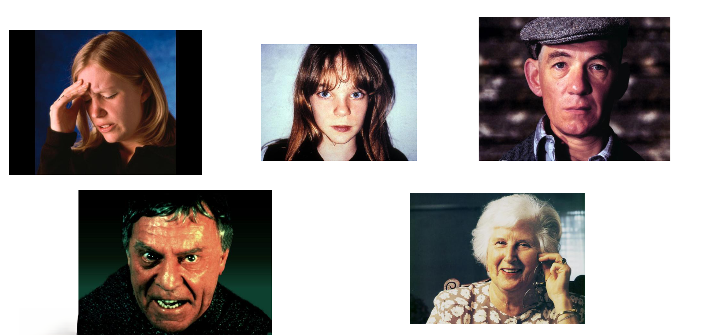

##  {.slide-transicion}

:::: transicion-inner
::: barra-acento
:::

<h2>Bloque 1 — Pensamiento</h2>
::::

------------------------------------------------------------------------

## ¿Qué es pensar?

Pensar es la **transformación sistemática de representaciones mentales** (Holyoak & Morrison, 2005). Es lo que hacemos cuando manipulamos información en la cabeza para llegar a algún lado.

:::::: cols-2
::: tarjeta
<h4>Productos</h4>

Creencias, juicios, decisiones. El <em>resultado</em> de pensar.

:::

::: tarjeta
<h4>Procesos</h4>

Planificar, comparar, deducir, resolver problemas. El <em>cómo</em> se piensa.

:::
::::::

::: {.caja-crema style="margin-top:0.8em; font-size:0.85em"}
**Función adaptativa:** anticipar desafíos antes de que ocurran. Planificar el menú de la semana según lo que hay en la heladera y quiénes vienen a comer es pensamiento en acción.
:::

------------------------------------------------------------------------

## Razonamiento deductivo

De premisas verdaderas se extraen conclusiones **necesariamente** verdaderas. Si las premisas son ciertas, la conclusión no puede ser falsa.

:::::: {.cols-2 style="margin-top:0.6em; font-size:0.9em"}
::: tarjeta
<h4>Silogismo</h4>

Todos los mamíferos tienen corazón.

Las ballenas son mamíferos.

<strong>∴ Las ballenas tienen corazón.</strong>

:::

::: tarjeta
<h4>Transitividad</h4>

Si A > B y B > C,

<strong>entonces A > C.</strong>

Juan gana más que María; María gana más que Pedro; Juan gana más que Pedro.

:::
::::::

::: {.caja-verde style="margin-top:0.7em; font-size:0.88em"}

<strong>Característica clave:</strong> va de lo general a lo particular. La conclusión ya estaba contenida en las premisas.

:::

------------------------------------------------------------------------

## Razonamiento inductivo

De casos particulares se generaliza a una conclusión **probable**, no certera. Cuantos más casos, mayor la probabilidad, pero nunca llegamos a la certeza absoluta.

:::::: {.cols-2 style="margin-top:0.6em; font-size:0.9em"}
::: tarjeta
<h4>Ejemplo cotidiano</h4>

Los primeros 100 cisnes que vi eran blancos.

<strong>∴ Todos los cisnes son blancos.</strong>

<em>Hasta que aparece un cisne negro en Australia.</em>

:::

::: tarjeta
<h4>En ciencia</h4>

El paracetamol bajó la fiebre en 10.000 pacientes del ensayo.

<strong>∴ El paracetamol baja la fiebre.</strong>

:::
::::::

::: {.caja-crema style="margin-top:0.6em; font-size:0.85em"}
La base normativa de la inducción es la **estadística bayesiana** (Tversky & Kahneman, 1974). Toda generalización es revisable ante nueva evidencia.
:::

------------------------------------------------------------------------

## Heurísticos: atajos del pensamiento

Reglas intuitivas rápidas para tomar decisiones cuando el análisis exhaustivo sería demasiado costoso. Cambian precisión por velocidad.

::: {.caja-verde style="margin-top:0.7em; font-size:0.9em"}

Los heurísticos funcionan bien la mayor parte del tiempo, pero introducen <strong style="color:#f5f0e8">sesgos sistemáticos</strong>.

:::

:::::: {.cols-3 style="margin-top:0.7em; font-size:0.82em"}
::: tarjeta
<h4>Representatividad</h4>

Juzgar por similitud al prototipo.

:::

::: tarjeta
<h4>Disponibilidad</h4>

Estimar por facilidad de evocar ejemplos.

:::

::: tarjeta
<h4>Anclaje y ajuste</h4>

Partir de un valor de referencia y ajustar poco.

:::
::::::

Tversky & Kahneman (1974) los identificaron como los tres heurísticos centrales en la toma de decisiones bajo incertidumbre.

------------------------------------------------------------------------

## Heurístico de representatividad

Juzgamos la probabilidad de que algo pertenezca a una categoría por **cuánto se parece al prototipo** que tenemos de esa categoría, ignorando información estadística más útil.

::: {.caja-crema style="margin-top:0.7em; font-size:0.88em"}
**Ejemplo:** Laura es callada, lee poesía y tiene anteojos. ¿Es más probable que sea **bibliotecaria** o **vendedora**?

La mayoría responde "bibliotecaria" porque encaja con el prototipo. Pero en Argentina hay muchas más vendedoras que bibliotecarias. Estadísticamente, lo más probable es que sea vendedora.
:::

::: {.caja-verde style="margin-top:0.7em; font-size:0.85em"}

<strong style="color:#f5f0e8">Sesgo asociado:</strong> ignorar las tasas base (cuán frecuente es cada categoría en la población).

:::

------------------------------------------------------------------------

## Heurístico de disponibilidad

Estimamos la frecuencia de un evento por **qué tan fácil nos viene a la cabeza** un ejemplo. Si recordamos casos rápido, lo juzgamos frecuente.

::: {.caja-crema style="margin-top:0.7em; font-size:0.88em"}
**Ejemplo:** después de ver dos noticias seguidas sobre ataques de tiburón, mucha gente decide no meterse al mar. Pero la probabilidad real de ser atacada por un tiburón es ínfima comparada con la de ahogarse o ser atropellada yendo a la playa.
:::

::: {.caja-verde style="margin-top:0.7em; font-size:0.85em"}

<strong style="color:#f5f0e8">Sesgo asociado:</strong> los medios y la memoria emocional inflan la frecuencia percibida de eventos vívidos y raros.

:::

------------------------------------------------------------------------

## Heurístico de anclaje y ajuste

Tomamos un **valor inicial de referencia** (el ancla) y ajustamos desde ahí. El problema: el ancla influye incluso cuando es arbitraria o irrelevante, y el ajuste suele quedar corto.

::: {.caja-crema style="margin-top:0.7em; font-size:0.88em"}
**Ejemplo:** un departamento publicado a USD 200.000 pero "rebajado" a USD 170.000 parece una oportunidad. Si el mismo departamento se hubiera publicado desde el inicio a USD 170.000, parecería caro. El ancla original (200K) condiciona la valoración.
:::

::: {.caja-verde style="margin-top:0.7em; font-size:0.85em"}

<strong style="color:#f5f0e8">Sesgo asociado:</strong> el ancla pesa más de lo que debería, incluso cuando sabemos que es arbitraria.

:::

------------------------------------------------------------------------

## Sistema 1 y Sistema 2

Kahneman (2011) propone que la mente opera con dos sistemas que conviven en cada decisión.

:::::: {.cols-2 style="margin-top:0.6em; font-size:0.86em"}
::: tarjeta
<h4>Sistema 1 — Intuitivo</h4>

Rápido, automático, inconsciente. Trabaja con heurísticos. Bajo costo cognitivo.

<em>Frenar al ver que un auto se cruza.</em>

<em>Reconocer la cara de un amigo.</em>

:::

::: tarjeta
<h4>Sistema 2 — Analítico</h4>

Lento, controlado, consciente. Sigue reglas. Alto costo cognitivo.

<em>Calcular el interés compuesto de un plazo fijo.</em>

<em>Comparar departamentos en una planilla.</em>

:::
::::::

::: {.caja-crema style="margin-top:0.6em; font-size:0.85em"}
Los heurísticos son herramientas del **Sistema 1**. El Sistema 2 corrige cuando detecta que algo no cierra, pero pocas veces se activa por sí solo.
:::

------------------------------------------------------------------------

## El Sistema 1 en acción

Dos tareas para mostrar la diferencia entre procesamiento automático y reflexivo.

:::::: {.cols-2 style="margin-top:0.6em; font-size:0.88em"}
::: tarjeta
<h4>Tarea 1</h4>

¿Quién está feliz en las fotos de abajo?

<em>La respuesta llega antes de pensarla. Eso es Sistema 1: reconocimiento facial automático.</em>

{width="25%"}
:::

::: tarjeta
<h4>Tarea 2</h4>

<strong>18 + 29 + 54 + 42</strong>

<em>La respuesta no llega sola. Hay que activar el Sistema 2: cálculo lento, controlado, esforzado.</em>

:::
::::::

------------------------------------------------------------------------

##  {.slide-transicion}

:::: transicion-inner
::: barra-acento
:::

<h2>Bloque 2 — Conceptos: la unidad básica</h2>
::::

------------------------------------------------------------------------

## La unidad básica del pensamiento

Para pensar, primero hay que **clasificar**. Los conceptos son categorías mentales que agrupan objetos, personas o situaciones según características comunes.

::: {.caja-crema style="margin-top:0.7em; font-size:0.9em"}
Ver tres objetos distintos (una silla de madera antigua, una silla de oficina, un taburete) y reconocer que todos son **sillas** es formar y aplicar un concepto.
:::

::: {.caja-verde style="margin-top:0.7em; font-size:0.88em"}

Sin conceptos no hay pensamiento posible: tendríamos que tratar cada objeto del mundo como único e irrepetible.

:::

La pregunta de fondo: <em>¿qué tiene que cumplir algo para entrar en una categoría?</em> Bruner, Goodnow & Austin (1956) describieron tres formas básicas.

------------------------------------------------------------------------

## Conceptos conjuntivos

Un objeto pertenece a la categoría solo si cumple **todos** los atributos a la vez. Si falta uno, queda afuera.

::: {.caja-verde style="margin-top:0.5em; font-size:0.85em"}

<strong style="color:#f5f0e8">Regla lógica: A Y B</strong>

:::

:::::: {.cols-2 style="margin-top:0.7em; font-size:0.85em"}
::: tarjeta
<h4>Mamífero</h4>

Tiene pelo <strong>Y</strong> alimenta crías con leche.

Un reptil con pelo (imposible, pero hipotéticamente) no sería mamífero. Una vaca sin pelo (rara) tampoco.

:::

::: tarjeta
<h4>Soltero</h4>

Adulto <strong>Y</strong> no casado.

Un niño no casado no es soltero. Un adulto casado tampoco.

:::
::::::

Son los más comunes en el lenguaje cotidiano y los más fáciles de aprender. La mente busca naturalmente "qué tienen en común" todos los miembros.

------------------------------------------------------------------------

## Conceptos relacionales

La pertenencia depende de la **relación** del objeto con otro. Mirar el objeto aislado no alcanza para saber si pertenece a la categoría.

::: {.caja-verde style="margin-top:0.5em; font-size:0.85em"}

<strong style="color:#f5f0e8">Regla lógica: depende del vínculo con otro objeto</strong>

:::

:::::: {.cols-2 style="margin-top:0.7em; font-size:0.85em"}
::: tarjeta
<h4>Tío</h4>

No es una propiedad de la persona en sí: es alguien que tiene un sobrino.

Sin sobrino, no hay tío. La misma persona pasa a ser tío cuando nace su sobrino, sin que nada cambie en ella.

:::

::: tarjeta
<h4>Más caro que</h4>

Un café de 3000 pesos es caro comparado con uno de un bar de barrio, pero barato comparado con uno de Palermo.

El "ser caro" no está en el precio absoluto: depende con qué se compare.

:::
::::::

Cuestan más de aprender porque exigen comparar, no solo observar el objeto.

------------------------------------------------------------------------

## Conceptos disyuntivos

Basta con cumplir **al menos uno** de varios atributos posibles. Distintos miembros de la categoría pueden entrar por razones diferentes.

::: {.caja-verde style="margin-top:0.5em; font-size:0.85em"}

<strong style="color:#f5f0e8">Regla lógica: A O B O C</strong>

:::

:::::: {.cols-2 style="margin-top:0.7em; font-size:0.85em"}
::: tarjeta
<h4>Ciudadano argentino</h4>

Por nacimiento en el país <strong>O</strong> por padres argentinos <strong>O</strong> por naturalización.

Tres argentinos pueden serlo por tres vías distintas, sin compartir ninguna.

:::

::: tarjeta
<h4>Salir expulsado en fútbol</h4>

Doble amarilla <strong>O</strong> roja directa <strong>O</strong> agresión al árbitro.

Cada expulsión puede tener una causa distinta. No hay un único atributo común.

:::
::::::

Son los más difíciles de aprender: el aprendiz busca "qué tienen en común" todos los casos, y la respuesta es que no hay un atributo único compartido.

------------------------------------------------------------------------

## Síntesis: los tres tipos

| Tipo | Regla lógica | Pregunta clave | Ejemplo |
|------|--------------|----------------|---------|
| **Conjuntivo** | A Y B | ¿Cumple **todos** los atributos? | Mamífero |
| **Relacional** | depende del vínculo | ¿En qué **se relaciona** con otro? | Tío |
| **Disyuntivo** | A O B | ¿Cumple **al menos uno**? | Ciudadano |

::: {.caja-crema style="margin-top:0.8em; font-size:0.88em"}
La mente cotidiana funciona bien con los conjuntivos. Los relacionales y disyuntivos requieren más entrenamiento y suelen aparecer en ámbitos especializados (derecho, deportes, ciencia).
:::

------------------------------------------------------------------------

##  {.slide-transicion}

:::: transicion-inner
::: barra-acento
:::

<h2>Bloque 3 — Pensamiento y lenguaje</h2>
::::

------------------------------------------------------------------------

## Lenguaje, habla, escritura, seña

Conviene distinguir tres niveles que en la vida cotidiana se mezclan.

:::::: {.cols-3 style="margin-top:0.7em; font-size:0.82em"}
::: tarjeta
<h4>Lenguaje</h4>

Sistema mental abstracto de símbolos y reglas.

Incluye <em>pragmática, semántica, sintaxis, fonología</em>.

:::

::: tarjeta
<h4>Habla</h4>

Realización física del lenguaje a través del aparato fonador.

Sonidos, entonación, ritmo.

:::

::: tarjeta
<h4>Escritura y seña</h4>

Otras realizaciones físicas: gráfica (escritura) o gestual (lengua de señas).

:::
::::::

::: {.caja-crema style="margin-top:0.7em; font-size:0.85em"}
Una persona sorda usuaria de lengua de señas tiene **lenguaje** pleno aunque no use el **habla**. El lenguaje es la capacidad cognitiva; el habla es solo uno de sus canales.
:::

------------------------------------------------------------------------

## Semántica: el significado

La semántica estudia cómo las palabras significan. Toda palabra tiene dos capas de significado.

:::::: {.cols-2 style="margin-top:0.6em; font-size:0.86em"}
::: tarjeta
<h4>Denotativo</h4>

Sentido literal y objetivo, el que aparece en el diccionario.

<strong>Casa:</strong> construcción destinada a vivienda humana.

<strong>Serpiente:</strong> reptil ofidio sin extremidades.

:::

::: tarjeta
<h4>Connotativo</h4>

Cargas emocionales, valoraciones, asociaciones personales y culturales.

<strong>Casa:</strong> calidez, hogar, seguridad ("volver a casa").

<strong>Serpiente:</strong> traición, peligro ("rodeado de serpientes en la oficina").

:::
::::::

::: {.caja-verde style="margin-top:0.7em; font-size:0.85em"}

La connotación es lo que hace que dos palabras "sinónimas" no sean intercambiables: <em>flaco</em> y <em>esquelético</em> denotan algo parecido, connotan cosas muy distintas.

:::

------------------------------------------------------------------------

## ¿Qué relación tienen pensamiento y lenguaje?

Cuatro posturas clásicas, cada una con un autor representativo.

:::::: {.cols-2 style="margin-top:0.8em; font-size:0.88em"}
::: tarjeta
<h4>01 · Sapir-Whorf</h4>

El pensamiento <strong>depende</strong> del lenguaje.

:::

::: tarjeta
<h4>02 · Berlin & Kay / Piaget</h4>

El lenguaje <strong>depende</strong> del pensamiento.

:::
::::::

:::::: {.cols-2 style="margin-top:0.6em; font-size:0.88em"}
::: tarjeta
<h4>03 · Vygotsky</h4>

Pensamiento y lenguaje son <strong>independientes</strong> y luego se unen.

:::

::: tarjeta
<h4>04 · Watson</h4>

Pensamiento y lenguaje son <strong>lo mismo</strong>.

:::
::::::

------------------------------------------------------------------------

## 01 — El pensamiento depende del lenguaje

**Sapir y Whorf** formularon la **hipótesis de la relatividad lingüística**: el idioma que hablamos determina los conceptos disponibles para pensar.

::: {.caja-verde style="margin-top:0.7em; font-size:0.88em"}

<strong style="color:#f5f0e8">"Los límites de mi idioma son los límites de mi mundo"</strong>

— Wittgenstein, Tractatus 5.6

:::

::: {.caja-crema style="margin-top:0.7em; font-size:0.86em"}
**Tesis fuerte (determinismo lingüístico):** si una lengua no tiene cierta categoría, sus hablantes no pueden pensarla.

**Tesis débil (relatividad):** la lengua que hablamos influye en cómo categorizamos el mundo, sin determinarlo del todo.
:::

------------------------------------------------------------------------

## El caso de los esquimales: nota crítica

El ejemplo clásico para ilustrar Sapir-Whorf: "los esquimales tienen 20 palabras para nieve, los europeos una sola, entonces los esquimales perciben 20 nieves distintas".

::: {.caja-verde style="margin-top:0.7em; font-size:0.85em"}

<strong style="color:#f5f0e8">El problema:</strong> el ejemplo es un mito lingüístico (Pullum, 1991, <em>The Great Eskimo Vocabulary Hoax</em>). Las lenguas inuit no tienen significativamente más raíces para "nieve" que el inglés o el español.

:::

::: {.caja-crema style="margin-top:0.7em; font-size:0.86em"}
**Evidencia más sólida (Boroditsky, 2011):** los hablantes de **Kuuk Thaayorre** (aborígenes australianos) no usan "izquierda/derecha" sino puntos cardinales ("la taza está al norte de tu mano"). Tienen una orientación espacial absoluta notablemente superior a la de hablantes de inglés o español.

Acá la lengua sí parece moldear una habilidad cognitiva real, aunque sin "determinar" la posibilidad de pensar el espacio.
:::

------------------------------------------------------------------------

## 02 — El lenguaje depende del pensamiento

Las posturas **universalistas** invierten la relación: el pensamiento es previo, y el lenguaje lo expresa.

:::::: {.cols-2 style="margin-top:0.6em; font-size:0.85em"}
::: tarjeta
<h4>Berlin & Kay (colores)</h4>

Aunque las lenguas tienen distinta cantidad de palabras para colores, todas siguen una <strong>jerarquía universal</strong>: si una lengua tiene 3 términos, son blanco, negro y rojo.

Los bebés discriminan colores antes de tener palabras para ellos: la percepción es previa al lenguaje.

:::

::: tarjeta
<h4>Piaget</h4>

El lenguaje refleja el nivel de desarrollo cognitivo alcanzado.

El niño entiende "tanto como" recién cuando ya domina la conservación de la cantidad. La palabra llega <em>después</em> del concepto.

:::
::::::

::: {.caja-verde style="margin-top:0.7em; font-size:0.85em"}

El lenguaje se acomoda a estructuras cognitivas previas, no las crea.

:::

------------------------------------------------------------------------

## 03 — Pensamiento y lenguaje independientes

**Vygotsky** sostuvo que pensamiento y lenguaje empiezan separados y se entrelazan durante el desarrollo.

:::::: {.cols-3 style="margin-top:0.7em; font-size:0.78em"}
::: tarjeta
<h4>Hasta los 2 años</h4>

<strong>Lenguaje preintelectual:</strong> llantos, balbuceos, expresiones afectivas sin contenido conceptual.

<strong>Pensamiento prelingüístico:</strong> sensaciones y percepciones sin palabras.

:::

::: tarjeta
<h4>Entre los 2 y 7 años</h4>

<strong>Discurso egocéntrico:</strong> el niño habla en voz alta sobre sus planes, pero sin intención comunicativa. No distingue habla para sí de habla para otros.

:::

::: tarjeta
<h4>Desde los 7 años</h4>

<strong>Discurso racional:</strong> lenguaje para comunicar.

<strong>Discurso interno:</strong> lenguaje para pensar. Hereda al discurso egocéntrico y organiza ideas.

:::
::::::

::: {.caja-crema style="margin-top:0.7em; font-size:0.85em"}
El discurso interno es la clave vygotskiana: pensamos "hablándonos por dentro", pero ese habla interna se construyó socialmente primero.
:::

------------------------------------------------------------------------

## 04 — Pensamiento y lenguaje son lo mismo

**Watson** (conductismo) propuso el **periferalismo**: el pensamiento no ocurre en una "mente" interna, sino periféricamente en la laringe.

::: {.caja-crema style="margin-top:0.7em; font-size:0.88em"}
Los pensamientos serían sensaciones producidas por **micromovimientos del aparato fonador**, demasiado pequeños para oírse. Pensar = hablar en silencio.
:::

::: {.caja-verde style="margin-top:0.7em; font-size:0.85em"}

<strong style="color:#f5f0e8">Evidencia en contra:</strong>

• Pacientes con parálisis muscular total inducida farmacológicamente recuerdan haber pensado durante la parálisis.

• Personas sordomudas de nacimiento, que no usan el aparato fonador, piensan con normalidad.

:::

Hoy la postura tiene valor histórico: muestra hasta dónde llegó el conductismo intentando expulsar lo mental del estudio de la conducta.

------------------------------------------------------------------------

## Las 4 posturas en una tabla

| Postura | Autor | Tesis central |
|---------|-------|---------------|
| 1. Pensamiento depende del lenguaje | Sapir-Whorf | El idioma define qué se puede pensar |
| 2. Lenguaje depende del pensamiento | Berlin & Kay / Piaget | El concepto precede a la palabra |
| 3. Independientes y luego se unen | Vygotsky | Se entrelazan en el desarrollo |
| 4. Son lo mismo | Watson | Pensar = hablar silenciosamente |

::: {.caja-crema style="margin-top:0.8em; font-size:0.85em"}
Hoy la psicología cognitiva tiende a posiciones intermedias: el lenguaje influye en algunos procesos cognitivos (versión débil de Whorf), pero no determina todo el pensamiento.
:::

------------------------------------------------------------------------

## Para el parcial: lo que tiene que quedar

:::::: {.cols-2 style="margin-top:0.6em; font-size:0.82em"}
::: tarjeta
<h4>Pensamiento</h4>

• Razonamiento <strong>deductivo</strong> (general → particular, certeza) vs <strong>inductivo</strong> (particular → general, probabilidad).

• Los tres <strong>heurísticos</strong>: representatividad, disponibilidad, anclaje.

• <strong>Sistema 1</strong> (rápido, intuitivo) y <strong>Sistema 2</strong> (lento, analítico).

:::

::: tarjeta
<h4>Conceptos y lenguaje</h4>

• Tres tipos de conceptos: <strong>conjuntivos</strong> (Y), <strong>relacionales</strong> (vínculo), <strong>disyuntivos</strong> (O).

• Las <strong>4 posturas</strong> sobre la relación pensamiento-lenguaje, con su autor.

• Diferencia entre lenguaje, habla y escritura/seña.

:::
::::::

::: {.caja-verde style="margin-top:0.7em; font-size:0.85em"}

<strong style="color:#f5f0e8">Conviene poder dar un ejemplo propio de cada categoría.</strong>

:::

------------------------------------------------------------------------

##  {.slide-cita}

::: caja-verde

"El lenguaje no es solo un vehículo del pensamiento, sino su forjador."

— Lev Vygotsky, <em>Pensamiento y Lenguaje</em> (1934)

:::
