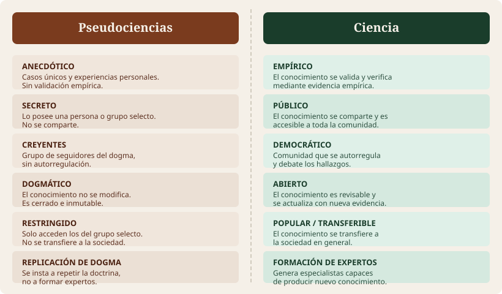

<!-- PORTADA -->
:::{.slide-portada data-visibility="hidden" #title-slide}
:::

## {data-visibility="hidden"}

  <!-- Círculo decorativo fondo -->
  <svg style="position:absolute;top:-60px;right:-60px;opacity:0.08" width="360" height="360" viewBox="0 0 360 360">
    <circle cx="180" cy="180" r="180" fill="#95c17a"/>
  </svg>
  <!-- Círculo pequeño acento -->
  <svg style="position:absolute;bottom:40px;left:40px;opacity:0.12" width="180" height="180" viewBox="0 0 180 180">
    <circle cx="90" cy="90" r="90" fill="#f5f0e8"/>
  </svg>

  <!-- Contenido superior: materia + título -->
  

    
Psicología General

    <h1 style="
      font-family:'Playfair Display',serif;
      font-size:1.55em;
      color:#f5f0e8;
      line-height:1.2;
      margin:0 0 32px 0;
      max-width:700px;
    ">Perspectiva general y diversidad en psicología</h1>
    <!-- Línea separadora -->
    

  

  <!-- Franja crema inferior: datos del docente -->
  

    

      
Dr. Fernando Tonini

      
Universidad de Palermo

    

    <svg width="38" height="38" viewBox="0 0 38 38">
      <circle cx="19" cy="19" r="19" fill="#1a3d2b"/>
      <text x="19" y="25" text-anchor="middle" fill="#95c17a" font-size="18" font-family="serif" font-weight="bold">Ψ</text>
    </svg>
  

---

## {.slide-transicion}

  

  <h2>Psicología: visión del sentido común</h2>

---

## Psicología: visión del sentido común

**¿Qué hace? ¿Dónde trabaja?**

> ¿Cómo se imaginan a un/a psicólogo/a?

. . .

Usualmente las respuestas giran en torno a la **psicología clínica**, principalmente haciendo referencia al psicoanálisis.

Lo cierto es que la realidad dentro de esta disciplina es un poco más **diversa**.

---

## La propuesta de la materia

  <strong>Existen las ciencias</strong>

  <strong>Existen las psicologías</strong>

Para comenzar, distinguimos entre dos grandes formas de entender la disciplina:

<ul>
  <li>Psicología del **sentido común**</li>
  <li>Psicología como **ciencia**</li>
</ul>

---

## {.slide-transicion}

  

  <h2>Diversidad en psicología</h2>

---

## Diversidad en psico

Otro aspecto importante es la **variedad de trabajos profesionales** que se pueden desempeñar en psicología.

Una clasificación divide los trabajos en dos grandes ramas:

  <h4>Rama Aplicada</h4>
  
Ejercicio profesional directo con personas, organizaciones o sistemas.

  <h4>Rama Académica</h4>
  
Producción y transmisión de conocimiento científico.

---

## Diversidad en psico: rama académica

### Psicólogo/a Investigador/a

  <h4>Investigación pura</h4>
  
Incrementar el conocimiento que existe en la disciplina, sin una aplicación inmediata.

  <h4>Investigación aplicada</h4>
  
Busca soluciones a problemáticas concretas aplicando el conocimiento existente.

---

## Diversidad en psico: rama aplicada

<ul>
  <li>Psicología clínica</li>
  <li>Psicología organizacional / laboral</li>
  <li>Psicología educacional</li>
  <li>Orientación psicológica</li>
</ul>
<ul>
  <li>Psicología del consumidor</li>
  <li>UX / UI</li>
  <li>Psicología forense</li>
  <li>Docencia</li>
</ul>

---

## Diversidad en psico: distribución

<!-- Slide 8: placeholder para gráficos con datos -->
{width=80%}

::: {.fragment}
> *Los gráficos se actualizan con los datos provistos por la cátedra.*
:::

---

## {.slide-transicion}

  

  <h2>Escuelas psicológicas</h2>

---

## Gran diversidad de escuelas

Hoy en día la psicología se configura como un terreno donde convergen la **diversidad** y los puntos de vista opuestos.

Esto se debe a dos grandes tipos de escuelas:

  <h4>Cognitivos</h4>
  
Explican conductas a partir de <strong>procesos mentales</strong>.

  <h4>Conductistas</h4>
  
Explican la conducta como resultado de la <strong>interacción organismo–entorno</strong>.

  <h4>Psicoanalistas</h4>
  
Ponen el foco en las <strong>experiencias tempranas</strong> en el desarrollo de la personalidad.

. . .

⚠ Hay escuelas que aplican el método científico (cognitiva, conductismo) y otras que no (psicoanálisis).

---

## {.slide-transicion}

  

  <h2>¿Qué hace científica a una disciplina?</h2>

---

## ¿Qué hace científica a una disciplina?

<!-- Slide 10: placeholder imagen método científico -->
{width=65%}

---

## Pseudociencias vs. Ciencia

{width=95%}

---

## El método científico en acción

**Ejemplo: ¿Afecta el estrés a la memoria?**

  <strong>Observación</strong> 
  Estudiantes con dificultades para recordar en exámenes; reportan altos niveles de estrés.

  <strong>Hipótesis</strong> 
  "El estrés elevado interfiere en la memoria de estudiantes universitarios."

  <strong>Deducción</strong> 
  Si se induce estrés controlado, el rendimiento en memoria será inferior al del grupo sin estrés.

  <strong>Experimentación</strong> 
  Grupo control vs. grupo experimental (inducción de estrés: "si no aprobás, recursás").

  <strong>Resultados</strong> 
  Se miden y comparan los resultados de la tarea de memoria entre ambos grupos.

  <strong>Conclusión</strong> 
  Se explican los efectos encontrados o se replantean las hipótesis si no hay diferencias.

---

## Probemos algo…

1. Necesito que alguien agarre algo que **no se pueda romper** (una hoja hecha bollito, por ejemplo).
2. Dejamos caer ese objeto.
3. Anotamos qué pasa.
4. Ahora lo repetimos **todos**.
5. Anotamos qué pasa y comparamos con la primera vez.

---

## 🎉 ¡Replicamos un hallazgo!

  
Encontramos evidencia que soporta la

  
Teoría de Gravitación Universal de Newton

  

  
Un experimento simple, observación sistemática, resultado replicable. Eso es ciencia.

---

## {.slide-transicion}

  

  <h2>Crisis de replicabilidad</h2>

---

## Otro aspecto clave: ¡Replicar!

La **crisis de replicabilidad** se refiere a la dificultad para replicar resultados de estudios previos bajo las mismas condiciones.

Es un desafío central en la psicología moderna (y en todas las ciencias).

**¿Por qué se llegó a esto?**

<ul class="lista-crisis" style="margin-top:0.5em; font-size:0.88em">
  <li>Sesgos de publicación</li>
  <li>Falta de transparencia en los datos</li>
  <li>Tamaños de muestra insuficientes</li>
  <li>Prácticas de investigación cuestionables (<em>p-hacking</em>, <em>HARKing</em>)</li>
</ul>

---

## {.slide-transicion}

  

  <h2>Algunos autores</h2>

---

## Empirismo y psicología: antecedentes

**Antes de 1870** no existían laboratorios dedicados a la investigación psicológica.

Los primeros psicólogos científicos tenían formación en **fisiología, medicina, filosofía**, o combinaciones de estas disciplinas.

### Wilhelm Wundt 1832–1920

  Estableció el **primer laboratorio de psicología** en 1879 en Leipzig, Alemania. 
  Formado como fisiólogo, se convirtió en profesor de "filosofía científica". 
  Su laboratorio marcó el <strong>nacimiento de la psicología como disciplina independiente</strong>.

---

## Algunos autores: interdisciplinariedad

La fundación de la psicología como ciencia se benefició de la intersección de múltiples disciplinas: **fisiología, medicina y filosofía**.

**Wundt y James** son acreditados con el desarrollo de la **psicología académica**, estableciendo las bases para la investigación experimental.

La creación de los primeros laboratorios fue crucial para el estudio empírico de la mente y el comportamiento.

---

## Algunos autores: William James 1842–1910

  <h4>Definición de psicología</h4>
  
James la definió como <em>"la ciencia de la vida mental"</em>. Sentó bases para futuras teorías.

  <h4>Influencia de Darwin</h4>
  
Sus ideas hicieron que los estadounidenses fueran receptivos a las teorías sobre variación individual y selección natural.

  <h4>Funcionalismo</h4>
  
Su trabajo inspiró el funcionalismo: teoría que enfatiza el <strong>propósito y la utilidad</strong> de la conducta y el interés por las diferencias individuales.

---

## Algunos autores: John B. Watson 1878–1958

### La revolución conductual

  <strong>Crítica a la introspección</strong> 
  La consideró poco confiable y difícil de verificar, por su carácter subjetivo y privado.

  <strong>Manifiesto Conductista (1913)</strong> 
  Redefinió la psicología enfocándola en el estudio <em>observable</em> del comportamiento, excluyendo la conciencia como objeto de estudio.

. . .

Este cambio de paradigma sentó las bases para el conductismo como corriente dominante en el siglo XX.

---

## {.slide-transicion}

  

  <h2>La revolución cognitiva</h2>

---

## La revolución cognitiva

**1956**: ampliamente reconocido como el inicio de la revolución cognitiva.

  <h4>Críticas al conductismo</h4>
  
Insatisfacción con sus limitaciones: no podía explicar completamente la complejidad del comportamiento y la experiencia humana.

  <h4>Expansión de la psicología cognitiva</h4>
  
Estudio de percepción, pensamiento, memoria, lenguaje y solución de problemas.

  <h4>Nuevos métodos</h4>
  
Experimentos controlados, modelos computacionales, neurociencia cognitiva.

  <h4>Implicancias interdisciplinares</h4>
  
Influyó en lingüística, inteligencia artificial y neurociencia, fomentando un enfoque más integrado.

---

## {.slide-transicion}

  

  <h2>En la actualidad</h2>

---

## En la actualidad

La psicología estudia muchos temas. Una clasificación útil los divide en:

  <h4>Foco en los procesos</h4>
  
Contenido próximamente — pendiente de datos de la cátedra.

  <h4>Foco en las personas</h4>
  
Contenido próximamente — pendiente de datos de la cátedra.

<!-- TODO: agregar contenido de slides 21-24 cuando esté disponible -->

---

## {.slide-transicion}

  

  <h2>Síntesis de la clase</h2>

---

## Ahora deberían saber…

- Existen **diversas áreas y escuelas** dentro de la psicología.
- Algunas aplican el **método científico** (cognitiva, conductismo); otras no (psicoanálisis).
- En un principio se usaba la **introspección** para indagar sobre los procesos mentales → **Wundt**.
- El **conductismo** dotó a la psicología de métodos empíricos y cuantificó los cambios en la conducta → **Watson**.
- La **revolución cognitiva** surgió como respuesta a las limitaciones del conductismo.
- A mediados del siglo XX surge el **cognitivismo** → **Chomsky** y otros.
- Hoy existen dos grandes perspectivas: una focalizada en los **procesos** y otra en las **personas**.

