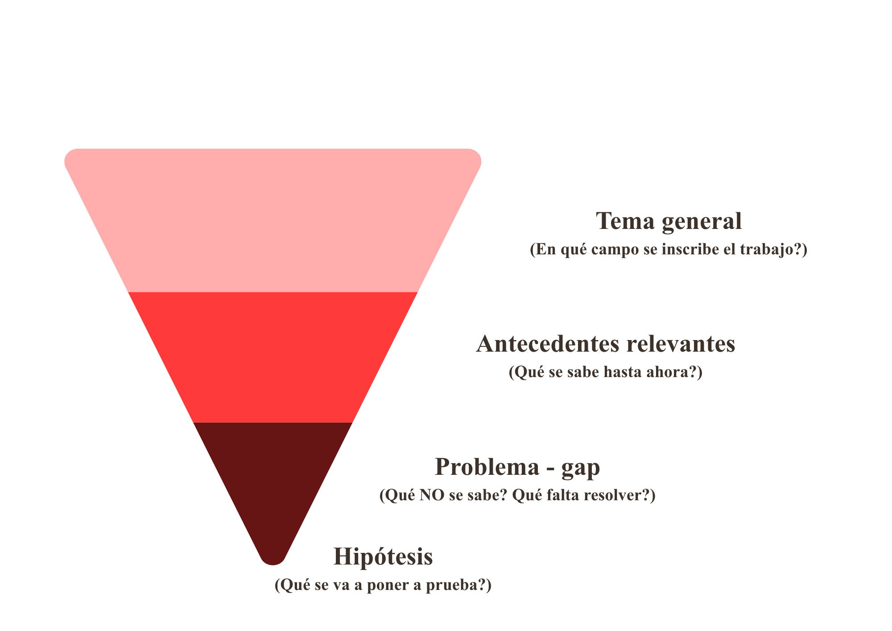
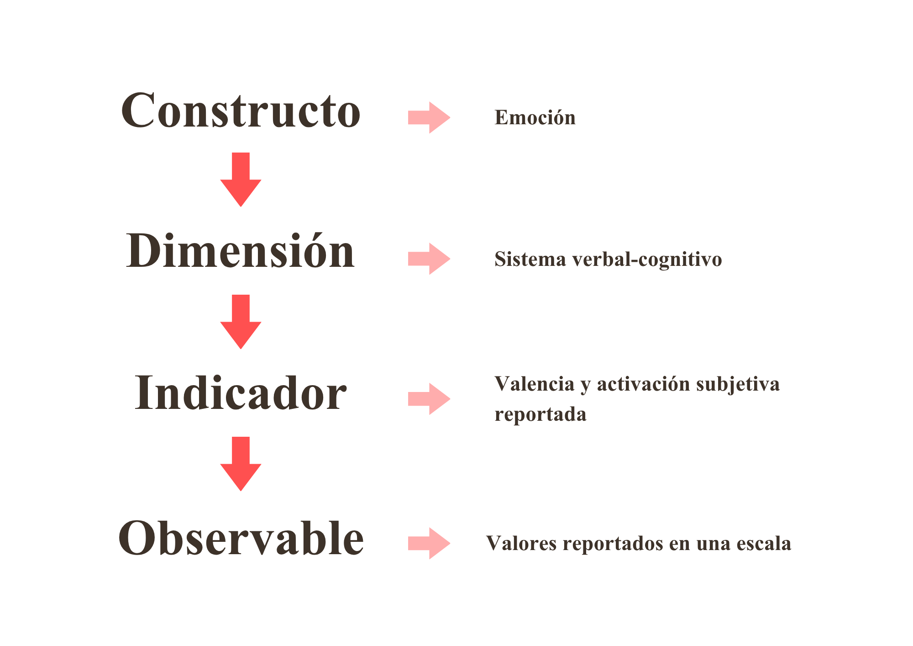

------------------------------------------------------------------------

## Hoja de ruta de hoy

::: highlight-box
Hoy vamos a trabajar **cómo se construye** la introducción y el marco teórico de un proyecto de investigación, no solo qué dicen los manuales.
:::

**Cuatro bloques:**

1. Qué es (y qué no es) un marco teórico  
2. La estructura del **cono invertido**  
3. Variables y constructos: cómo definirlos  
4. Normas **APA**: formear, estructurar, redactar, citar y referenciar

::: ref
Lectura complementaria: Gallego Ramos, J. R. (2018). *Cómo se construye el marco teórico de la investigación.* Cadernos de Pesquisa, 48(169), 830–854.
:::

------------------------------------------------------------------------

##  {.no-title data-background-color="#FFFFFF"}

:::: transition-slide
::: section-title
¿Qué es (y qué no es) un marco teórico?
:::
::::

------------------------------------------------------------------------

## El problema, en una imagen

:::::: {.cols-2 style="margin-top:0.5em"}
::: {.tarjeta}
<h4>Lo que suele pasar</h4>

El marco teórico se vuelve <strong>una argamasa de conceptos, frases e ideas pobremente articuladas</strong>, cuya lectura resulta trabajosa.

— Gallego Ramos (2018)

:::

::: {.tarjeta}
<h4>Por qué pasa</h4>

No es un problema de redacción: es <strong>epistemológico</strong>. Refleja que no se asimiló el sistema conceptual con el que se observa el objeto de estudio.

:::
::::::

::: {.warning-box style="margin-top:0.7em"}
**Consecuencia:** los cuatro componentes de la investigación —problema, marco teórico, metodología y resultados— quedan **disociados entre sí**.
:::

------------------------------------------------------------------------

## ¿Qué es un marco teórico?

::: {.highlight-box style="margin-top:0.6em"}

"Un corpus de conceptos de diferentes niveles de abstracción articulados entre sí que orientan la forma de aprehender la realidad."

— Sautu et al. (2005, p. 34)

:::

**Tres ideas clave en esa definición:**

- **Corpus articulado** —-> no es una lista de citas sueltas  
- **Distintos niveles de abstracción** —-> de teoría general a observable empírico  
- **Orienta la mirada** —-> define *qué* miramos y *cómo* lo miramos

------------------------------------------------------------------------

## ¿Qué NO es un marco teórico?

:::::: {.cols-2 style="margin-top:0.5em; font-size:0.92em"}
::: {.warning-box}

<strong>NO es</strong> un resumen de todo lo que leíste sobre el tema

:::

::: {.warning-box}

<strong>NO es</strong> una genealogía interminable del concepto

:::

::: {.warning-box}

<strong>NO es</strong> un inventario de citas pegadas una atrás de otra

:::

::: {.warning-box}

<strong>NO es</strong> un glosario de definiciones de manual

:::
::::::

::: {.example-box style="margin-top:0.7em"}
**Tip:** si comparás el índice de tu marco teórico con la operacionalización de tus variables, debería haber **una relación casi de espejo** 
:::

------------------------------------------------------------------------

## Marco teórico

- Justifica la pregunta de investigación, el diseño utilizado y la operacionalización de variables

- Demuestra que el problema existe y es relevante

- Define los conceptos con los que vas a observar el problema

- Antecedentes generales - datos del contexto

- Estado de la cuestión (qué se investigó antes)

- Definiciones, dimensiones e indicadores de las variables

------------------------------------------------------------------------

##  {.no-title data-background-color="#FFFFFF"}

:::: transition-slide
::: section-title
Estructura de cono invertido
:::
::::

------------------------------------------------------------------------

## La idea del cono invertido

::: highlight-box
La introducción y el marco teórico van **de lo general a lo específico**, embudando al lector hacia tu pregunta de investigación.
:::

{width="55%" fig-align="center"}

Empezás con el campo amplio · Terminás con tu hipótesis

------------------------------------------------------------------------

## Los cuatro niveles del cono

:::::: {.cols-2 style="margin-top:0.5em; font-size:0.86em"}
::: {.tarjeta}
<h4>1 · Campo general</h4>

El área temática amplia. <strong>Por qué importa</strong> el fenómeno en términos sociales, clínicos o teóricos.

<em>Ej.: la motivación laboral en organizaciones contemporáneas.</em>

:::

::: {.tarjeta}
<h4>2 · Tema específico</h4>

Recorte dentro del campo. Qué <strong>aspecto particular</strong> vas a abordar y desde qué tradición teórica.

<em>Ej.: motivación intrínseca en empleados de empresas tecnológicas.</em>

:::

::: {.tarjeta}
<h4>3 · Estado de la cuestión</h4>

Qué <strong>sabemos hasta ahora</strong>: hallazgos, debates abiertos, vacíos identificados.

<em>Ej.: hallazgos sobre autonomía y SDT en contextos de teletrabajo.</em>

:::

::: {.tarjeta}
<h4>4 · Tu problema</h4>

La <strong>pregunta específica</strong> que tu investigación va a responder, y por qué responderla aporta algo nuevo.

<em>Ej.: ¿cómo impacta el teletrabajo en la motivación intrínseca?</em>

:::
::::::

------------------------------------------------------------------------

## Una analogía útil

::: {.example-box style="margin-top:0.6em"}

Pensá la introducción como una <strong>cámara que hace zoom</strong>:

<strong>Plano general →</strong> el campo amplio, lo que cualquier lector culto entendería.

<strong>Plano medio →</strong> la conversación académica específica, ya con marco teórico.

<strong>Primer plano →</strong> el vacío, el debate o el problema concreto.

<strong>Foco →</strong> tu pregunta y tu hipótesis.

:::

El error más común es **arrancar en primer plano**: el lector se pierde porque no entiende por qué eso importa.

------------------------------------------------------------------------

## Proporción aproximada

<table style="font-size:0.82em; margin-top:0.5em">
  <thead>
    <tr>
      <th style="width:25%">Nivel</th>
      <th style="width:20%">% del texto</th>
      <th style="width:55%">Función</th>
    </tr>
  </thead>
  <tbody>
    <tr>
      <td><strong>Campo general</strong></td>
      <td>~15%</td>
      <td>Contextualizar y enganchar al lector</td>
    </tr>
    <tr>
      <td><strong>Tema específico</strong></td>
      <td>~25%</td>
      <td>Definir el recorte y la tradición teórica</td>
    </tr>
    <tr>
      <td><strong>Estado de la cuestión</strong></td>
      <td>~45%</td>
      <td>Mapear lo que ya se sabe e identificar el vacío</td>
    </tr>
    <tr>
      <td><strong>Problema y objetivos</strong></td>
      <td>~15%</td>
      <td>Formular pregunta, hipótesis y aporte</td>
    </tr>
  </tbody>
</table>

::: {.warning-box style="margin-top:0.6em; font-size:0.9em"}
**Atención:** son proporciones orientativas. Lo que **no puede pasar** es que el "campo general" ocupe la mitad del texto y el problema quede en dos párrafos al final.
:::

------------------------------------------------------------------------

##  {.no-title data-background-color="#FFFFFF"}

:::: transition-slide
::: section-title
Definir variables y constructos
:::
::::

------------------------------------------------------------------------

## Del concepto al observable

::: highlight-box
Un marco teórico bien construido **conecta** lo abstracto (constructos teóricos) con lo concreto (datos empíricos).
:::

{width="75%" fig-align="center"}

Cada nivel reduce abstracción y gana especificidad empírica.

------------------------------------------------------------------------

## Tres tipos de definición

:::::: {.cols-3 style="margin-top:0.6em; font-size:0.83em"}
::: {.tarjeta}
<h4>Constitutiva</h4>

Definición <strong>conceptual</strong>: qué es la variable en términos teóricos.

<em>"La motivación intrínseca es el impulso a realizar una actividad por la satisfacción inherente a ella."</em>

:::

::: {.tarjeta}
<h4>Operacional</h4>

Cómo se va a <strong>medir</strong> la variable en esta investigación concreta.

<em>"Puntaje en la subescala de motivación intrínseca del WEIMS (Tremblay et al., 2009)."</em>

:::

::: {.tarjeta}
<h4>Por dimensiones</h4>

Cuando el constructo es complejo, se desagrega en <strong>componentes medibles</strong>.

<em>"SDT incluye autonomía, competencia y relación."</em>

:::
::::::

------------------------------------------------------------------------

## Ejemplo trabajado: estrés laboral

<table style="font-size:0.74em; margin-top:0.4em">
  <thead>
    <tr>
      <th style="width:18%">Nivel</th>
      <th style="width:42%">Contenido</th>
      <th style="width:40%">Ejemplo</th>
    </tr>
  </thead>
  <tbody>
    <tr>
      <td><strong>Constructo</strong></td>
      <td>Concepto teórico amplio</td>
      <td>Estrés laboral</td>
    </tr>
    <tr>
      <td><strong>Definición constitutiva</strong></td>
      <td>Qué es, según un autor</td>
      <td>"Respuesta del organismo ante demandas laborales que exceden los recursos disponibles" (Lazarus &amp; Folkman, 1984)</td>
    </tr>
    <tr>
      <td><strong>Dimensiones</strong></td>
      <td>Componentes</td>
      <td>(1) Demandas, (2) Control, (3) Apoyo social</td>
    </tr>
    <tr>
      <td><strong>Indicadores</strong></td>
      <td>Manifestaciones observables</td>
      <td>Carga horaria, autonomía decisional, percepción de respaldo</td>
    </tr>
    <tr>
      <td><strong>Definición operacional</strong></td>
      <td>Instrumento concreto</td>
      <td>Puntaje total en el JCQ de Karasek (versión española)</td>
    </tr>
  </tbody>
</table>

------------------------------------------------------------------------

## Tipos de variables (recordatorio)

:::::: {.cols-2 style="margin-top:0.5em; font-size:0.88em"}
::: {.tarjeta}
<h4>Según el rol en el diseño</h4>

- **Independiente (VI):** la que se manipula o predice  
- **Dependiente (VD):** la que se mide como efecto  
- **Mediadora:** explica *cómo* la VI afecta a la VD  
- **Moderadora:** explica *cuándo* o *para quién* hay efecto  
- **Control:** se neutraliza estadística o metodológicamente
:::

::: {.tarjeta}
<h4>Según el nivel de medición</h4>

- **Nominal:** categorías sin orden (sexo, profesión)  
- **Ordinal:** categorías con orden (nivel educativo)  
- **Intervalo:** distancias iguales, sin cero absoluto (temperatura)  
- **Razón:** cero absoluto (edad, ingresos)
:::
::::::

------------------------------------------------------------------------

## Coherencia: el test de espejo

::: highlight-box
Una vez terminado el marco teórico, comparalo con la **operacionalización** de tus variables: deben reflejarse mutuamente.
:::

**Si en tu operacionalización aparece** una dimensión llamada *autonomía decisional*, **entonces en el marco teórico** tiene que haber un apartado que la defina, ubique en una tradición teórica y explique cómo se mide.

::: {.warning-box style="margin-top:0.6em"}
**Si no hay correspondencia**, una de dos cosas pasa:  
(a) el marco teórico habla de cosas que no vas a estudiar, o  
(b) vas a estudiar variables que nunca definiste teóricamente.
:::

------------------------------------------------------------------------

##  {.no-title data-background-color="#FFFFFF"}

:::: transition-slide
::: section-title
Norma APA
:::
::::

------------------------------------------------------------------------

## APA · Formato del manuscrito

:::::: {.cols-2 style="margin-top:0.4em; font-size:0.85em"}
::: {.tarjeta}
<h4>Página y tipografía</h4>

- **Márgenes:** 2,54 cm (1 pulgada) en los cuatro lados  
- **Tipografía:** Times New Roman 12, Calibri 11 o Arial 11  
- **Interlineado:** doble en todo el documento  
- **Alineación:** izquierda (no justificado)  
- **Numeración:** ángulo superior derecho, desde la portada
:::

::: {.tarjeta}
<h4>Párrafos y títulos</h4>

- **Sangría:** primera línea, 1,27 cm (1 tab)  
- **Sin espacio extra** entre párrafos  
- **Cinco niveles** de títulos jerarquizados  
- **Nivel 1:** centrado, negrita, mayúscula y minúscula  
- **Nivel 2:** alineado a la izquierda, negrita 
:::
::::::

------------------------------------------------------------------------

## Redacción científica · principios

::: highlight-box
La escritura científica busca **claridad, precisión y economía**. No es escritura literaria: el objetivo es transmitir información de manera inequívoca.
:::

::: {.tarjeta}
<h4>✓ Hacé</h4>

- Una idea por párrafo, una idea por oración  
- Voz activa cuando sea posible  
- Tiempos verbales consistentes (pasado para resultados previos, presente para conclusiones generales)  
- Términos técnicos siempre con el mismo significado  
- Conectores lógicos explícitos (*sin embargo*, *por lo tanto*, *en cambio*)
:::

------------------------------------------------------------------------

## Redacción científica · principios

::: {.tarjeta}
<h4>✗ Evitá</h4>

- Adjetivos valorativos (*increíble*, *fascinante*, *terrible*)  
- Frases hechas y muletillas (*cabe destacar que*, *es importante mencionar*)  
- Sinónimos forzados para una misma variable  
- Oraciones de más de 3 líneas  
- Párrafos de una sola oración (!!!)
- Primera persona del plural retórico (*"como sabemos…"*)
:::

::: {.example-box style="margin-top:0.6em; font-size:0.88em"}
**Antes:** *"Resulta verdaderamente importante destacar que, como bien sabemos, la motivación constituye un fenómeno sumamente complejo y multidimensional."*  
**Después:** *"La motivación es un constructo multidimensional (Ryan & Deci, 2017)."*
:::

------------------------------------------------------------------------

## Citado - Por qué importa citar bien

:::::: {.cols-2 style="margin-top:0.5em; font-size:0.9em"}
::: {.tarjeta}
<h4>Razones académicas</h4>

- Reconocer el trabajo de otros  
- Permitir que el lector verifique tus fuentes  
- Mostrar que conocés la conversación del campo
:::

::: {.tarjeta}
<h4>Razones formales</h4>

- Evitar el **plagio** (consecuencias serias)  
- Cumplir con el estándar de la disciplina  
- Facilitar la evaluación del jurado
:::
::::::

::: {.warning-box style="margin-top:0.6em; font-size:0.9em"}
**Sobre el plagio:** "Nada justifica la apropiación indebida de las ideas de otros. Citen siempre" (Gallego Ramos, 2018, p. 851).
:::

------------------------------------------------------------------------

## APA · Citas en el texto

<table style="font-size:0.78em; margin-top:0.4em">
  <thead>
    <tr>
      <th style="width:25%">Tipo</th>
      <th style="width:38%">Formato</th>
      <th style="width:37%">Ejemplo</th>
    </tr>
  </thead>
  <tbody>
    <tr>
      <td><strong>Narrativa</strong></td>
      <td>Autor (Año)</td>
      <td>Gallego Ramos (2018) sostiene que…</td>
    </tr>
    <tr>
      <td><strong>Parentética</strong></td>
      <td>(Autor, Año)</td>
      <td>…el marco teórico es la guía conceptual (Gallego Ramos, 2018).</td>
    </tr>
    <tr>
      <td><strong>Cita textual corta</strong></td>
      <td>(Autor, Año, p. X)</td>
      <td>"corpus de conceptos articulados" (Sautu et al., 2005, p. 34).</td>
    </tr>
    <tr>
      <td><strong>Dos autores</strong></td>
      <td>Apellido y Apellido (Año)</td>
      <td>Lazarus y Folkman (1984)</td>
    </tr>
    <tr>
      <td><strong>Tres o más</strong></td>
      <td>Apellido et al. (Año)</td>
      <td>Hernández et al. (2014)</td>
    </tr>
  </tbody>
</table>

------------------------------------------------------------------------

## APA · Citas textuales

:::::: {.cols-2 style="margin-top:0.4em; font-size:0.88em"}
::: {.tarjeta}
<h4>Corta (menos de 40 palabras)</h4>

Va entre comillas, integrada al párrafo:

<em>El marco teórico es "un corpus de conceptos de diferentes niveles de abstracción articulados entre sí" (Sautu et al., 2005, p. 34).</em>

:::

::: {.tarjeta}
<h4>Larga (40 palabras o más)</h4>

Bloque aparte, sangría, sin comillas, tamaño igual al texto:

<em>El marco teórico constituye la trama de las relaciones esenciales que en un plano más genérico no solo condiciona, sino que caracteriza y orienta de algún modo la formulación del tipo de problema objeto de la investigación. (Guadarrama, 2009, p. 74)</em>

:::
::::::

------------------------------------------------------------------------

## APA · Referencias (formatos clave)

<strong>Artículo de revista científica:</strong>

::: {.example-box style="font-size:0.78em; margin-top:0.2em"}
Apellido, N. (Año). Título del artículo. *Nombre de la Revista*, *Volumen*(Número), páginas. https://doi.org/xx.xxxx/xxxx
:::

<strong>Libro:</strong>

::: {.example-box style="font-size:0.78em; margin-top:0.2em"}
Apellido, N. (Año). *Título del libro en cursiva*. Editorial.
:::

<strong>Capítulo de libro:</strong>

::: {.example-box style="font-size:0.78em; margin-top:0.2em"}
Apellido, N. (Año). Título del capítulo. En N. Apellido (Ed.), *Título del libro* (pp. xx–xx). Editorial.
:::

<strong>Tesis:</strong>

::: {.example-box style="font-size:0.78em; margin-top:0.2em"}
Apellido, N. (Año). *Título de la tesis* [Tesis de maestría/doctorado, Institución]. Repositorio. URL
:::

------------------------------------------------------------------------

## Referencias · ejemplos completos

::: {.example-box style="font-size:0.78em; margin-top:0.4em"}
Gallego Ramos, J. R. (2018). Cómo se construye el marco teórico de la investigación. *Cadernos de Pesquisa*, *48*(169), 830–854. https://doi.org/10.1590/198053145177
:::

::: {.example-box style="font-size:0.78em; margin-top:0.3em"}
Hernández Sampieri, R., Fernández Collado, C., & Baptista Lucio, P. (2014). *Metodología de la investigación* (6.ª ed.). McGraw-Hill.
:::

::: {.example-box style="font-size:0.78em; margin-top:0.3em"}
Sautu, R., Boniolo, P., Dalle, P., & Elbert, R. (2005). *Manual de metodología: Construcción del marco teórico, formulación de los objetivos y elección de la metodología*. CLACSO.
:::

::: {.warning-box style="margin-top:0.5em; font-size:0.85em"}
**Detalles que importan:** sangría francesa, orden alfabético, DOI como URL completa (https://doi.org/...), cursiva solo en título de revista/libro y volumen.
:::

------------------------------------------------------------------------

## Herramientas para gestionar bibliografía

:::::: {.cols-3 style="margin-top:0.6em; font-size:0.85em"}
::: {.tarjeta}
<h4>Zotero</h4>

Gratuito, open source. Ideal para empezar. Plugin de Word/Google Docs.

<em>zotero.org</em>

:::

::: {.tarjeta}
<h4>Mendeley</h4>

Gratuito (Elsevier). Buena integración con su ecosistema.

<em>mendeley.com</em>

:::

::: {.tarjeta}
<h4>EndNote</h4>

Pago. Estándar en muchas universidades. Más robusto, menos amigable.

<em>endnote.com</em>

:::
::::::

::: {.highlight-box style="margin-top:0.7em; font-size:0.9em"}
**Recomendación:** elegí una herramienta **al inicio** del proyecto y cargá cada paper que leas. Lo peor es armar la bibliografía a mano la noche antes de entregar.
:::

------------------------------------------------------------------------

##  {.no-title data-background-color="#FFFFFF"}

:::: transition-slide
::: section-title
Errores frecuentes
:::
::::

------------------------------------------------------------------------

## Error 1 · El "Frankenstein de citas"

:::::: {.cols-2 style="margin-top:0.5em; font-size:0.88em"}
::: {.warning-box}
<h4 style="color:var(--uai-bordo); margin-top:0">❌ Mal</h4>

<em>"Para Smith (2010) la motivación es X. Por su parte, Jones (2015) afirma que Y. Asimismo, García (2018) sostiene que Z. También López (2020) indica que W…"</em>

:::

::: {.example-box}
<h4 style="color:var(--uai-bordo); margin-top:0">✓ Bien</h4>

<em>"La motivación ha sido conceptualizada principalmente desde dos tradiciones: las teorías de contenido (Smith, 2010; García, 2018) y las teorías de proceso (Jones, 2015; López, 2020). La presente investigación se inscribe en la primera porque…"</em>

:::
::::::

::: {.highlight-box style="margin-top:0.6em; font-size:0.9em"}
**Diferencia clave:** la versión buena **agrupa, compara y posiciona**. La mala solo enumera.
:::

------------------------------------------------------------------------

## Error 2 · Empezar demasiado lejos

:::::: {.cols-2 style="margin-top:0.5em; font-size:0.88em"}
::: {.warning-box}
<h4 style="color:var(--uai-bordo); margin-top:0">❌ Mal</h4>

<em>"Desde la antigua Grecia, los filósofos se preguntaron por la naturaleza humana. Aristóteles, en su Ética a Nicómaco…"</em>

Para una tesis sobre <em>burnout en residentes de medicina</em>.

:::

::: {.example-box}
<h4 style="color:var(--uai-bordo); margin-top:0">✓ Bien</h4>

<em>"El burnout en profesionales de la salud es un problema documentado a nivel global, con prevalencias del 30 al 50% en residentes médicos (West et al., 2018)…"</em>

:::
::::::

::: {.highlight-box style="margin-top:0.6em; font-size:0.9em"}
**Regla:** entrá al campo amplio del **problema**, no a la historia universal del concepto.
:::

------------------------------------------------------------------------

## Error 3 · Marco teórico sin variables claras

::: {.warning-box style="margin-top:0.5em"}

Marco teórico de 30 páginas que define <em>identidad</em>, <em>cultura</em>, <em>sociedad</em> y <em>posmodernidad</em>… pero la investigación mide <strong>satisfacción laboral con la escala de Warr</strong>.

:::

**Síntomas típicos:**

- El índice del marco teórico no se parece a la operacionalización  
- Aparecen autores que no se vuelven a citar nunca  
- Las dimensiones medidas no fueron definidas teóricamente  
- Las definiciones del marco teórico no se usan en la discusión

::: {.example-box style="margin-top:0.6em; font-size:0.9em"}
**Cómo se arregla:** primero operacionalizá tus variables; después escribí el marco teórico **sobre esas variables**, no antes.
:::

------------------------------------------------------------------------

## Error 4 · Ausencia del estado de la cuestión

::: highlight-box
El **estado de la cuestión** mapea qué se investigó antes sobre tu problema. Sin él, no podés justificar que tu pregunta aporta algo nuevo.
:::

**Funciones del estado de la cuestión:**

- Mostrar que **conocés** la conversación del campo  
- Identificar el **vacío** que tu trabajo viene a llenar  
- Justificar tus **decisiones** teórico-metodológicas  
- Aportar **puntos de comparación** para tus resultados

::: {.example-box style="margin-top:0.6em; font-size:0.9em"}
Un buen estado de la cuestión te evita preguntas incómodas en la defensa: *"¿Por qué no usaste tal enfoque?"* — porque ya mostraste que sabés que existe y por qué elegiste otro (Gallego Ramos, 2018).
:::

------------------------------------------------------------------------

## Error 5 · Plagio (incluso involuntario)

:::::: {.cols-2 style="margin-top:0.5em; font-size:0.88em"}
::: {.warning-box}
<h4 style="color:var(--uai-bordo); margin-top:0">Tipos comunes</h4>

- Copiar y pegar sin comillas ni cita  
- Parafrasear sin citar la fuente  
- Citar mal la fuente original  
- Reutilizar texto propio ya publicado (autoplagio)
:::

::: {.example-box}
<h4 style="color:var(--uai-bordo); margin-top:0">Cómo evitarlo</h4>

- Citá **siempre** que tomes una idea de otro  
- Si copiás textual: comillas + página  
- Si parafraseás: igual citá  
- Usá un gestor bibliográfico desde el día 1
:::
::::::

------------------------------------------------------------------------

##  {.no-title data-background-color="#FFFFFF"}

:::: transition-slide
::: section-title
Cierre y Actividad
:::
::::

------------------------------------------------------------------------

## Checklist final

::: {.highlight-box style="margin-top:0.4em; font-size:0.88em"}
Al finalizar con la redacción, revisá que tu marco teórico:
:::

<table style="font-size:0.78em; margin-top:0.4em">
  <tbody>
    <tr><td style="width:5%">☐</td><td>Sigue una estructura de cono invertido (general → específico)</td></tr>
    <tr><td>☐</td><td>El índice se corresponde con la operacionalización de tus variables</td></tr>
    <tr><td>☐</td><td>Cada variable tiene definición constitutiva y operacional</td></tr>
    <tr><td>☐</td><td>Las dimensiones e indicadores están definidos teóricamente</td></tr>
    <tr><td>☐</td><td>Hay un estado de la cuestión claro</td></tr>
    <tr><td>☐</td><td>Las citas en el texto siguen APA </td></tr>
    <tr><td>☐</td><td>Las referencias están en orden alfabético, con sangría francesa</td></tr>
    <tr><td>☐</td><td>Cada referencia citada en el texto está en la lista, y viceversa</td></tr>
    <tr><td>☐</td><td>No hay autores citados que no aparezcan en el resto de la tesis</td></tr>
  </tbody>
</table>

------------------------------------------------------------------------

## Para la próxima clase

**Actividad**

1. Redactar marco teórico 
2. Debe tener una extensión entre 5 y 10 carillas máximo.   
3. Formato de Normas APA (interlineado, sangrías, márgenes, referencias). 

::: {.example-box style="margin-top:0.6em; font-size:0.9em"}
En esta etapa se debe sustentar teóricamente la investigación. Esta tarea implica exponer de manera coherente y organizada las teorías y definiciones de cada una de las variables y la población que están estudiando.  
:::

------------------------------------------------------------------------

## {.cierre-slide background-color="#8B1A2B"}

::: cierre-container
<h2>Gracias</h2>

"El marco teórico es la trama de relaciones esenciales que orienta la formulación del problema."

— Guadarrama (2009)

Dr. Fernando Tonini

Seminario II · UAI

:::
